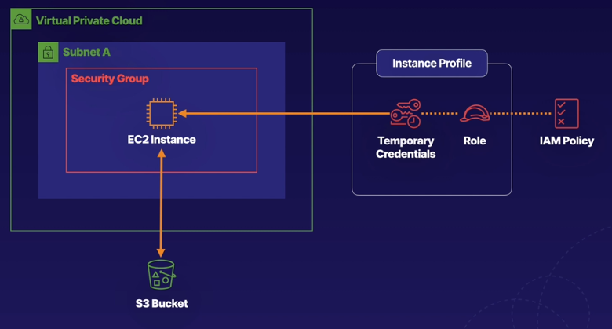

# using EC2 roles and instance profiles in aws

깃에서 ssh 서명 사용하는 상황이랑 비슷

권한이 있는 사용자가 맞는지 서명을 내놔!

EC2에서 S3버킷(외부리소스)에 접근할 때 올바른 사용자가 맞는지 웹 애필리케이션에서 사용할 수 있는 권한을 나타내는 서명을 보여줘야 함.

IAM에서 정책과 롤을 생성하고 그것을 애플리케이션에 부여하면 접근할때마다 서명을 받아야 하는 것을 피할 수 있다.

이번 랩은 CLI를 사용해서 더 어려웠음. 클라우드 나인을 사용하면 더 쉬움

AWS API는 admin이 아닌 이상 보통 복붙해서 사용함

- 명령어의 흐름이 어떻게 되는지 이해하는게 더 중요

랩을 하는 이유는

- AWS 의 CLI를 이용해서 동작되는 원리에 대한 이해를 돕기 위해
- CLI를 이용해서 하는 거라서 각 명령어에 대한 이해가 없으면 진행에 차질이 생길 수 있다.
- 간단하게 AWS 명령어를 파악한 후 랩에 접근하면 그닥 어려운 내용은 없음

## 동작 원리

IAM에서 제공하는 정책이 있는데 롤과 임시 서명을 EC2 애플리케이션에 부여하여 

서로 다른 인스턴스를 접근할 때 무조건 접근가능한게 아니다! IAM 정책을 사용하고 있기 때문에 Policy이 있는 롤을 가진 사용자만이 접근이 가능한것이다.

부담 갖지 말고 이런 것들이 있다. 돌아가는 원리. 실습까지 해서 이해가 다 되면 좋음

랩을 따라하면서 이런 자료들이 기본 제공되는 것들이 있으니 이외 자료는 어디서 찾으면 되는지 

몇번 반복을 했어야 실패가 없지... 

# Deploying a basic infrastructure using cloudformation templates

이 실습에서는 CloudFormation을 사용하여 EC2 인스턴스로 기본 인프라 환경을 프로비저닝(제공)한다. CloudFormation으로 구축 할 수있는 다양한 기본 인프라가 있으며 이 실습은 하나의 예 일뿐이다. EC2 키 페어 생성, CloudFormation 템플릿을 사용하여 EC2 인스턴스가 있는 기본 인프라 배포, 마지막으로 SSH를 통해 인스턴스에 로그인하여 환경을 올바르게 프로비저닝하고 배포한 CloudFormation 스택을 시연하는 등이 실습 전체에서 몇 가지 목표를 완료한다.

목표

1. EC2 key pair를 생성하고 제공된 CloudFormation 템플릿을 사용하여 EC2 인스턴스 프로비저닝
2. EC2 public IP 주소 및 터미널을 사용하여 인스턴스 ping

`키페어`

`스택` : 리소스 집합

`템플릿`: 

`CloudFormation` : 

`프로비저닝` :

도커에서 자주 쓰는 시스템들은 이미지로 만들어놓고 컨테이너화하는 것과 비슷한 개념

OS, 네트워크, 보안 환경 등 템플릿화가능!

템플릿화 = 컨테이너화

스택 = 컨테이너

스택을 지우면 VPC와 리소스 한번에 지워져서 업데이트 시 간편함

# Troubleshooting Amazon EC2 Network Connectivity

네트워크의 다양한 컨셉을 이해하기 위해서 나오는 다양한 용어를 이해하자는 취지

이 부분을 제대로 이해하기 위해서는 네트워크에서 사용되는 용어를 이해할 필요가 있다.

서브넷 계산까진 할 필요 없는데, 아웃바운드와 인바운드에서 세팅하는 내용

라우팅 테이블 세팅

게이트웨이 세팅

앞에 세 조꺼 직접 해보기

2조 5조는 다음주

---

0.0.0.0/0 은 어떤 IP 대역이든 다 허용하겠다는 의미

