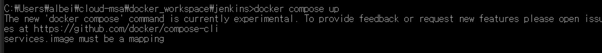
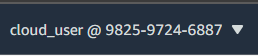
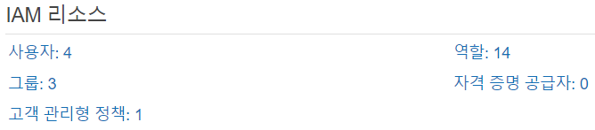
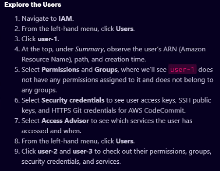
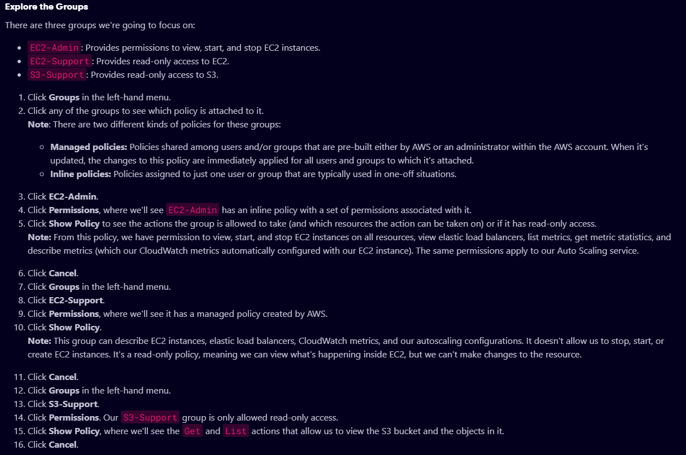
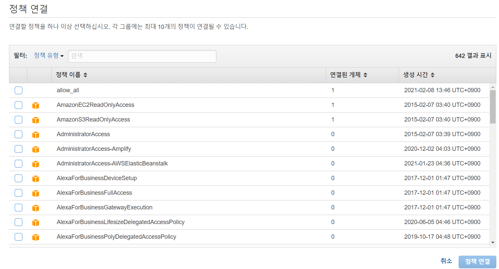
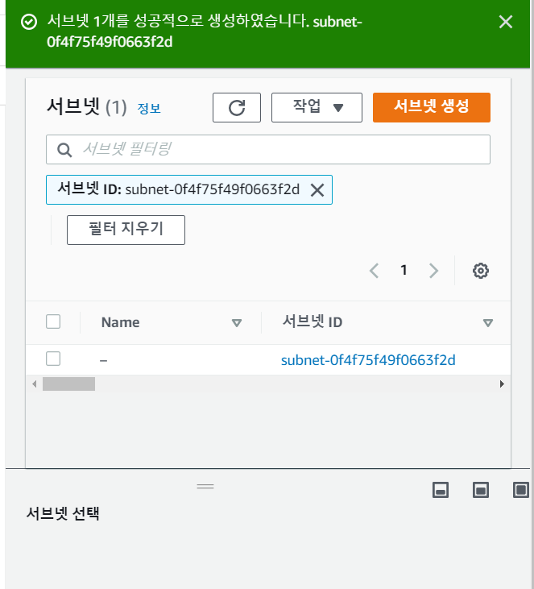

운영환경은 AWS 쓰게 된다.

---

하이퍼브이를 통해 네트워크 구성 이슈 발생. 의존적 문제 발생

실제로는 AWS 를 사용하게 되고 베이스 이미지는 LINUX를 사용함

엔터프라이즈 솔루션은 LINUX 가 많음.

윈도우 환경에서 발생하는 네트워크 문제에 시간낭비할 필요는 없음

---

교재처럼 마스터 슬레이브로 구축한다면 장점 - 인증과정 테스트

실제 프로젝트할 때 마스터-슬레이브로 구축까진 필요 없음


___

ZERO TRUST - 클라우드 보안 인증 방법

모든 사람에 대해서 인증 요구

믿을 사람 하나 없다는 컨셉

---


자원을 많이 사용할 수록 비용을 많이 지불해야한다

alpine, slim, busybox - 가능한한 자원을 적게 써서 기본적인 서비스를 제공하는 것

필요할때마다 커스터마이징이 요구됨

---


도커 컴포즈로 젠킨스 설치하기(교재)

1. official image 사용

- dockerfile 참고

```sh
FROM openjdk:8u121-jdk-alpine	# 베이스이미지:openjdk. JAVA 기반을 의미. 로컬에 없으면 설치한다.

RUN apk add --no-cache git openssh-client curl unzip bash ttf-dejavu coreutils

ARG user=jenkins		
ARG group=jenkins
ARG uid=1000
ARG gid=1000
ARG http_port=8080			# 필요 시 포트포워딩
ARG agent_port=50000

ENV JENKINS_HOME /var/jenkins_home			# 환경변수 설정
ENV JENKINS_SLAVE_AGENT_PORT ${agent_port}

# Jenkins is run with user `jenkins`, uid = 1000
# If you bind mount a volume from the host or a data container, 
# ensure you use the same uid
RUN addgroup -g ${gid} ${group} \
    && adduser -h "$JENKINS_HOME" -u ${uid} -G ${group} -s /bin/bash -D ${user}

# Jenkins home directory is a volume, so configuration and build history 
# can be persisted and survive image upgrades
VOLUME /var/jenkins_home

# `/usr/share/jenkins/ref/` contains all reference configuration we want 
# to set on a fresh new installation. Use it to bundle additional plugins 
# or config file with your custom jenkins Docker image.
RUN mkdir -p /usr/share/jenkins/ref/init.groovy.d

ENV TINI_VERSION 0.14.0
ENV TINI_SHA 6c41ec7d33e857d4779f14d9c74924cab0c7973485d2972419a3b7c7620ff5fd

# Use tini as subreaper in Docker container to adopt zombie processes 
RUN curl -fsSL https://github.com/krallin/tini/releases/download/v${TINI_VERSION}/tini-static-amd64 -o /bin/tini && chmod +x /bin/tini \
  && echo "$TINI_SHA  /bin/tini" | sha256sum -c -

COPY init.groovy /usr/share/jenkins/ref/init.groovy.d/tcp-slave-agent-port.groovy

# jenkins version being bundled in this docker image
ARG JENKINS_VERSION
ENV JENKINS_VERSION ${JENKINS_VERSION:-2.60.3}

# jenkins.war checksum, download will be validated using it
ARG JENKINS_SHA=2d71b8f87c8417f9303a73d52901a59678ee6c0eefcf7325efed6035ff39372a

# Can be used to customize where jenkins.war get downloaded from
ARG JENKINS_URL=https://repo.jenkins-ci.org/public/org/jenkins-ci/main/jenkins-war/${JENKINS_VERSION}/jenkins-war-${JENKINS_VERSION}.war

# could use ADD but this one does not check Last-Modified header neither does it allow to control checksum 
# see https://github.com/docker/docker/issues/8331
RUN curl -fsSL ${JENKINS_URL} -o /usr/share/jenkins/jenkins.war \
  && echo "${JENKINS_SHA}  /usr/share/jenkins/jenkins.war" | sha256sum -c -

ENV JENKINS_UC https://updates.jenkins.io
ENV JENKINS_UC_EXPERIMENTAL=https://updates.jenkins.io/experimental
RUN chown -R ${user} "$JENKINS_HOME" /usr/share/jenkins/ref

# for main web interface:
EXPOSE ${http_port}

# will be used by attached slave agents:
EXPOSE ${agent_port}

ENV COPY_REFERENCE_FILE_LOG $JENKINS_HOME/copy_reference_file.log

USER ${user}

COPY jenkins-support /usr/local/bin/jenkins-support
COPY jenkins.sh /usr/local/bin/jenkins.sh
ENTRYPOINT ["/bin/tini", "--", "/usr/local/bin/jenkins.sh"]

# from a derived Dockerfile, can use `RUN plugins.sh active.txt` to setup /usr/share/jenkins/ref/plugins from a support bundle
COPY plugins.sh /usr/local/bin/plugins.sh
COPY install-plugins.sh /usr/local/bin/install-plugins.sh
```


indentation 또는 인자 값 앞에 띄어쓰기 안 되었는지 확인

2. docker-compose.yml 로 컨테이너 생성

   - master, slave 2개의 컨테이너가 필요하기 때문에 docker compose로 컨테이너 생성

   - ports: 는 docker hub 에서 해당 이미지 dockerfile 참고

   - volumes:는 jenkins_home 디렉토리와 마운트할 주소를 기재

     - dockerfile ENV 인자 참고

   - 값 앞에 반드시 띄어쓰기 입력

   - <error>

     

     <solution>

3. 설치 시 디폴트로 설정된 비밀번호 잊지 않고 기록해야 한다.

   또는 jenkins_home/secretes/initialAdminPassword 에 써있으니 참고한다.

4. localhost의 지정 포트로 접속 후, 설치 진행
5. Installation error
   - home 에디션인 경우에는 retry 해본다.
   - 그 외 hyper-v를 사용하는 pro, education 버전은 설치가 되지 않는다.


## docker-compose.yml-volumes 의미


# A Cloud Guru

gmail ID: campusseven105

pw: zoavjtm7# (캠퍼스7#)

모든 핸즈온랩을 다루진 않음.

여러 핸즈온랩을 사용하면서 클라우드 서비스의 기능을 익혀보자는 취지

핸즈온랩: 아마존에 직접 가입하지 않고 A CLOUD GURU를 통해 다양한 클라우드 관련 서비스를 사용해볼 수 있는  교육 플랫폼


## 기본적인 사용법

한번 쭉 훑어보고 스텝별로 진행하면 됨

동영상도 참고하면서 진행할 수 있음

시크릿창에서 링크 열기

핸즈온 랩마다 주어진 리소스가 다르다.

매번 로그인할 대마다 계정번호가 바뀜

루트 계정 사용자 번호는 정해져있음. 계약 맺은 사람들이 할당받음

권한 정책이 이미 AWS에 정해놨음. 이것을 사용자와 그룹에 부여만 하면 됨






현재는 루트 계정이 아님.

루트 계정은 사용자, 그룹 생성과 접근권한 조작이 가능하다.



보안자격증명은 다른 사이트 접근할 때 필요한 인증서 같은 것







## region 개념

서비스를 하기 위한 시스템을 갖추고 있는데, 전세계 사용자에게 서비스를 제공하기 위해 지역별로 시스템을 

어느 리전의 서비스를 제공받는지 알 수 있다.

IAM은 특정 리전 상관없음

리전을 어디 사용하느냐에 따라 비용이 다르게 발생됨


IAM은 직접 핸들링할 일은 많지 않음


## EC2

* 가장 많이 사용하는 것
* 가상 컴퓨팅 환경
* 원격으로  연결한 서버 사용하는 것
* 데이터나 보안을 위해 SSH 사용
* CMD(a cloud guru에서 제공하는 것) vs.  mobaxterm(putty 사용하기 위함)
  * mobaxterm stable version installer v20.5 설치
* 가상화 환경을 제공하는 클라우드
* 원하는 운영체제를 설치해서 원하는 프로그램 설치 가능
* 도커
* 

## 인증과정

* mobaxterm 사용
* 


공개키(대칭키) 암호화 알고리즘

- 키쌍을 만들어서 공개키는 공개화
- 개인키 가진 사람만 복호화하기로 약속


비대칭키 암호화 알고리즘

* 

ssh로 통신한다 = 

* 서버가 배포한 공개키를 가진 사용자인지 확인
* aws 에서 키를 생성하여 공개키를 주면
* mobaxterm에 키를 공개하고 배포해주면
* 원격에 붙어서 조작하려면 ssh를 사용한다.


putty로 원격 접속해서 쓰는 기능으로 제일 많이 사용했었음. mobaxterm은 sftp등 다양한 기능을 가져서 이를 많이 사용함.


클라우드에서 제공하는 파일을 복사해서 받아야 한다. -> FTP로 파일업로드 다운로드를 해야 한다. ssh와 통신하는 방법 같다.


---

- 네트워크 기반 지식을 가지고 있어야 커스터마이징을 할 수 있음
- 네트워크, 운영체제 기본 지식을 가진 인프라 엔지니어가 데브옵스 분야 진출 유리
- VPC 생성
- 서브넷 생성
  - 


