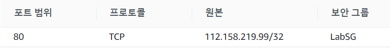

public ip는 게이트웨이에서 요청왔을 때 접근 가능하고

private ip는 내부에서 사용하도록 하기 위한 것

AWS 1년 사용 가능

CPU 750 시간, 스토리지 5G, 데이터베이스 750시간, 처럼 컴퓨팅 리소스를 정해진 양만큼만 무료로 사용할 수 있다.

---

GCP에서는 30만원 정도의 서비스를 제약없이 무료로 제공받을 수 있음

---

# creating and working with an EC2 Instance in AWS

- ec2로 웹서버용 인스턴스만들기
- docker 이미지를 활용해도 됨

1. 기본 VPC 생성
2. EC2 인스턴스 생성 (리눅스)
3. 사용자 데이터 입력
4. 태그 추가
5. 그룹명 변경(크게 의미 없음)
   - 웹서버를 만드는 것이므로 HTTP 규칙 추가
6. 새 키 페어 생성 및 키 페어 다운로드
7. 외부에서 접근가능한 ipv4 주소 확인
   - 
   - 퍼블릭 ip는 계속 바뀌기 때문에 도메인 네임을 사용
   - 또는 탄력적ip를 사용할 수도있음
     - 고정 ip임. 내부에서 ip변경되는것을 자동으로 반영함
     - 탄력적 ip 주소 할당을 별도로 해야함

8. 보안 탭 확인
   - 

9. mobaxterm 실행
   - ssh 연결. Session 오픈
   - username = 인스턴스 연결 정보의 사용자이름

---

AWS 클라우드 학습에 대한 동영상 강의들이 잘 되어있음

- 이걸 보면 개발자가 어떠한 역할을 맡아야 하는지 알 수 있겠네!

---

자격증으로 어떠한 이익을 보겠다 ?? NONONO

기술사 자격증은 예외. 기술사 자격증을 따면 승진에 도움되거나, 5급 공무원으로 갈 수 있음

그래도 최고권위 자격증이기 때문에 대우를 많이 해줌

민간경력자 채용에도 도움됨

정보처리기술사를 따면 감리사로 역할을 수행할 수 있음

---

# 리눅스에 도커 설치하기

아마존 리눅스 -> 우분투 리눅스로 왜 바꾼거지?

