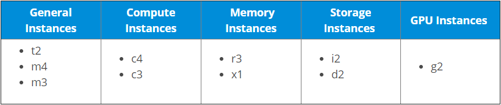

# EC2

Amazon Elastic Compute Cloud, EC2는 클라우드에서 크기 조정이 가능한 컴퓨팅 서비스를 제공하는 Amazon의 웹 서비스입니다. 컴퓨팅 요구 사항이 변경되면 사용중인 서버 인스턴스의 수를 빠르게 확장하거나 축소 할 수 있으므로 크기를 조정할 수 있습니다.

---

`인스턴스`는 Amazon의 EC2에서 애플리케이션을 실행하기위한 가상 서버이다. 또한 자체 하드 드라이브, 네트워크 연결, OS 등이 있는 더 큰 컴퓨터의 작은 부분으로 이해하면 된다. 그러나 실제로는 모두 가상이다. 하나의 물리적 시스템에 여러 대의“작은”컴퓨터를 가질 수 있으며 이러한 모든 작은 시스템을 인스턴스라고 한다.

---

## EC2의 취지

개발자라고 가정하고 독립적으로 작업하기를 원하기 때문에 일부 서버를 구입하고 올바른 용량을 추정했으며 컴퓨팅 성능은 충분합니다. 이제 매일 보안 패치 업데이트를 관리해야하고 서버의 백엔드 수준에서 발생할 수있는 문제를 해결해야합니다.

하지만 EC2 인스턴스를 구입하면 Amazon에서 모두 관리하므로 이러한 사항에 대해 걱정할 필요가 없습니다. 응용 프로그램에만 집중하면됩니다. 그것도 이전에 발생한 비용의 일부로! 흥미롭지 않나요?

## EC2에서 시스템들을 실행하는 방법

- AWS 계정에 로그인하고 AWS EC2를 클릭합니다.
- 인스턴스 생성에서 인스턴스 시작을 클릭합니다.

---

이제 `Amazon Machine Image (AMI)`를 선택해야 한다. AMI는 OS의 템플릿이며 인스턴스를 시작하는 데 필요한 정보를 제공한다. 인스턴스를 시작하려면 사용할 AMI를 지정해야합니다. Ubuntu, Windows 서버 등이 될 수 있습니다.

AMI는 미리 구성되거나 요구 사항에 따라 직접 구성 할 수 있습니다.

- 사전 구성된 AMI의 경우 AWS 마켓 플레이스에서 선택해야합니다.
- 직접 설정하려면 빠른 시작으로 이동하여 하나를 선택하십시오.
- 구성하는 동안 EBS 스토리지 옵션을 선택해야하는 지점에 도달하게됩니다. Elastic Block Storage (EBS)는 EC2와 함께 사용되는 영구 블록 수준 스토리지 볼륨입니다.

## EC2 컴퓨팅 인스턴스의 유형

컴퓨팅은 매우 광범위한 용어이며 작업의 특성에 따라 필요한 컴퓨팅의 종류가 결정됩니다. 따라서 AWS EC2는 다음과 같은 5 가지 유형의 인스턴스를 제공합니다.

- General Instances
  - 성능과 비용의 균형이 필요한 애플리케이션에 적합하다.
    - 예: 즉각적인 응답이 필요하고 많은 처리가 필요하지 않기 때문에 cost-effective해야하는 이메일 응답 시스템.
- Compute Instances
  - CPU에서 많은 처리가 필요한 응용 프로그램에 적합하다.
    - 예 : Twitter 스트림과 같은 데이터 스트림의 데이터 분석
- Memory Instances
  - 많은 RAM을 필요로 하는 무거운 응용 프로그램에 적합하다.
    - 예: 멀티태스킹(백그라운드에서 돌아가는 애플리케이션 많이 필요할 때)
- Storage Instances
  - 크기가 크거나 많은 공간을 차지하는 데이터 셋을 가진 애플리케이션에 적합
    - 예: 애플리케이션이 매우 클 때
- GPU Instances
  - 무거운 그래픽 렌더링이 필요한 응용 프로그램에 적합
    - 예: 3D 모델링 등

모든 인스턴스 유형에는 다양한 워크로드에 최적화 된 인스턴스 세트가 있다.

# Hands-on Labs: Custom Virtual Private Cloud (VPC)에서 EC2 인스턴스 시작

## 1. Create Custom VPC

## 2. Create Public and Private Subnets

VPC에 대해 두 개의 서브넷을 구축합니다. 하나(public)는 인터넷에서 액세스를 허용하기 위해 공개되고 다른 하나(private)는 비공개입니다. 서브넷을 만들 때 유효한 CIDR 블록을 할당했는지 확인하십시오.

## 3. Create Routes and Internet Gateway

## 4. Launch Instances in Subnet

## 5. Access Instance

도커 compose - 여러 서비스들을 모아주는 역할

docker swarm - 서버 다운, 기능 확장, 서버 부하 등을 해결해주는  오케스트레이션 기능 담당하는 소프트웨어

쿠버네티스가 docker swarm과 같은 역할

쿠버네티스는 클라우드환경 내에서 다뤄보는게 효과적임

