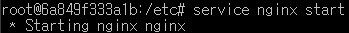
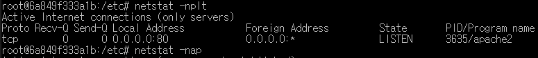
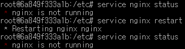
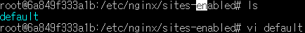
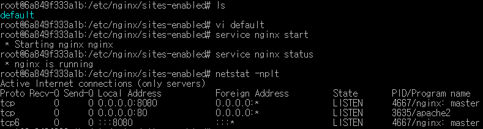

실제로는 웹 서버에서 동작시켜야 http 프로토콜을 통해서 응답할 수 있게 됨


```sh
docker run --name nginx -p 8888:80 nginx
```


localhost:8888 접속

---

uniminimized


nginx 또는 apache httpd 웹서버를 리눅스환경에서 설치


도커에서 리눅스를 설치한 후 nginx를 직접 설치해보기

우분투 20.04 버전에 웹서버 설치해보기


# 우분투 리눅스에서 apache httpd 웹서버 설치

```sh
sudo apt-get update && sudo apt-get upgrade	# 패키지 업그레이드
sudo apt-get install apache2
apache2 -v		# apache2 버전 확인
service apache2 start			# 방법1
sudo /etc/init.d/apache2 start	# 방법2

netstat -nplt	# 네트워크 상태 확인
service apache2 status	# 아파치 서비스 상태 확인
```


docker 명령어나 dockerfile 인스트럭션으로 설치할 수 있을까?


# 1. NGINX

Nginx (“Engine-X”로 발음)는 리버스 프록시 또는 HTTP 캐시로 자주 사용되는 오픈 소스 웹 서버입니다. Linux에서 무료로 사용할 수 있습니다.


프록시 서버: 요청이 들어왔을 때

웹서버를 프록시 서버로 쓰는 것!

웹서버를 쓰는 이유

- 만든 어플리케이션을 배포하기 위한 도구

웹서버 기능

- 클러스터링
- 로드밸런싱: FTS
- 캐싱
- 

nginx 이벤트 드리븐 방식

apache 웹서버는 요청이 들어올 때마다 쓰레드를 생성하는 방식이다.


인스톨했으면 기본적으로 확인해야할 것은

* 홈페이지로 응답하는 페이지 등의 위치
* (실행)파일들의 위치
* start 명령이 어디에 있는지
* conf 위치. 어떤것들이 있는지
* DB를 붙여야 하는데
* 실행위치


나중에 배포, 자동화 스크립트를 작성해야하기 때문에 이러한 것들을 찾아봐야 한다.












# 3. Mariadb 설치

- 서버, 클라이언트 설치
- 실무에선 개발환경 DB, 운영환경 DB가 별도로 존재
- 툴과 연결해보기(테스트 커넥션)
- 암호 잊어버렸을 때
- db설치 시,인코딩을 주의해야함- 인코딩 변경


# 4. REDIS 설치


문서화

* 문제 발생 시 해결 방법 
* 간단한 CRUD


systemctl 실행가능한 파일을


# 5. MONGODB 설치

