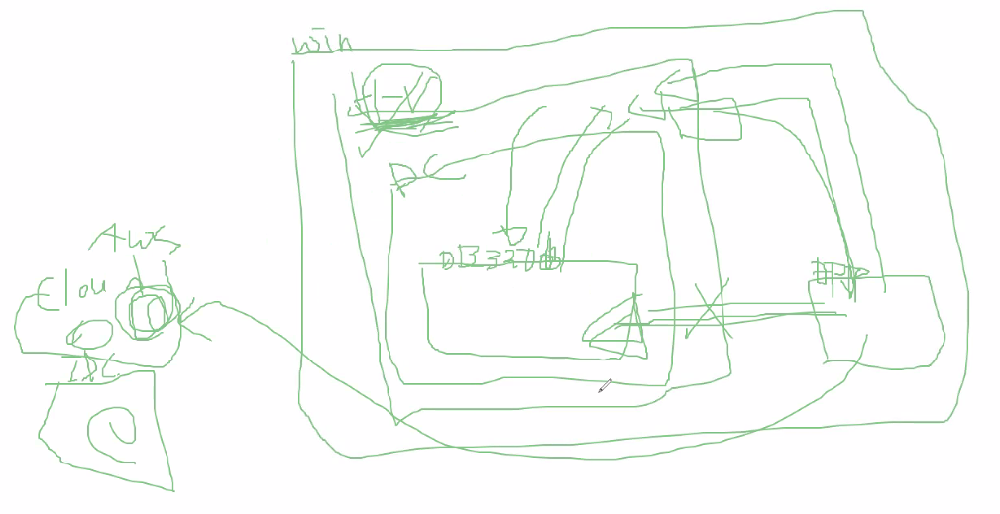

하이퍼V를 썼을 때, 네트워크 접근하는 방법

하이퍼V를 사용하면서 도커에서 내부적으로 IP를 변경하게 됨. 이 부분에서

맥이나 홈에디션은 문제 없음


DOCKER COMPOSE

7장.


웹서버, DB서버, API서버 등 우분투위에서 이각각을 설치해서 쓰는 것? 하나의 티어에 


실무에선 해당되는 각각의 기능들은 갖는 컨테이너들을 설치함 .

하나 컨테이너는 웹서버 설치, DB를 설치함


비유

동시다발적으로 모든 서비스를 하나의 컴퓨터로 처리하는 것과

도커 컨테이너로 웹서버 3개, API 서버 1대, DB서버1대 만들어서 연결해서 쓴다.(각각을 컴퓨터로 봄). 컨테이너를 조합해서 쓴다고 생각하면 됨. 이를 잘 조합하기 위해 오케스트레이션 툴을 사용하는 것


물리적으로 나누는것을 티어, 논리적으로 나누는것을 레이어라고 함


어제는 그냥 실제 명령어로 설치해봤는데 이를 알고 이미지를 활용해 설치하는 것과 모르는 것은 차이가 있음


---

Docker compose: 여러 컨테이너를 모아서 관리하기 위한 툴

docker- compose.yml

```
YAML Ain't Markup Language
yml (야믈 파일):json처럼 환경설정하는데 사용되는 문법(환경설정 선언용 문법)

YAML은 모든 프로그래밍 언어에 대한 인간 친화적 인 데이터 직렬화 표준입니다.

yaml을 데이터 전송목적으로도 쓰일 수 있긴함. 보통은 config 설정으로 사용함

파싱지원시스템을 통해서 사용하게 됨.

깊게 알필요없고 원리만 파악하고 써도 문제 없음
```

- 윈도우나 맥에는 이미 설치되어 있음
- 


# Docker compose 문법

*문법 이해하자*

- 들여쓰기로 종속성 나타냄


- 하나로 config를 작성할 수도 있고 ---로 config를 구분하여 작성할 수 도 있다.


이것을 파싱해서 해석해주는 애플리케이션이 있으면 이것의 해석 약속을 지정해줘야 한다.


매번 도커 환경설정에 대한 수고를 덜어줌


docker compose 실습


여러 컨테이너 생성하는 설정


redis에 대한 Dockerfile이 없는 이유는 docker-compose에서 가져온 redis를 변경없이 사용하기 때문

커스터마이징한다면 Dockerfile이 필요함

`docker compose up` 명령어는 docker compose  yaml 파일이 있는 곳에서 실행해야 한다.

> 포트 문제로 실행 에러가 발생할 수 있다.

docker compose config 설정한 것들이 설치됨


개발자, 인프라담당자 입장에서 모두 편리

- 개발자가 환경 셋팅 정보를 받아서 직접 환경 셋팅하면서 문제가 생기면 인프라 담당자에게 도움요청하고 문제해결 정보받고 이렇게 핑퐁상황 이어짐
- 웹서버 리눅스 기반 - 디비는 윈도우 기반 이라면 


# 도커가 어렵게 느껴지는 이유

```

개발자는 인프라를 다뤄보진 않았음
도커 자체가 어려운게 아니라 DB, WAS, WEB서버 등을 관리해주는 네트워크를 다루는게 어려운 것
단, 도커를 쓸 수 있게끔 각 벤더들이 이미지를 제공해줘야 편한 것
그렇지 않으면 ADMIN 입장에서 설정 조작을 해야함

REDIS config설정을 통해 이미지를 받아오면 도커에 필요한 설정들이 자동으로 되는 것


```

# Node 기반으로 todo app 생성해보기

Docker doc - part2. our application 참고

express 프레임워크가 활용된 예제


1. dockerfile 생성
2. 이미지 생성
3. 컨테이너로 실행


## docker ps -q

--name을 안 줄경우에 하나의 이미지에 대해서 임의의 이름을 가진 여러 개의 컨테이너가 생성된다.


---


yarn 없으면 에러남.

node:12-alpine 관련 docker file에 베이스 이미지에 yarn 설치를 명시해뒀는지 확인해야 함.


- DB이므로 인증이 필요하다

- MYSQL 설치 시 반드시 이행해야하는 작업

  - DB생성
  - 유저생성
  - 권한

- 여기서는 MYSQL_DATABASE 로 DB 생성한 것

  


# mariadb 설치


개발자는 


하이퍼브이에서는 로컬호스트가 변경되어있음

Windows 폴더-drivers-hosts 참고


하나의 네트워크로 묶여야 컨테이너간 통신이 가능하다.

수동으로 묶을 필요없이 디폴트 네트워크로 묶이게 된다.


하이퍼브이를 통한 로컬 DB의 네트워크 세팅이 어려움 ㅠㅠ

검색키워드: 하이퍼브이 로컬 네트워크 공유

홈에디션은 로컬호스트로 연결하면 됨


실제 프로젝트할 땐 AWS가 제공하는 네트워크를 사용하기 때문에 포트하나 열어주면 끝이남


[홈에디션 연결]


실제 통신 플로우




클라우드 활용할 경우 포트포워딩만 해주면되기 때문에 문제 없음

# 리뷰


이미지 빌드할 때 a-z 


다행히 도커가 표준이 되면서 사용이 늘어가는 이유는 쿠버네티스에서 도커를 지원하기도하고 최근에 기술문서


현재 os벤더에서 도커를 제공하는 벤더들이 늘어나고 있음.


dockerfile이 어떻게 제공되는지 훑어볼 필요 없음

일주일동안 기본명령어들만 사용해봤음

스펙문서에서 제공하는 part1234 했으니 compose 해보기


다음주에 해볼테니 직접해본것과 비교해보기


책에는 젠킨스 나와있는데 aws ec2에 직접해봐도 되지만 그것도 리눅스 해보는 것이기 때문에 리뷰해볼것임


핸즈온앱으로 제공하는 기능들 다뤄볼 예정


쿠버네티스는 기본 명령어만 다뤄보고 aws ec2 설치 한다음 쿠버네티스는 프로젝트 전에 다뤄볼것임 다 까먹어버리기 때문에


프로젝트에 필요한 react, django rest로 바꿔서 해야하는 시간 준비중


mysql db 붙여서 사용해보기

