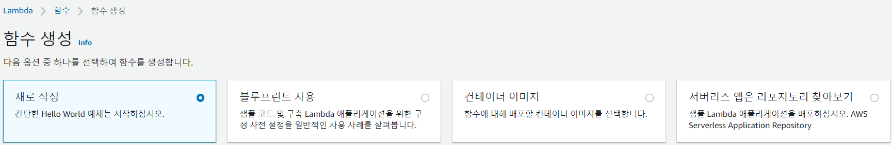
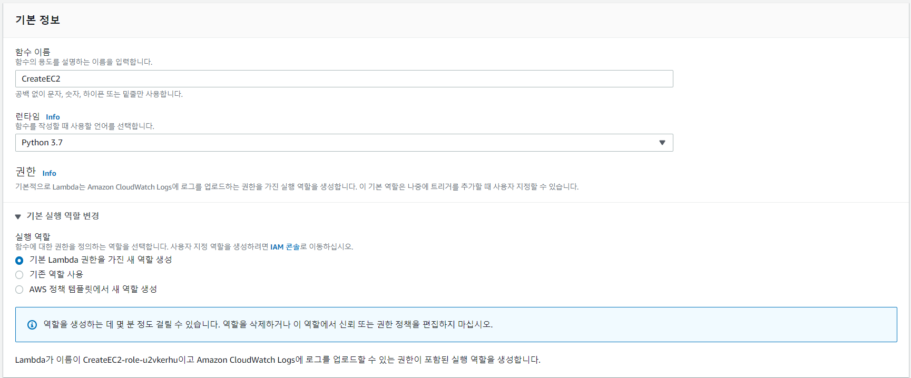
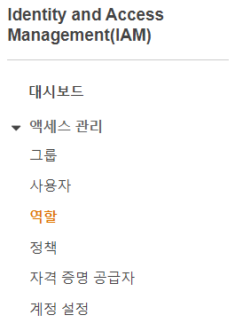
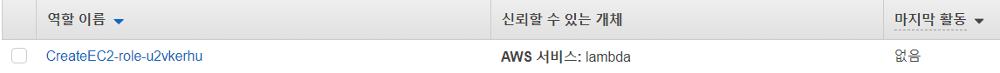
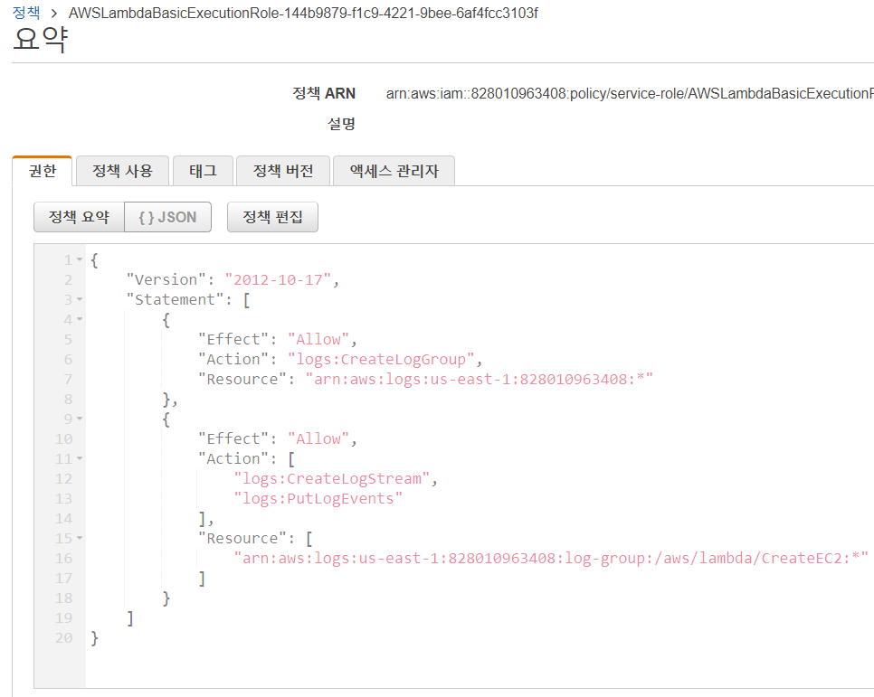
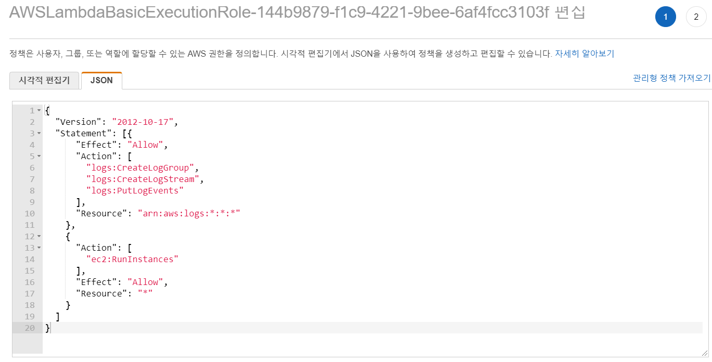
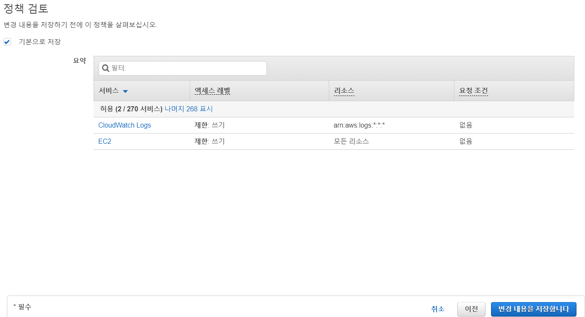
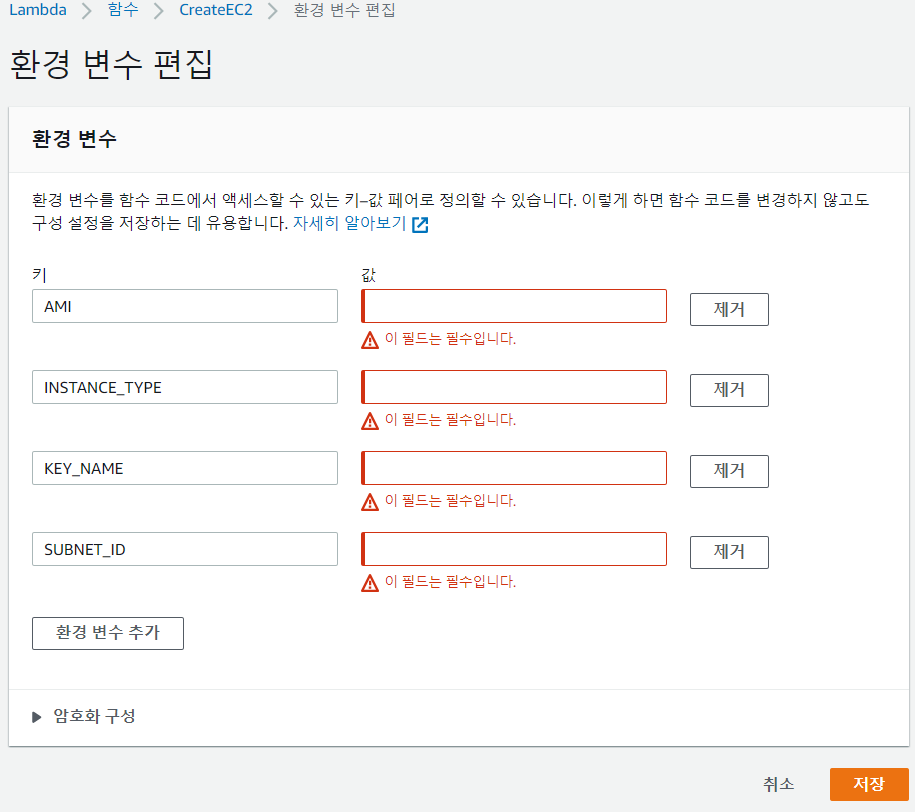
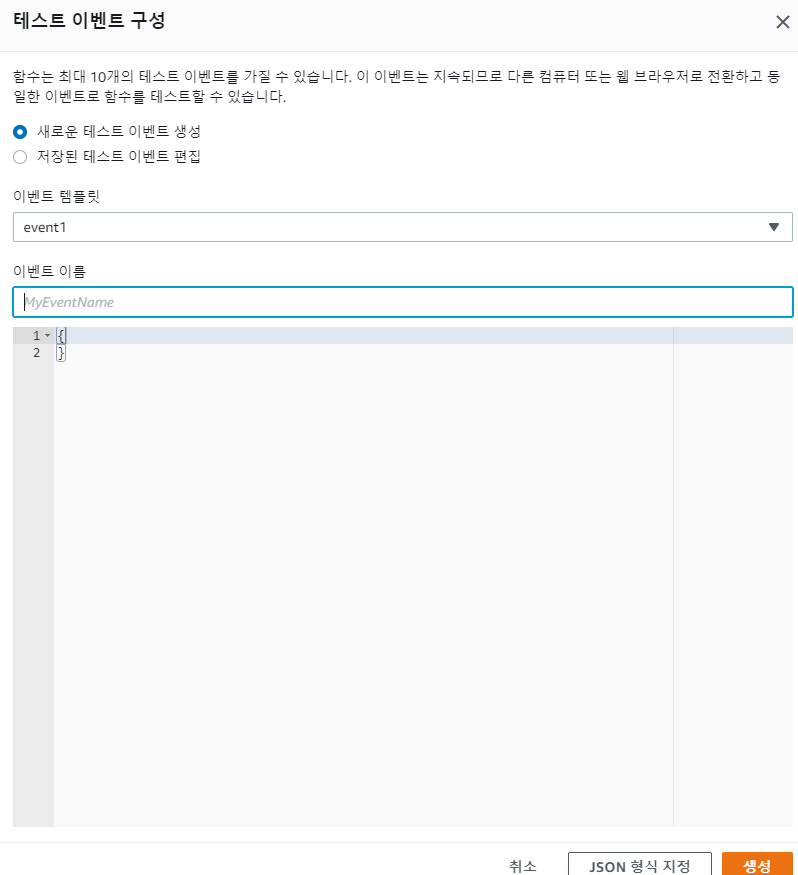
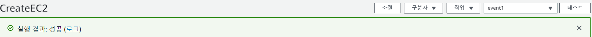

# 목표

AWS 람다를 이용해서 편하게 EC2 인스턴스 생성하기


# 용어

lambda function (AWS Lambda)

역할(role)

정책(policy)


# 작업


## 1. Lambda function 생성






### 2. IAM > 역할 > 정책 변경









```json
{
  "Version": "2012-10-17",
  "Statement": [{
      "Effect": "Allow",
      "Action": [
        "logs:CreateLogGroup",
        "logs:CreateLogStream",
        "logs:PutLogEvents"
      ],
      "Resource": "arn:aws:logs:*:*:*"
    },
    {
      "Action": [
        "ec2:RunInstances"
      ],
      "Effect": "Allow",
      "Resource": "*"
    }
  ]
}
```




### 3. lambda 함수 코드 변경


```python
import os
import boto3

AMI = os.environ['AMI']
INSTANCE_TYPE = os.environ['INSTANCE_TYPE']
KEY_NAME = os.environ['KEY_NAME']
SUBNET_ID = os.environ['SUBNET_ID']

ec2 = boto3.resource('ec2')


def lambda_handler(event, context):

    instance = ec2.create_instances(
        ImageId=AMI,
        InstanceType=INSTANCE_TYPE,
        KeyName=KEY_NAME,
        SubnetId=SUBNET_ID,
        MaxCount=1,
        MinCount=1
    )

    print("New instance created:", instance[0].id)
```


### 4. 환경 변수 편집




## 5. 테스트 및 인스턴스 생성 확인






## 6. ssh 연결


# 궁금한점

