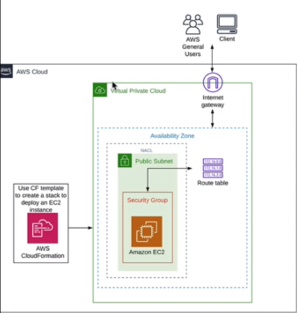
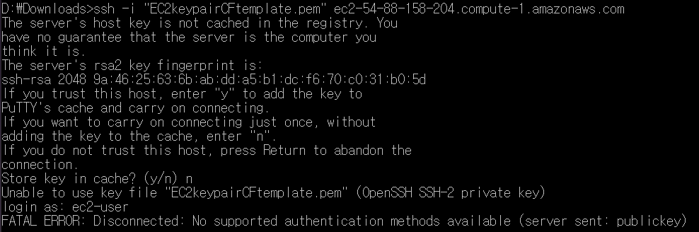
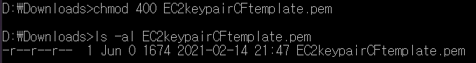
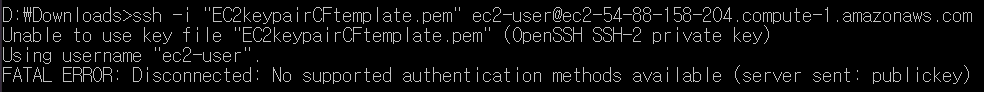
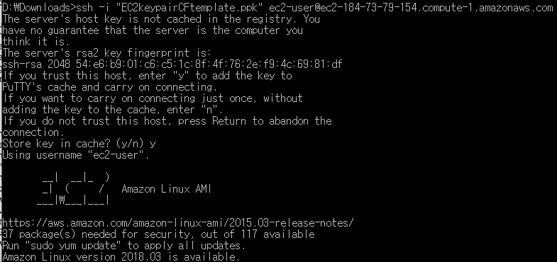
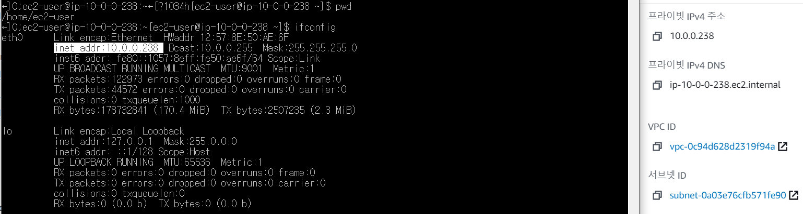

# 목표

- CloudFormation 사용해서 EC2 인스턴스로 기본 인프라 환경을 제공(프로비저닝)
  - EC2 key pair 생성
  - CloudFormation을 사용하여 EC2 인스턴스로 기본 인프라 환경 제공
  - 마지막으로 SSH를 통해 인스턴스에 로그인하여 환경을 올바르게 프로비저닝하고 배포한 CloudForamtion stack을 보여주기 

# 용어

- `EC2 key pair`: private key와 public key로 구성된 key pair는 인스턴스에 연결할 때 자격 증명 입증에 사용하는 보안 자격 증명 집합이다. Amazon EC2는 public key를 저장하고 사용자는 private key를 저장한다. 암호 대신 private key를 사용하여 인스턴스에 안전하게 액세스할 수 있다. private key를 소유하는 사람은 누구나 인스턴스에 연결할 수 있으므로 보안된 위치에 private key를 저장해 두는 것이 중요하다.
- `provisioning`: 사용자 요구에 맞게 시스템 자원을 할당, 배치, 배포해두었다가 필요 시 시스템을 즉시 사용할 수 있는 상태로 미리 준비해두는 것
- `deploying`: 

# 작업

1. key pair 생성
2. 주어진 EC2 템플릿으로 stack 생성
3. VPC(환경) 
   - 기본적인 네트워크 인프라에 필요한 모든 것을 볼 수 있음
   - VPC 대시보드 > Running Instance 확인
   - 
   - 이 모든 것은 템플릿에 모두 정의되어 있음
4. ssh 연결

기존 pem 대신 ppk파일 이용하니까 된다! 도대체 왜??

5. 연결 확인

