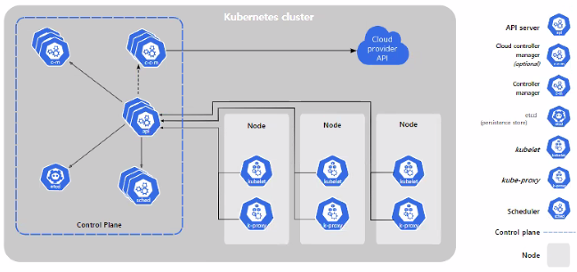
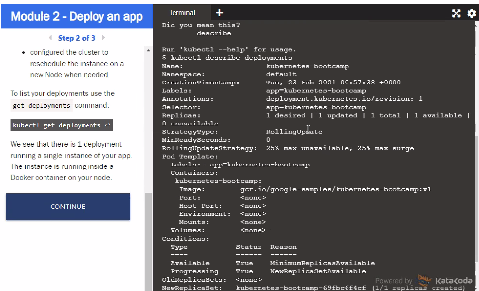

쿠버네티스 튜토리얼




클러스터, 노드, 파드 모두 ip를 각각 지니고 있다.

노드의 [컴포넌트](https://kubernetes.io/ko/docs/concepts/overview/components/#노드-컴포넌트)에는 [kubelet](https://kubernetes.io/docs/reference/generated/kubelet), [컨테이너 런타임](https://kubernetes.io/docs/setup/production-environment/container-runtimes) 그리고 [kube-proxy](https://kubernetes.io/docs/reference/command-line-tools-reference/kube-proxy/)가 포함된다.

클러스터 = 컨트롤 플레인




namespace: 이름충돌 방지 목적

label:

selector: name, namespace, label 등 여러 값으로 찾을 수 잇음

---

​	

# 앱 외부로 노출하기

로드밸런서를 통해서 노출하는게 가장 일반적

```sh
kubectl get pods # 파드 확인
kubectl get services # 서비스 확인
```

포트 종류 여러개


보통은 클라이언트에게 노드밸런서의 인그레스를 통해서 하게 함

노드간 통신은 노드포트로 노출을 시켜야 한다.

노출 왜 하냐 통신하기 위해서

클러스터IP는 클러스터 내에서 통신하기 위해서

일반적으로 노드포트를 공개하지 않음

사내 시스템이면 노드포트를 공개함


다음을 이해할 필요가 있다.

- 객체의 의미

- 아이피의 모두 다른 이유


# 앱 스케일링하기


# 앱 어데이트 하기

## 롤링 업데이트(cf. 블루그린배포)

서비스 중지 없이 업데이트하는 방법 중 하나

하나씩 성공해야 다음 인스턴스 업데이트 실행

레플리카 개수 맞추는 작업을 계속함


*name과 namespace가 중요한 이유*

현재 노드는 하나(미니쿠베이기 때문에)

기본적으로 노드 3개 이상 만들게 되고 이 안에 파드가 어떻게 될지는 모른다. 그것은 describe로 확인해보면 된다.


블루그린 배포: 한번에 백업해놓고 한번에 터미네이트되는 메커니즘