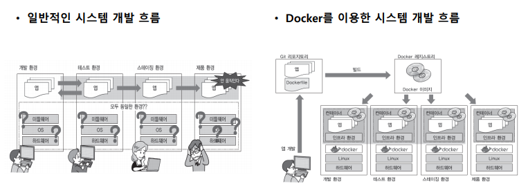
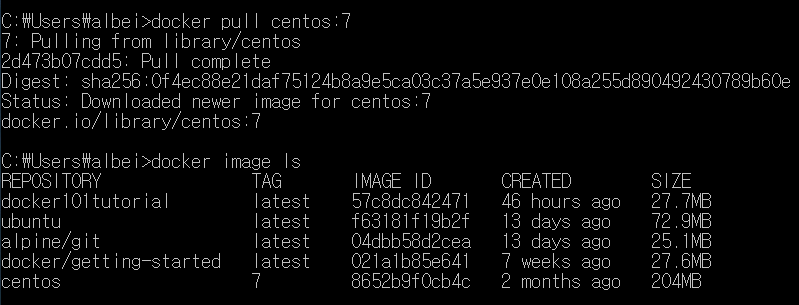
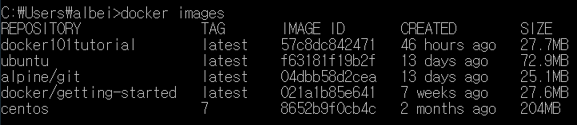
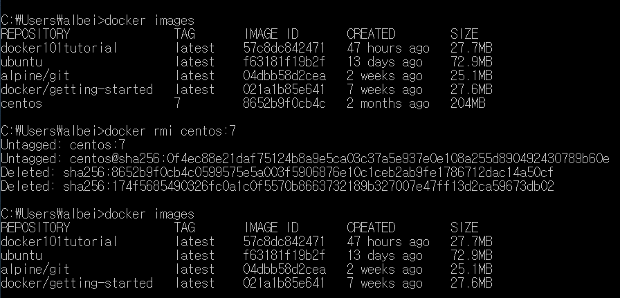
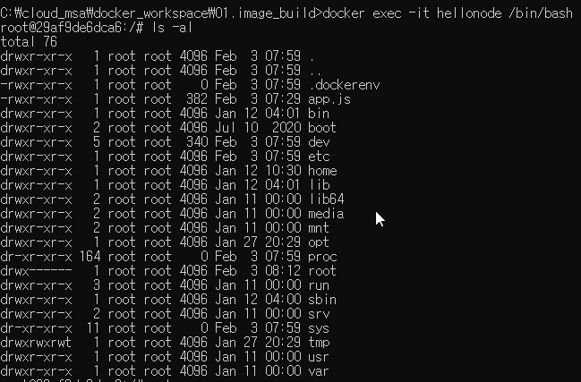
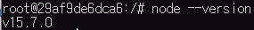

툴체인

협업 툴

형상관리 툴

CI/CD 운영환경에 배포하는 데 필요한 툴


기존 인프라 담당자가 DEVOPS로 커리어 패스를 발전시킴

DEVOPS 문화를 잘 적용하기 위해선

---

# 1.1시스템 기반의 기초 지식

   

온프레미스:

퍼블릭 클라우드

프라이빗 클라우드


---

# 1.2하드웨어와 네트워크 기초 지식


인터넷을 사용할 때 보안을 위해서 가장 먼저 도입하는 것은 방화벽 제품

방화벽에 비정상적 패턴이 등록되어 있고, 이러한 패턴이 많이 등록되어 있는 것이 좋은 제품

방화벽은 하드웨어, 소프트웨어적으로 모두 존재한다.

방화벽은 L7, L4, L2 레이어 등에 포함된다.

1. 패킷필터형
2. 애플리케이션 게이트웨이형(프록시서버)
   * 애플리케이션 프로토콜 레벨에서 외부와의 통신을 대체 제어
   * 프록시: 프록시 서버에서 걸러서 보내주는 필터 역할


허니팟

웹 어플리케이션 방화벽


라우터/레이어 3 스위치

라우터는 LAN구축에 필요한 장비(3계층)


# 1.3 OS(Linux) 기초지식

# 1.4미들웨어 기초 지식

1. 웹 서버, 웹 애플리케이션 서버

2. 데이터베이스 서버

SQLite는 기업용 DBMS는 아님

실무에서 많이 사용되고 있는 DB는 Oracle(공공쪽),

3. 모니터링 툴

HA, FTS 서비스를 제공에 도움


# 1.5 인프라 구성 관리 기초 지식

* OS의 시작을 자동화하는 툴: Vagrant
  * 컨테이너 기반의 도커를 사용하므로 우리는 사용 x
* 여러 서버의 관리를 자동화하는 툴(오케스트레이션): Kubernetes

---

CI/CD

이를 위한 툴로 Jenkins 을 사용한다.

---

원래 컨테이너 개념이 있었음.

리눅스기반의 컨테이너가 원래 존재했었가 도커가 오픈소스로 표준으로 자리잡은 것

컨테이너를 배포하면 같은 환경에서 CI/CD하기가 편해짐

---

예전에는 리눅스를 설치한 후 도커를 사용했어야 함

윈도우 입장에서는 가상화를 쓰는 것과 별 차이가 없었음


---

# 도커 개요



* 

도커는 이미지를 만들기 위해서 다양한 기능이 존재함

1. 빌드 (메인기능)
   * 빌드
2. ship (공유)
   * docker 이미지는 docker 레지스트리(docker hub)에서 공유 가능
3. run
   * docker는 리눅스상에서 컨테이너 단위로 서버 기능을 작동시킴
   * docker가 설치된 환경에서 docker 이미지를가지고 어디서든 컨테이너를 작동 가능


---

devops 엔지니어는 궁극적으로 개발자가 개발에만 신경쓸 수 있도록 개발 이외의 모든 과정을 자동화시켜야 한다. 개발자는 클릭으로만 개발 외 과정을 손쉽게 처리할 수 있도록 만들어주는 역할을 수행해야 한다.

---

# Docker 기능

docker 컴포넌트

- docker engine
- docker registry
- docker compose
- docker machine(docker 실행 환경 구축)
- Kubernetes(여러 컨테이너가 있을 때 오케스트레이션)
  - 여러 개의 도커 머신을 묶어주는 역할(클러스터링)
  - 노드: 클러스터를 구성하는 단위
  - 외부에서 요청이 들어오면 로드밸런싱 하는 역할

# Docker 작동 구조


# 도커 명령

이미지는 컨테이너 생성을 위한 틀

모든 것을 새롭게 빌드해서 사용하는 게 아니라 많이 사용되는 것들은 빌드되어 허브에 공유되어 있기 때문에 받아서 사용하는 것으로 활용한다.

official image는 믿을만함

버전명은 image 이름 뒤에 붙인다.

이러한 규칙은 문서로 제공된다.


`alpine`:도커 이미지로 경량화로 제공하는 것을 나타내는 태그

## 이미 조작 명령어


### 이미지 다운로드

```shell
docker (image) pull [옵션] 이미지명[:태그명]
```



* docker registry(default:docker hub)에 로그인 상태여야 한다.
* 태그 안 붙이면 디폴트는 LTS
* LTS 가 없으면 해당 이미지의 홈페이지에서 다운로드

### 이미지 목록 표시

```sh
docker image ls [옵션] [레포지토리명]
docker images
```




### 이미지 상세 정보 확인

```shell
docker image inspect [이미지명:태그명]
```

* 키:값 형태의 JSON으로 반환
* 


### 이미지 삭제

```shell
docker rmi [이미지명:태그명]
# 보통 container가 생략된 것. 단순히 rm을 적어줄 경우 container를 삭제함.
# image를 삭제하는 rmi를 사용
```




### 이미지 생성

```shell
docker build -t 이미지명[:태그명] dockerfile경로
docker build -t dockerhub_ID/이미지명[:태그명] # docker hub에 공유할 경우
```

* 태그명 생략하면 디폴트는 LTS


### 이미지 공유

```shell
docker image push 이미지명[:태그명]
docker image push docker_ID/이미지명[:태그명]
```


## 컨테이너 조작 기본 명령

### 생성

```sh
 docker (container) create
```


### 생성(create), 시작(start)

```sh
docker (container) run
```


### 시작

```shell
docker (container) start
```


### 정지

```shell
docker (container) stop
```


### 삭제

```sh
docker (container) rm
```


### 컨테이너 터미널 사용

```shell
docker exec -it [터미널명] [shell이름]
```

### 컨테이너 실행 상태 확인

```sh
docker ps		# 실행 중인 컨테이너 표시
docker ps -a	# 실행 여부 상관없이 상태 표시
```


---

운영체제 컨테이너 생성시 포트는 필요 없음

지금 포트포워딩 필요는 없음

centos image로 터미널 여는 것까지 연습

1. 컨테이너 생성(이름 부여)

2. 컨테이너 리스트 확인 `docker ps -a`

3. 컨테이너 실행 `docker start centos_7`

   * <Error>: status가 단지 created 또는 exited 상태. 아직 run 상태X
   * <solution>: 컨테이너 재생성함. 근본적으로는 doc 참고!

4. d

   `docker run -it --name centos7 centos:7 /bin/bash`


d(daemon, 백그라운드)


포트포워딩: 서비서 포트 충돌 시, 변경해줄 수 있음


# 이미지 생성 및 공유 Dockerfile(3:00~) * 보충 필요

교재 59페이지


## 명령


### FROM절

가장 기본은 from 절


FROM golang:1.9

OS별도로 설치할 필요 없음

보통 내부적으로 go 언어를 실행할 수 있는 가벼운 운영체제를 같이 가지고 있음

거기서 go 언어를 위한 환경셋팅이 되어 있음


### RUN


### COPY


### CMD


## 환경 및 네트워크 설정

### ENV 명령

* PATH 설정


## 파일설정

### ADD 명령: 파일 및 디렉터리 추가


### COPY: 파일 복사


### VOLUME: 볼륨 마운트

도커 이미지가 문제가 되어서 도커 이미지를 다시 말아야 하는 상황.


로컬호스트에서 같이 유지할 필요성이 있을 경우

백업 기능


명령어 그닥 많지 않음


---

교재는 go언어를 사용하지만, 우리는 go 사용하지 않고 react 때문에 Nodejs를 사용할 예정이기 때문에

nodejs 이미지 가져옴

구글드라이브에서 js파일과 dockerfile 다운로드 받아

docker_workspace > image_build 로 이동


js 는 브라우저에서 돌아감

이는 브라우저가 컴파일하고 실행했기 때문

node도 이를 해줌


node를 사용하는 이유는 웹 말고 서버단 프로그램을 만들기 위해서 나옴

react, vue는 node기반에서 돌아감


express 없이 node를 사용해서 


## node 기본 문법

require = import


## node 기반 웹 서버 동작 방식

s노트에 그림


# node의 OS 확인(5:00~)


app.js 와 dockerfile을 도커이미지로 빌드하기






db등 다양한 형태로 빌드하는 방법은 내일

그다음 docker compose

포트포워딩 사용해서 컨테이너 재생성 해보기