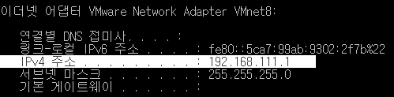
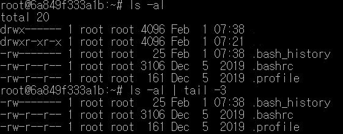
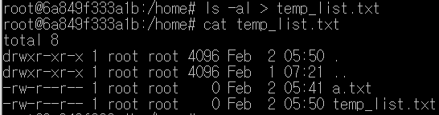

일반 유저가 타겟이었떤 MS도 초창기에 DOS를 채용하여 CLI였는데, 유저의 편의를 위해 GUI를 개발함.


MSSQL은 큰 규모에서 사용하지 않음


# 커널

* 리눅스에서는 커널을 커스터마이징할 수 있다.
* 커널의 레이어와 통신을 하기 위해서 쉘(명령어 해석기)을 사용한다.
* 쉘은 csh, bash 등이 존재한다.
* 쉘을 통해서 응용 프로그램들이 실행하게 된다.
* 우리는 쉘을 통해서 응용 프로그램들을 실행시켜야 하기 때문에 리눅스 명령어들을 익히는 것을 목적으로 한다. (커널 프로그래밍X)


#  GNU 프로젝트

* 모두가 공유할 수 있는 소프트웨어를 만드는 것이 목표

* GNU와 다르게 `GPL(General Pulbic License)`은   상용 소프트웨어 개발 시 비용을 지불해야 함
* 소프트웨어 설계시 사용할 오픈 라이선스에 대한 걸림돌들을 체크해야 한다.
* 삼성전자의 경우 소송당한 사례가 있음.


apt-get : 패키지 설치 시 명령어

ec2 사용할 때, apt-get 명령어를 사용함.

-y 옵션을 주면 설치 중간에 물어보는 모든 질문에 자동으로 y응답하여 설치


---

가상머신의 사용 메모리가 커지면 호스트 속도가 떨어짐

---


# 도커 우분투 실행

도커에 설치한 우분투로 명령어 실습

```sh
docker ps -a					# 컨테이너 리스트
docker start ubuntu_os			# 멈춰있던 ubuntu_os 컨테이너 시작
docker exec -it ubuntu_os /bin/bash	# 실행 중인 컨테이너에 명령어(/bin/bash) 명령어 실행
```

*run, start, exec 차이 알아보기!

  


# 리눅스 기본 명령어

## `ls`: 해당 디렉터리에 있는 파일의 목록을 나열

```shell
ls						# 현재 디렉터리의 파일 목록
ls /etc/systemd			# /etc/systemd 디렉터리의 파일 목록
ls -a					# 현재 디렉터리의 목록(숨김 파일 포함)
ls -l					# 현재 디렉터리의 목록을 자세히
ls *.conf				# 확장자가 confg인 목록
ls -l /etc/systemd/b*	# /etc/systemd 디렉터리의 b로 시작하는 파익 목록
```

* 리눅스는 숨김 파일이라는 속성이 별도로 존재하지 않는다. 파일 이름이나 디렉터리의 맨 앞 글자가 '.'이면 자동으로 숨김 파일이 된다.

## `cd` : (change directory) 디렉터리를 이동

```sh
cd					# 현재 사용자의 홈 디렉터리로 이동. 만약 현재 사용자가 root이면 root 디렉터리로 이동
cd ~ubuntu			# ubuntu 사용자의 홈 디렉터리로 이동
cd ..				# 바로 상위 디렉터리로 이동
cd /etc/systemd		# /etc/systemd 디렉터리로 이동(절대경로)
cd ../etc/systemd	# 상위 디렉터리로 이동한 후 /etc/systemd로 이동(상대 경로)
```


## `pwd` : (Print Working Directory) 현재 디렉터리의 전체 경로를 출력


## `touch` : 크기가 0인 새 파일을 생성하거나, 이미 파일이 존재한다면 파일의 최종 수정 시간 변경

```shell
touch abc.txt
```


## `mkdir` : (MaKe DIRectory) 새로운 디렉터리 생성

* 생성된 디렉터리는 명령을 실행한 사용자의 소유가 된다.


## `rmdir` : (ReMove DIRectory) 디렉터리 삭제

* 해당 디렉터리가 비어 있고 디렉터리에 대한 삭제 권한이 있어야 한다.
* 파일이 들어 있는 디렉터리를 삭제하려면 `rm -r`을 실행한다.

cp


rm


mv


cat


head, tail

```sh
head /etc/gai.conf
head -1 gai.conf # 해당 파일의 앞 3행만 화면에 출력
tail -5 gai.conf # 해당 파일의 뒤 5행만 화면에 출력
```


more

- 텍스트 형식으로 작성된 파일을 페이지 단위로 화면에 출력한다.
- `space bar` : 다음 페이지 이동
- `B` :  앞 페이지 이동
- `Q`: 종료

less

* `more` 명령어와 용도가 비슷하지만 더 확장된 기능의 명령어이다.
* `more` 명령어에서 사용하는 키도 사용할 수 있고 추가로 방향키, `PageUp`, `PageDown` 도 사용할 수 있다.

file

* 해당 파일이 어떤 종류의 파일인지 보여준다.

clear


sudo 설치

```shell
apt-get update && apt-get install -y sudo
```


# 네트워크 명령어

## 네트워크 정보 파악

* ifconfig 등 네트워크 관련 패키지 설치

```shell
sudo apt-get install net-tools
```


### 호스트 OS IP 주소 확인

* 윈도우 명령 프롬프트에서 `ipconfig` 또는 `ipconfig/all` 을 통해서 VMnet8을 확인
* ip주소 중 세 번째 숫자는 VMware를 설치할 때마다 0~255 중 하나가 임의로 할당되므로 VMware를 재설치하면 이 숫자가 바뀐다. 만약 교재와 동일하게 111이라면 우연의 일치이다.



### 가상머신 IP주소 확인

* `ifconfig ens32`  또는 `ifconfig` 명령을 통해 IP주소 확인
* `ifconfig ens32`는 안 먹힘


```sh
cat /etc/hosts
```


도커를 사용하면 127.0.0.1 의 도메인 네임이 바뀐 것을 확인

`localhost` -> `kubernetes...`

gateway.docker.internal 은 자주쓰는 ip를 캐싱해놓음


ubuntu 지원 		

```sh
nm-connection-editor
```


```shell
netstat -a
```

윈도우에서는 인터네셍 연결됐기 때문에 출력되는 것들이 있음


# 파일 압축과 묶기

```sh
tar cvf *
tar xvf *
```


# 파일 위치 검색

리눅스에서 특정 파일의 위치를 검색하는 명령어는 find, which, whereis, locate가 있다.

## find 경로 옵션 조건 action

```shell
find /etc -name "*.conf"
find /home -usr ubuntu					# /home 디렉터리에 있으며 소유자명이 ubuntu인 파일 검색
find ~ -perm 644						# 현재 사용자의 홈 디렉터리 하위에 있는 허가권이 644인 파일 검색
find /usr/bin -size +10k -size -100k	# /usr/bin 디렉터리 하위에 있으며 크기가 10~100KB인 파일 검색
find ~ -size 0k -exec ls -l {} \;		# 현재 사용자의 홈 디렉터리 하위에 있으며 크기가 0인 파일의 목록을 상세히 출력
find /home -name "*.swp" -exec rm {} \;	# /home 디렉터리 하위에 있으며 확장명이 *.swp인 파일 삭제
```


`-exec` 와 `\;` 는 외부 명령어의 시작과 끝을 나타냄

`rm {}` : find 명령어의 실행 결과인 *.swp 파일이 rm 명령으로 실행됨. 즉 파일이 삭제됨


## which 실행파일명

PATH 설정된 디렉터리와 절대 경로를 포함한 위치를 검색한다.

명령어 존재를 확인할 때 사용한다.

# whereis 실행파일명

실행 파일과 소스, man 페이지 파일까지 검색한다.

명령어 존재를 확인할 때 사용한다.

# locate 파일명


# 파이프, 필터, 리디렉션

## 파이프

두 프로그램을 연결하는 연결 통로를 의미하며 '|'를 사용한다.

여러개 명령어 연결할 때



## 필터

필요한 것만 걸러주는 명령으로는 grep, tail, wc, sort, awk, sed 등이 있으며 주로 파이프와 같이 사용한다.


## 리디렉션

표준 입출력의 방향을 바꾸는 것

표준 입력은 키보드이고 표준 출력은 화면이지만, 이를 파일로 처리하고 싶을 때 주로 사용



