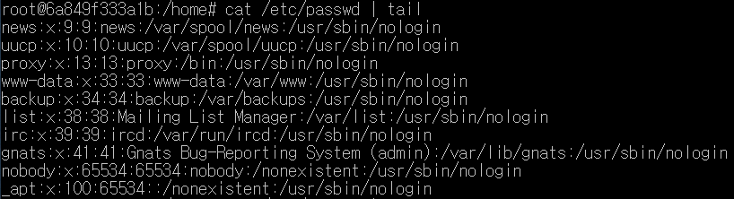

# 사용자 관리


## 사용자 비밀번호 관련 정보 확인

```sh
cat /etc/passwd
```


`사용자 이름:비밀번호:사용자ID:사용자 소속 그룹 ID:추가 정보:홈 디렉터리:기본 쉘`

추가 정보에는 `이름, 방 번호, 직장 전화번호, 집 전화번호, 기타` 가 있다.

## 그룹 비밀번호 관련 정보 확인

```shell
cat /etc/group
```


`그룹 이름:비밀번호:그룹ID:보조 그룹 사용자`

보조 그룹 사용자는 이 그룹을 주 그룹이 아닌 보조 그룹으로 사용하는 사용자의 목록이며, 여러 명이면 쉼표로 구분된다.


## 사용자와 그룹 관련 명령어

### 새로운 사용자 추가: adduser

- home 아래에 디렉터리 생성됨
- 새로운 사용자를 추가하는 `adduser` 명령어를 실행하면 /etc/passwd, /etc/shadow, /etc/group 파일에 새로운 행이 추가됨


### 사용자 삭제: userdel





#### 그룹 생성: groupadd

* 그룹 생성 후, 해당 그룹에 사용자를 추가하기


# 파일의 소유와 허가권

## 파일 유형

```shell
ls -l
```

- sticky bit: 파일 유형


## 파일 허가권

```shell
chmod
```


## 파일 소유권

* 소유권 가지고 있는 사용자가 소유권을 부여해야 함

```sh
chown
```


## 사용자 변경

```shell
su cloudmsa
```


## 링크 *보충필요

원본 파일 데이터 없어지면 심볼릭 링크 파일을 열 때 에러가 남

꼭 써야할 때는 사용자별로 일일이 변경해줘야 하는 수고로움이 있을 경우

필요악. 최소로 사용 권장

- 해커는 심볼릭 링크 파일을 통해 원본 파일을 공격하기 도함
  - 원본 데이터를 변경하거나
  - 쉘코드를 심어서 실행시킨다.

# 프로세스, 서비스(데몬) *보충필요

프로세스

- 포그라운드 프로세스
- 백그라운드 프로세스

스레드


서비스와 소켓

* 서비스: 평상시에도 늘 작동하는 서버 프로세스
* 소켓: 필요할 때만 작도하는 서버 프로세스

```shell
systemctl start/ stop/ restart 서비스명
```


