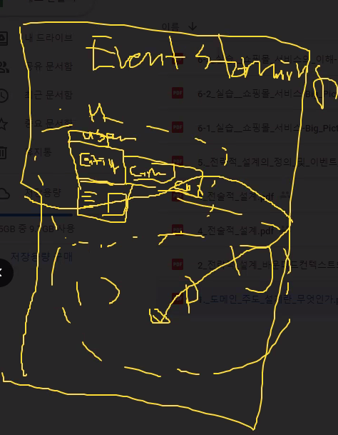

# 모놀리틱


- 프레젠테이션 티어 , 비즈니스 티어, 리소스 티어를 하나의 서버에에 담았음
- 하나의 DB로 운영하는 경우가 대부분

CBD로 구현했었음    


## 장점

- 트랜잭션 관리하기 쉬움


## 단점

- 하나의 서비스 수정이 다른 서비스에 영향을 미칠 수 있음
- 


 

# MSA


- 비즈니스 티어의 서비스 단위로 나누고(물리적으로 하나/따로 배포되든 상관없이) 각 서비스가 독립적 실행 환경을 갖는다.
- 서비스단위로 DB와 묶는 것. 동일한 DB를 공유하는 경우도 있긴하다
- REST형태로 API만 제공(모놀리틱도 REST API 제공할 수 있음)
- 프론트에서 필요한 리소스를 가져다 쓰는 형태
- 문법이 달라지지 않음
- 모놀리틱의 CBD로 구현된 것은 가져오기 쉬움
- 서비스 api로 메쉬업해서 새로운 서비스를 만들기 쉬움(단, 의존성없는 서비스가 보장되어야 함)
- api를 제공하는 서비스가 MSA 프로젝트에 적합함
- DDD는 서비스를 쪼개는 개발 가이드(DDD는 MSA에 적합한 개발 방법론)
- 서비스를 쪼개기 위해서 모델을 어떻게 정의할 지에 대한 논의가 필요함
- MSA 꽃은 이벤트 기반  개발
- 애플리케이션 메쉬업, 네트워크 메쉬업을 통해서 빠르게 서비스 개발이 가능하다.


단점도 있다.

- integration 고민
- 트랜잭션 고민


## METHODOLOGY

process: scrum

notation: UML(sequence, ER Diagram ...), document(ppt, word...)

경험론 : pattern, LL(프로젝트 종료 후 데이터화-노하우 구축)

- 프론트, 백엔드에서 MVC, Layer
- react mobx - observer pattern
- [GOF](https://www.google.com/url?sa=t&rct=j&q=&esrc=s&source=web&cd=&ved=2ahUKEwjG3O3z28fvAhXxy4sBHQo6CfAQFjACegQIAhAD&url=https%3A%2F%2Fbuihuycuong.medium.com%2Fthe-23-gang-of-four-design-patterns-974ae8d1a957&usg=AOvVaw1a8U8ITieqE48lnqZ0JaaL)
- 디자인 패턴을 쉽게 배우는 방법은 내가 사용하는 라이브러리를 뜯어보면 됨


```
신입 개발자들에게 원하는 것
빠르게 기술을 습득해서 조직에 적용하는 능력
"AWS 서비스들을 사용해봤습니다." 라고 말해야 함. (잘 써본다 X)
어려웠던 점을 말하면서 이 회사 시니어 개발자들한테 잘 배우고 싶다라고 말하면 됨
```

```
JAVA EE는 엔터프라이즈 솔루션을 위한 것이기 때문에 러닝커브가 높음
기존의 서비스가 spring으로 되어있는 것이 많기 때문에 spring boot 기반의 MSA 프로젝트로 전환하려고 한다.
다른 것으로 바꾸는데 부담이되기 때문이다.
```

```
요즘 금융권도 MSA로 전환하는 추세가 보임
```


# 1. 도메인 주도 설계란

유저스토리 작성한 것을 바탕으로 DDD 작성하는게 목표


**도메인** : 자동화된 비즈니스나 현실세계의 문제

흔히 어떤 문제를 해결하기위한 서비스를 기획할 때, 그 문제 영역을 가리킨다.

도메인 -> 서비스

problem 도메인 -> 요구사항(유저스토리) 도출

유저스토리를 도출할 때, 누가 무엇을 수행하는지 결정하는데

누가(stakeholder) :고객, 도메인 전문가, 아키텍트, 분석가, 개발자

보통 도메인 전문가가 없는 경우가 많은데, 해당 업무를 수행해본 컨설턴트라도 참여해야 프로젝트가 망하지 않는다.


abstraction: 현실 세계의 문제를 단순화 시키는 것...........?????

**모델** : 구현 가능한 형태로 실체화


이게 스타벅스야 ? 대부분 스타벅스를 상상할 수 있음

현실세계의 스타벅스를 다른 사람이 잘 알아먹도록 모델링한 것

사용자가 이해할 수 있는 형태로 모델링한 것

프로그래밍은 모델링을 해야 하는데, 모델링은 사용자가 딱 보고 알 수 있게, 사용하기 쉽게 만들어야 한다.

내가 그렇다면 그런줄알아 마인드 ㅋㅋㅋㅋXXXX


## 전략적 설계

요구사항(유저스토리) 정의

서비스 정의

1. 바운디드 컨텍스트 식별⭐
   - 이때 Event storming tool 을 사용 - 펜하고 포스트잇이 준비물
   - 
2. 유비쿼터스 언어 정의
   - 실제 사용자의 언어를 의미.


프로젝트 팀원 X - 실 사용자가 사용하는 언어로 정의

도구로써 제일 많이 사용하는 건 Event storming

도메인전문가가 유비쿼터스 언어 정의

개발자는 금융에서 수신,여신과 같은 용어를 잘 모름

그래서  용어사전도 별도로 만듬

## 전술적 설계

 서비스들을 전술적 설계= 분석설계

(분석설계는 F, NF 관련용어)

API 정의⭐


바운디드컨텍스트로 유저스토리를 작성하고 도메인 작성


db모델링에서 entity 정의하는 방법과 유사


**entity**: 식별자를 가지며 영속성이 필요한 객체

db랑 매핑해서 저장


object 종류: entity, value object, context object

**value object** 는 pk를 가지고 있지 않음


vo는 보통 enum 타입으로 정의

ex)고객의 타입

**애그리게잇**: 업무상 관련있는 객체들의 집합


entity + VO => 애그리게잇


# 전략적 설계의 정의 및 이벤트 스토밍 기법

유저스토리 -(input)> 이벤트스토밍 -(output)> 바운디드 컨텍스트


# 실습) 쇼핑몰 서비스 -pig picture 그리기


모놀리틱에서는 처음부터 완벽하게 하려다 납기일 다 되어서 불완전한 제품을 제공하는 경우가 허다함

애자일에서는 이젠 그러지 말자... 일단 시작하자.. 반복을 통해 구체화하자! big picture!!!

나랑 생각이 다르더라도 경청하세요. 다름을 인정해라.

개발자 중에 고집센 개발자 엄청 많음

유연한 생각을 가져라. 기술 책만 읽지말고 비즈니스 관련 책을 많이 읽어라

netscape 사의 사례를 기억하라. 기술은 좋지만 비즈니스가 안 돼서 찢겨 사라졌다.


RBAC(Role Based Access Control)


영속성있게 관리될 데이터를 entity로 도출한다.

핫스팟 - 예를들어 rsa 관련된 정보 첨부

유저스토리 작성할 때 인풋, 아웃풋, 사용자, 업무흐름, 탑다운

- 클래스다이어그램 - 엔티티간의 관계

- 시퀀스 다이어그램
- ER 다이어그램


# 산출물 가이드(공유 클라우드)

산출물 가이드 유저스토리 작성 가이드

가이드대로 안하고 이벤트 스토밍하듯이 이벤트 도출하고 흐름 파악해도 됨

탑다운 방식으로 lv1,2,3

스토리 id 는 임의로 부여

주요흐름, 선택흐름, 예외흐름, 사용자,사전사후 상태, 입력정보 , 출력정보,

WBS, 서비스 아키텍처는 기획서에 나중에 포함

planning, iteration 정도만 산출물 뽑는다.

transition: 서비스를 실제 제공하는 단계. LL 정리

api 설계서가 가장중요. 어떤 데이터가 들어가서 어떤 데이터가 나오는지

큰 목업작업은 이번주, 늦어도 31일까진 마무리 되어야 하고. 2일부터 개발 시작해야한다.


이것처럼 event 쫙 나열하는것부터 시작

[MURAL is a digital workspace for visual collaboration](https://www.mural.co/)