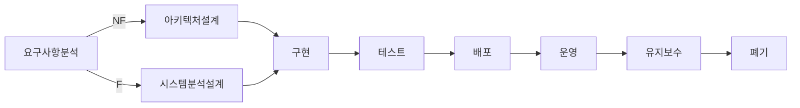
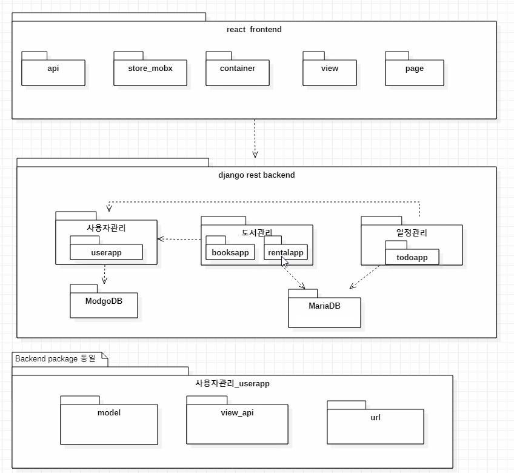
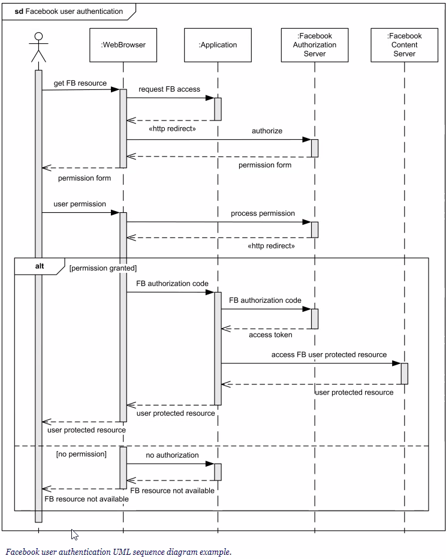

3.26

# UML

- 객체 기술에 대한 표준화 기구(OMG:Object Management Group)에서 인정한 객체지향 분석, 설계를 위한 모델링 언어(모델을 표현하는 언어)
- 건축물을 설계하는데 CAD가 사용된다면 객체지향 언어(python, java, c++)로 프로그램을 개발하는 데는 UML이 사용됨

### UML 특징

- 가시화 언어: 표현이 풍부한 시각적 언어. 의사소통을 용이하기 함
- 구축 언어: 특정 프로그래밍 언어나 개발 공정에 종속되지 않음
- 명세화 언어: 정확한 모델 제시, 완전한 모델 작성, 분석-설계의 표현
- 문서화 언어: 시스템에 대한 평가, 통제, 의사소통의 문서(요구사항, 아키텍처, 설계, 소스 코드, 프로젝트, 계획)
- 모든 UML은 크게 things와 relationship으로 구성. thinks와 relationship에 따라 UML 표현이 달라짐.

### UML 구성요소

사물

- 구조: use case, interface, class, object ...
- 행위: interaction, activity, state machine
- 그룹: package
- 주해(Annotation): note

관계

- 의존(dependency) 관계
- 연관(assocation) 관계
- 일반화(generalization) 관계
- 실제화(realization) 관계

다이어그램

- 정적모델

  - ojbect D
  - class D
  - component D
  - Deployment D
  - Package D
  - Composite Structure D

- 동적 모델

  - Sequence D

  - Activity D

  - State D

  - State Machine D

    ...

# 4+1 view

### 4+1 VIEW 정의

- 고객의 요구사항을 정리해 놓은 시나리오를 4개의 관점에서 바라보는 Software적인 접근 방법
- 복잡한 소프트웨어 아키텍처를 다양한 이해관계자(Stake-holder)들이 바라보는 관점으로서, View는 시스템의 여러 가지 측면을 고려하기 위한 다양한 관점을 바탕으로 정의되며, UML의 4+1view가 표준임.

### 4+1 view 모델의 필요성

- 

**소프트웨어 라이프사이클**

- 아키텍처 설계 시 여러 가지 방법이 존재

  - 그 중 하나가 4+1 architectural view model(Kruchten의 논문에서 처음 나타난다.)

  - RUP(Rational Unified Process): 10년 정도 우리나라 기업, 공공기관에서 많이 사용한 모델. Kruchten이 만든 model을 의미

  - 이후 UML이 Boot의 object 표기법을 사용하면서 4+1 

  - 건축 도면도 전체 도면, 상세 도면, 배관도 등 여러 관점이 있듯이 소프트웨어도 전체적인 운영환경, 구조 관점, 구현 관점, 배포 환경의 관점에 따라서 다양하게 표현해보자!

  - | view                      | 사용 다이어그램                           | 특징                                                         |
    | ------------------------- | ----------------------------------------- | ------------------------------------------------------------ |
    | process view              | deployment diagram                        |                                                              |
    | design(설계) view         | class diagram                             |                                                              |
    | implementation(구현) view | sequence composite structure diagram | 스펙만 따르면 다이어그램간 변환 가능                         |
    | deployment(배치) view     | deployment diagram                        |                                                              |
    | usecase view              | usecase diagram                           | * 요구사항과 관련 된 것. * +1에 해당 * UML작성할 때 가장 먼저 작성되고 필수 산출물 * usecase를 중심으로 다양한 관점의 산출물(나머지 4view)을 도출 * 시스템의 동작을 사용자의 입장에서 표현한 시나리오 * 시스템의 관련한 요구사항을 알아내는 과정 * 소프트웨어 개발 프로세스 중 개발을 위한 소프트웨어의 기능을 개략적으로 설명이 가능한 방법 |

### 5view가 아니라 4+1view인 이유

- 시나리오란 고객의 요구사항을 만족시키기 위해 시스템이 사용자와 상호작용하는 방법
- usecase 하나가 표현하는 요구사항을 만족시키려면 4개 view가 합심해야 한다.
- usecase는 4개 view에 영향을 미치고 4개view는 시나리오를 중복해 다룸
- +1이라는 것은 usecase가 나머지 4개 view에 모두 참여하면서 영향을 준다는 의미

### 우리 프로젝트에선 어떻게 적용했나?

- 우리는 usecase 작성 X

- ERD를 대체하거나 ORM할 수 있는 design view를 제공하는 **class diagram**을 작성

- 시간의 흐름에 따른 동작을 표현하기 위해 **sequence diagram**이나 composite diagram을 작성(우리나라에서는 sequence를 더 많이 사용한다.)

  

# domain model diagram

<<enumeration>> 은 <<value object>> 로 ddd로 익숙한 표현으로 바꿀 수 있다.

## example: online shopping

{} 사용하여 제약사항을 표현할 수 도 있다.

# 패키지 다이어그램

# 시퀀스 다이어그램

시간흐름에 따라 작성

things: actor, object,

화살표 한쪽 날개 또는 두쪽 날개에 따라 sync, async 구분

보통 시퀀스는 주 흐름만 표현

에러흐름, 예외흐름은 별도로 ??

# 유즈케이스 다이어그램

일단 다이어그램은 의사소통을 원활하게 하기 위한 목적

크게 제약을 느끼지 말아라!

산출물의 목적, 노테이션의 목적은 stakeholder간 의사소통을 하기위한 목적이다. 표준을 보고서 작성하는게 아니라 회사의 산출물 가이드를 보고 그것에 맞게 해석하고 작성한다.

starUML 자료 공유됨

# 시험

EC2, 오토스케일링이 대다수 문제

데이터베이스

- Elasticache - redis 역할.