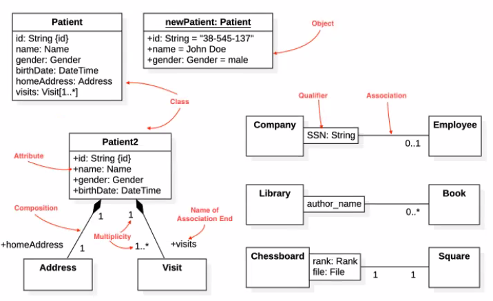
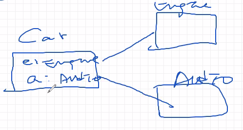
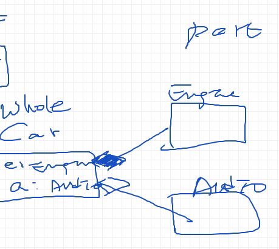
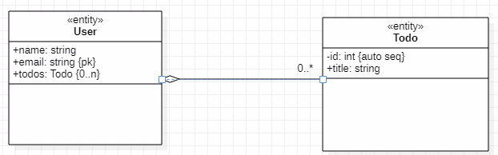
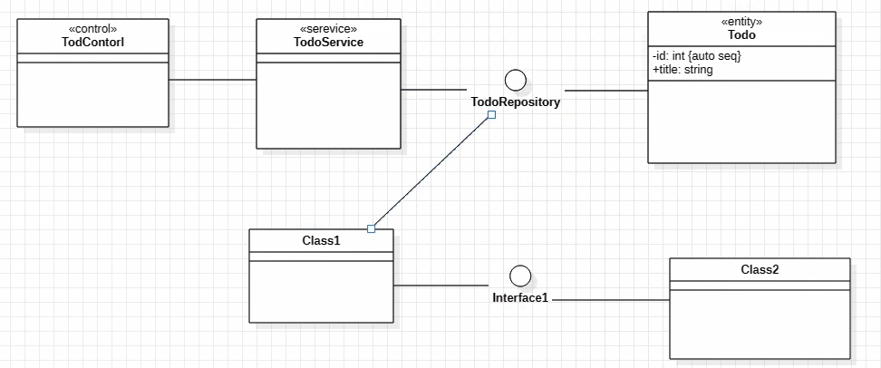
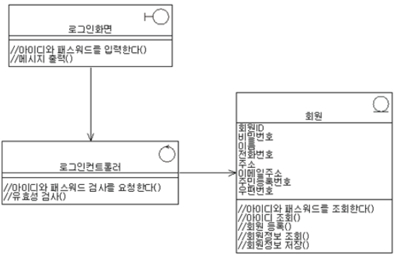

# 클래스 다이어그램



### 개념

- starUML에서 DesignView 디렉토리로 관리
- 클래스와 클래스들의 관계를 나타낸다.
- 모든 UML은 diagram, things, relationship으로 나뉘는데, class diagram에선 사물(things) = class
- UML
  - Diagram
    - things 사물
    - relationships 관계
- 어떤 관점에 따라서 개체와 관계를 표현하느냐에 따라서 diagram이 결정된다.

<<>> (스테레오타입) : 클래스 유형 지정(abstract, boundary, control, entity...)

variable : type=(초기값) {제약사항}

access modifier ( , +, #, -.) : public, protected, private, default

콜론 뒤에 타입

access_modifier variable : type = 초기값 {제약사항}

### class model element 문법

expression ::= [ '<<' stereotype '>>' ] [ visibility ] name = [ 초기값 ] [ '{' 제약사항 '}' ]
stereotype ::= (identifier)
visibility ::= '+' | '#' | '-' | '~' (access modifier, 접근 제한자)
name ::= (identifier)

|             | 어디서나 | 다른 package(DIR) | 같은 package(DIR) | 같은 class |
| ----------- | -------- | ----------------- | ----------------- | ---------- |
| public +    | O        | O                 | O                 | O          |
| protected # | X        | O                 | O                 | O          |
| default     | X        | X                 | O                 | O          |
| private -   | X        | X                 | X                 | O          |

*같은 패키지에 있을 땐 상속 관계가 아니더라도 O 표시된 access modifier는 모두 접근 가능하다.

유저스토리나 이벤트스토밍으로부터 클래스를 도출할 수 있다.

클래스는 변수, constructor, method로 구성된다.

3가지 영역으로 구분해서 표시한다. class name, variable 영역, method영역(constructor를 포함)

method 영역만 제외하고 작성하면 됨. 왜 ? ORM 사용할거거든(데이터 모델링 대신)

### 세부 표현법

#### 클래스 간 관계 표현 방법

1. association
   - aggragation, composition 포괄하는 개념
2. aggregation
3. compositon
4. dependency
5. generalization
6. interface realization


car, engine, autdio






USER생성하면서 TODO가 반드시 생성되는건 아니므로 association 또는 aggragation


상속은 generalization

realization은 인터페이스: 상속받는 자식이 abstract method를 의무적으로 오버라이딩해야하는 의무가 있다. 그렇지 않으면 


dependency: 의존성. 두 클래스가 영향을 받으면서 변하는 관계


DB에서는 2차원이기 때문에 n:m의 관계를 표현하지 못한다.

다대다 관계를 표현하는 다양한 방법이 있으므로 


실무에선 클래스 다이어그램과 ER다이어그램 별도의 산출물을 만든다.


/ : derived attribute (수량 + 단가 -> 금액)

## 실무에서의 클래스 다이어그램

### 클래스 다이어그램 표현 목적

- 엔티티 간의 관계를 나타내는게 아니라, 서비스 간의 관계를 표현하기 위한 목적
- 원래 클래스 다이어그램은 MVC 패턴으로 그려야한다.
- 분석 단계: entity, controller, boundary (MVC)뽑아서 관계를 표시. 개념 위주로 하기 때문에 이 단계에서는 conceptual class diagram이라 부른다.
- 설계 단계: 이 단계에서 기능까지 자세히 표현하기 때문에 클래스 다이어그램을 분석 단계에서 implementation diagram이라 부른다.
- 클래스 다이어그램에서 entity와 entity가 직접 연관되는 경우는 보통 없다.


**V(view) C(control) M(Boundary)**



MSA에서는 Presentation단의 템플릿을 직접 구현하지 않고 api로 전달하기 때문에 control단부터 관계를 나타내면 된다.

우리는 클래스 다이어그램을 ERD 형태로 그리지만, 실무에서 그렇게 그리면 실무에서 욕 먹는다.

다음은 실제 쓰이는 방법을 알려준다.

보통 서비스에서는 직접 entity를 호출하지 않고 액세스 인터페이스를 통해 받아온다.

클래스 다이어그램은 다른 클래스들과의 관계를 표시한다. ERD처럼 entity간의 관계를 표시하지 않는다.(클래스 다이어그램과 E-R 다이어그램을 구분해라)

```
☝요약
실무에서 클래스 다이어그램은 모든 클래스(control, service, interface, entity)간의 호출과 관계를 모두 표현하는 것이지, entity(데이터)간의 관계를 표현하지 않는다.
```


### 클래스 다이어그램과 E-R 다이어그램 차이점

실세상의 내용을 클래스로 추상화하여 그들간의 관계를 맺어줌으로써 구현할 소프트웨어의 정적인 구조를 설명한 것이 클래스 다이어그램인데, 이것은 정보공학 방법론의 ERD와 유사해 보인다. 사실 <<entity>>로 정의된 클래스만 등장하는 클래스 다이어그램이라면 ERD와 크게 다를 게 없다.

둘 다 시스템의 정적인 면을 설명한다는 점에서 동일하다. 하지만 모델링의 패러다임으로 비교해보면 차이가 있다. 정보공학 방법론에서는 시스템의 정적인 구조를 ERD로 설명하고, 시스템의 동적인 구조는 DFD(Data Flow Diagram)로 설명하는 것이 일반적이다.

그에 반해 UML을 이용하는 방법론에서는 시스템의 정적인 구조를 Usecase 다이어그램, 클래스 다이어그램 등으로 표현하고, 동적인 구조는 시퀀스 다이어그램과 콜라보레이션 다이어그램 등의 상호작용 다이어그램으로 표현하는 것이 일반적이다.

그렇지만 양쪽 패러다임이 다이어그램만으로 명확하게 분리되는 것은 아니다. 정보공학 방법론에서 사용하는 다이어그램이든, UML을 이용하는 방법론의 다이어그램이든 상황에 따라 서로가 혼합되어 사용된다.

객체지향 패러다임으로 시스템을 모델링하고 객체지향 언어로 개발을 한다고 하더라도 데이터베이스는 관계형 데이터베이스(RDB: Relational Database)를 사용하는 경우가 대부분이어서 **데이터베이스 설계를 위한 데이터 모델링에 클래스 다이어그램을 사용하기 보다는 오히려 ERD를 사용하게 된다.**

물론, UML의 클래스 다이어그램을 이용하여 ERD와 거의 동일한 모습으로 모델링이 가능하지만 그 영역이 다르고 아직 DBMS를 지원하는 Round-Trip Engineering은 기존의 데이터 모델링을 지원하는 CASE Tool 쪽의 기능이 편리하고 강력하기 때문에 클래스 다이어그램을 이용하여 데이터 모델링을 하는 경우는 드물다.

클래스 다이어그램에서 entity를 표현할 때는 *Primary key*나 *Foreign key*와 같은 데이터 모델링 요소에 대한 작업이 어렵기 때문에 entity들의 단순한 상관관계를 파악하는 수준으로 모델링하게 된다. 일부 객체지향 CASE Tool에서 클래스 stereo type을 <<table>>로 정의하고 데이터 모델링을 할 수 있도록 제공하고 있지만 결국 데이터 모델링 다이어그램으로 전환해야하는 작업이고, 전문적인 ERD 작성 도구와는 숙련도와 활용도의 차이로 인해 결국은 전문적인 데이터 모델링 도구를 사용하여 작업하고 있다. 여기에서 만약 두 모델의 연관성을 가져가려 한다면 서로 호환과 모델 변환이 잘 되는 도구를 선택하여야만 한다.

```
☝요약
클래스 다이어그램
E-R 다이어그램: entity들의 관계를 나타내어 RDBMS의 데이터 모델링을 하기 위해 사용한다.
```

### 분석 단계의 클래스 다이어그램

분석 단계에서 사용되는 클래스에서는 성능과 아키텍처를 고려한 구현 레벨의 오퍼레이션과 속성을 정의하지 않고, Usecase 명세서를 기반으로 시스템의 layer에 적합한 클래스와 해당 클래스가 수행해야하는 책임의 수준으로 내용을 작성한다.

분석단계의 주 목적이 <<boundary>> 를 담당하는 UI 클래스, <<control>>을 담당하는 비즈니스 프로세스 또는 비즈니스 로직 클래스, <<entity>>를 담당하는 데이터 클래스를 정의하고 이들간의 메시지 전달을 모델링하여 유스케이스 구현에 대한 논리적인 흐름을 모델링하는 것이다보니, 시퀀스 다이어그램이 주 작업이 되고 그 결과로 나타나게 되는 클래스 다이어그램은 시스템 구성 요소들의 관계에 대한 overview 성격이 강하다.




```
☝요약
시퀀스 다이어그램으로부터 나올 수 있는 산출물이 클래스 다이어그램이다. 
클래스 다이어그램의 클래스는 <<boundary>>, <<control>>, <<entity>>로 구분된다.
분석 단계의 클래스 다이어그램에선  속성과 연산의 code는 없다.
그래서 access modifier에 대한 언급도 없다.
```


<참고내용>

- 3.26(1) 49분 14초. 3월4째주>UML수업 내용
- [변화와 기다림의 사이 (daum.net)-정리완료(마지막 문단 제외)](https://blog.daum.net/hankylee/18?category=522586)