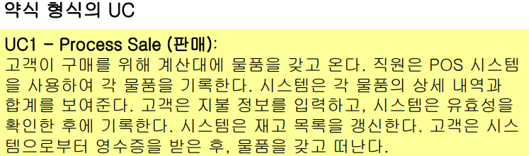

usecase

- 시스템을 사용하는 줄거리(story)

- 유스케이스는 다이어그램이 아니라 텍스트이다.

- 요구사항 수집 및 정의 단계에서 널리 사용됨

  - 특히, 시스템의 기능과 환경을 살펴보는데 좋다.

- 

- 참고)[소프트웨어개발방법론 (kocw.net)](http://contents.kocw.net/KOCW/document/2014/Seowon/SongHaesang/04.pdf)

  

요구사항 수집 및 정의를 위해서 유스케이스 시나리오와 다이어그램을 그리는구나

❓ECB패턴으로 아키텍처 분석을 왜 하는지는 모르겠다...

UML을 이용하여 시스템 분석할 때 가장 많이 사용하는 분석 기법이 MVC 아키텍처 패턴이다. 

> 아키텍처 패턴 != 디자인 패턴

MVC 패턴은 객체지향 패러다임의 가장 기본적인 아키텍처로써 시스템을 구성하는 구성요소에 대한 기초적인 사항을 정의한다. 객체지향 패러다임이 반드시 MVC패턴을 지킬 의무는 없지만, 객체지향 패러다임에서 나름대로 정의한 기본적인 아키텍처이기에 굳이 지키지 않을 이유도 없다.

객체지향 패러다임에서 기본적으로 사용하는 MVC패턴을 UML에서는 나름대로의 의미를 부여한 스테레오타입(Stereotype)의 클래스를 이용하여 아래와 같이 시스템의 아키텍처를 기본적으로 정의하고 있다.

- view : <<boundary>> 클래스. 시스템 내부와 시스템 외부의 연결을 담당하는 부분
- controller : <<control>> 클래스. 시스템 내부의 비즈니스 로직과 연산을 담당하는 부분
- model : <<entity>> 클래스. 데이터의 관리를 담당하는 부분

>여기에서 클래스는 코드 수준의 물리적 클래스가 아니라 논리적인 수준으로 그 역할을 정의한 클래스를 말한다.
>
>이 내용을 액터와 시스템 간의 개념적인 모습으로 나타내면 다음과 같이 표현할 수 있다.
>
>
>
>그림에서 보듯이 액터가 요구한