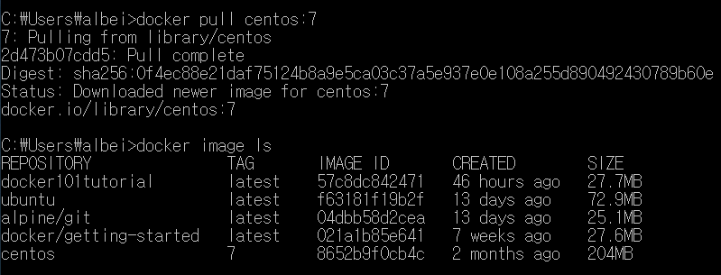
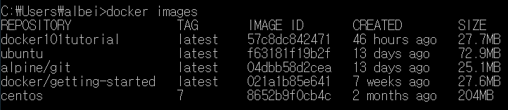
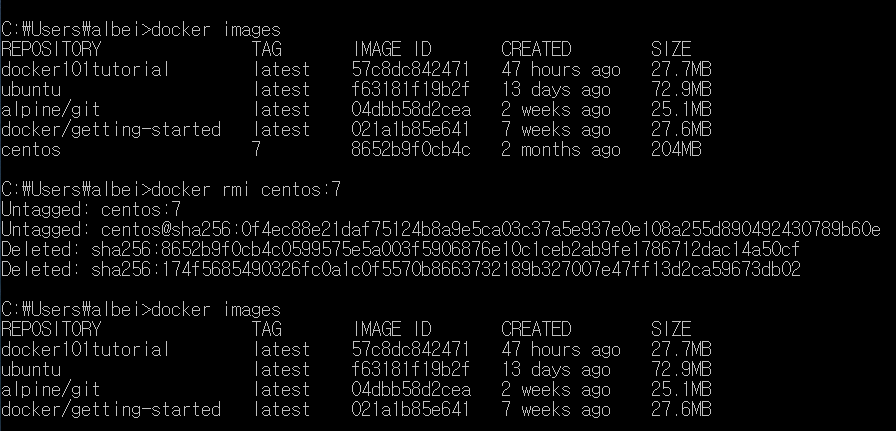
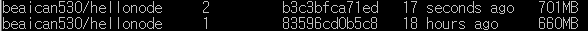

---

# 도커 개요


* 

도커는 이미지를 만들기 위해서 다양한 기능이 존재함

1. 빌드 (메인기능)
   * 빌드
2. ship (공유)
   * docker 이미지는 docker 레지스트리(docker hub)에서 공유 가능
3. run
   * docker는 리눅스상에서 컨테이너 단위로 서버 기능을 작동시킴
   * docker가 설치된 환경에서 docker 이미지를가지고 어디서든 컨테이너를 작동 가능


---

devops 엔지니어는 궁극적으로 개발자가 개발에만 신경쓸 수 있도록 개발 이외의 모든 과정을 자동화시켜야 한다. 개발자는 클릭으로만 개발 외 과정을 손쉽게 처리할 수 있도록 만들어주는 역할을 수행해야 한다.

---

# Docker 기능

docker 컴포넌트

- docker engine
- docker registry
- docker compose
- docker machine(docker 실행 환경 구축)
- Kubernetes(여러 컨테이너가 있을 때 오케스트레이션)
  - 여러 개의 도커 머신을 묶어주는 역할(클러스터링)
  - 노드: 클러스터를 구성하는 단위
  - 외부에서 요청이 들어오면 로드밸런싱 하는 역할

# Docker 작동 구조


# 도커 명령

이미지는 컨테이너 생성을 위한 틀

모든 것을 새롭게 빌드해서 사용하는 게 아니라 많이 사용되는 것들은 빌드되어 허브에 공유되어 있기 때문에 받아서 사용하는 것으로 활용한다.

official image는 믿을만함

버전명은 image 이름 뒤에 붙인다.

이러한 규칙은 문서로 제공된다.


`alpine`:도커 이미지로 경량화로 제공하는 것을 나타내는 태그

## 이미지 조작 명령어


### 이미지 다운로드

```shell
# 도커 레포지토리(hub.docker.com)에서 이미지를 가져오는 명령어
docker (image) pull [옵션] 이미지명[:태그명]
```



* 태그 안 붙이면 디폴트는 LTS
* LTS 가 없으면 해당 이미지의 홈페이지에서 다운로드

### 이미지 목록 표시

```sh
docker image ls <옵션> <레포지토리명>
docker images
```




### 이미지 상세 정보 확인

```shell
docker image inspect <이미지명:태그명>
```

* 키:값 형태의 JSON으로 반환
* 


### 이미지 삭제

```shell
docker rmi <이미지명:태그명>
# 보통 container가 생략된 것. 단순히 rm을 적어줄 경우 container를 삭제함.
# image를 삭제하는 rmi를 사용
```




### 이미지 생성

```shell
docker build -t <이미지명><:태그명> <dockerfile경로>
docker build -t <docker id>/<이미지명><:태그명> # docker hub에 공유할 경우
```

* 태그명 생략하면 디폴트는 LTS


### 이미지 공유

```shell
docker image push <이미지명><:태그명>
docker image push <docker id>/<이미지명><:태그명>
```


## 컨테이너 조작 기본 명령

### 컨테이너 리스트 보기

```shell
# 실행 중이거나 종료된 모든 컨테이너를 보여준다.
docker ps -a
```


### 컨테이너 생성

```sh
 docker (container) create
```


### 컨테이너 생성(create), 시작(start)

```sh
docker (container) run
docker run --name nodetest -p 9000:3000 beaican530/hellonode:1
```


### 시작

```shell
docker (container) start
```


### 컨테이너 접속

```shell
# 실행 중인 컨테이너에 접속한다.
docker exec -it <container id> bash
```


### 컨테이너 정지

```shell
# 실행중인 컨테이너를 멈춘다.
docker (container) stop <container id>
```


### 컨테이너 죽이기

```shell
# 실행을 즉시 중지하여 컨테이너를 종료한다.
# docker stop은 컨테이너를 정상적으로 종료할 시간을 제공한다.
# docker kill은 컨테이너를 중지하는 데 너무 많은 시간이 걸리는 상황에서 컨테이너를 종료할 수 있다.
docker kill <container id>
```


### 컨테이너 삭제

```sh
docker (container) rm <container id>
```


### 기존 컨테이너 변경하여 이미지 생성하기(이 방식으로 변경사항 적용X)

```sh
docker exec -it nodetest /bin/bash			# nodetest: 컨테이너명
t:apt-get update | apt-get install -y vim
t:vi app.js		# 수정, 저장
t:exit
# 기존 이미지는 변경되지 않은 상태

# 로컬 시스템에서 변경된 컨테이너의 새로운 이미지를 생성한다.
docker commit <container id> <username/imagename>
docker commit nodetest beaican530/hellonod:2
```





### 도커 허브 레포티토리에 로그인

```
docker login
```


CI/CD를 자동화해서 운영함

공유한 깃에 등록. dockerfile config가 등록되어 있음. 젠킨스에서 자동화하도록 스크립트 작성.

개발자는 build. 


제 컨테이너 생성시 포트는 필요 없음

지금 포트포워딩 필요는 없음

centos image로 터미널 여는 것까지 연습

1. 컨테이너 생성(이름 부여)

2. 컨테이너 리스트 확인 `docker ps -a`

3. 컨테이너 실행 `docker start centos_7`

   * <Error>: status가 단지 created 또는 exited 상태. 아직 run 상태X
   * <solution>: 컨테이너 재생성함. 근본적으로는 doc 참고!

4. d

   `docker run -it --name centos7 centos:7 /bin/bash`


d(daemon, 백그라운드)


포트포워딩: 서비서 포트 충돌 시, 변경해줄 수 있음


# 이미지 생성 및 공유 Dockerfile(3:00~) * 보충 필요

교재 59페이지


## 명령


### FROM절

가장 기본은 from 절


FROM golang:1.9

OS별도로 설치할 필요 없음

보통 내부적으로 go 언어를 실행할 수 있는 가벼운 운영체제를 같이 가지고 있음

거기서 go 언어를 위한 환경셋팅이 되어 있음


### RUN


### COPY


### CMD


## 환경 및 네트워크 설정

### ENV 명령

* PATH 설정


## 파일설정

### ADD 명령: 파일 및 디렉터리 추가


### COPY: 파일 복사


### VOLUME: 볼륨 마운트

도커 이미지가 문제가 되어서 도커 이미지를 다시 말아야 하는 상황.


로컬호스트에서 같이 유지할 필요성이 있을 경우

백업 기능


명령어 그닥 많지 않음


---

교재는 go언어를 사용하지만, 우리는 go 사용하지 않고 react 때문에 Nodejs를 사용할 예정이기 때문에

nodejs 이미지 가져옴

구글드라이브에서 js파일과 dockerfile 다운로드 받아

docker_workspace > image_build 로 이동


js 는 브라우저에서 돌아감

이는 브라우저가 컴파일하고 실행했기 때문

node도 이를 해줌


node를 사용하는 이유는 웹 말고 서버단 프로그램을 만들기 위해서 나옴

react, vue는 node기반에서 돌아감


express 없이 node를 사용해서 


## node 기본 문법

require = import


## node 기반 웹 서버 동작 방식

s노트에 그림


# node의 OS 확인(5:00~)


app.js 와 dockerfile을 도커이미지로 빌드하기


db등 다양한 형태로 빌드하는 방법은 내일

그다음 docker compose

포트포워딩 사용해서 컨테이너 재생성 해보기