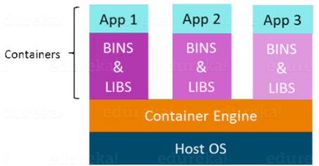
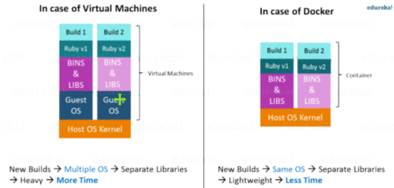

# 도커 왜 사용해?

## 컨테이너가 뭔진 알아?

- 컨테이너 기술 중 하나
- Docker社가 개발한 컨테이너 관리 소프트웨어
- 컨테이너 개념을 설명하기 위해 자주 인용되는 것이 가상머신(VM, Virtual Machine)

[컨테이너 역사 - CHROOT, Docker, KUBERNETES , OPENSHIFT (opennaru.com)](http://www.opennaru.com/openshift/container/history-of-the-container/)

개발자와 시스템 관리자 모두에게 유용한 기능을 제공하는 도구는 거의 없다. 도커가 그러한 도구이다.

간략히 말해서 도커는 소프트웨어 컨테이너화 플랫폼이다. 즉, 애플리케이션을 빌드하고 해당 종속성과 함께 컨테이너에 패키징한 다음 이러한 컨테이너를 쉽게 공유(ship)하여 다른 머신에서 실행할 수 있다.

>*For example*
>
>루비와 파이썬 두개로 작성된 리눅스 기반의 애플리케이션을 고려해보자.
>
>이 애플리케이션은 특정 버전의 리눅스, 루비, 파이썬을 필요로 한다.
>
>사용자 측에서 버전 충돌을 방지하기 위해 필요한 루비와 파이썬 버전을 애플리케이션과 함께 설치하여 리눅스 도커 컨테이너를 만들 수 있다.
>
>이제 최종 사용자는 종속성이나 버전 충돌에 대한 걱정 없이 컨테이너를 실행하여 애플리케이션을 쉽게 사용할 수 있다.

*가상 머신을 사용해서 동일한 작업을 수행할 수 있을까?* 그다지 효율적이지 않다.

*가상화와 컨테이너화의 차이점은 무엇일까?*

*두 용어는 서로 매우 비슷하다. 먼저 가상화부터 살펴보자*

# 핵심) 왜 중요하냐?

- 도커 이미지(오픈소스)를 통해 가능하면 클라우드 의존성을 낮추기 위해! 
- cf. AWS에서 제공하는 파이프 라인(AWS CodeStar)

# 컨테이너화(Containerization)

컨테이너화는 가상화를 운영체제 수준으로 가져오는 기술이다.

가상화는 하드웨어에 추상화를 가져오는 반면 컨테이너화는 운영 체제에 추상화를 가져온다.

컨테이너화는 가상화의 한 유형이기도 하다. 그러나 여기에는 게스트 OS가 없고 호스트 OS를 활용하고 가상 머신과 달리 필요할 때 관련 라이브러리 및 리소스를 공유하므로 컨테이너화가 더 효율적이다.

애플리케이션별 바이너리 및 컨테이너 라이브러리는 호스트 커널에서 실행되므로 처리 및 실행이 매우 빠르다. 컨테이너를 부팅하는데도 1초밖에 걸리지 않는다. 모든 컨테이너는 호스트OS를 공유하기 때문에 애플리케이션 관련 바이너리 및 라이브러리만 보유한다. 가상머신보다 가볍고 빠르다.

- lightweight
- stand-alone
- platform independent -> 도커는 윈도우와 리눅스 기반 플랫폼 모두에서 실행가능하다.
- executable package of a piece of software that includes everything needed to run a container

# 가상화 대비 컨테이너화의 장점

* 동일한 OS 커널의 컨테이너가 더 가볍고 작다.
* VM에 비해 더 나은 리소스 활용도
* 부팅 프로세스가 짧다.

# Docker 소개

Docker는 애플리케이션과 모든 종속성을 컨테이너 형태로 함께 패키징하여 애플리케이션이 모든 환경에서 원활하게 작동하도록하는 컨테이너화 플랫폼입니다.

다음 그림에서 볼 수 있듯이 각 애플리케이션은 별도의 컨테이너에서 실행되며 자체 라이브러리 및 종속성을 갖는다. 이는 또한 각 애플리케이션이 다른 애필리케이션과 독립적임을 의미하는 프로세스 수준 격리를 보장하므로 객발자가 서로 간섭하지 않는 애플리케이션을 구축할 수 있다는 확신을 준다.

- 

그래서 다른 애플리케이션이 설치된 컨테이너를 구축하여 개발자 환경을 복제하기 위해 컨테이너를 실행하기만 하면 되는 QA팀에 제공할 수 있다.

# Docker 이점

이제 QA팀은 코드를 테스트하기 위해 몯느 종속 소프트웨어와 응용 프로그램을 설치할 필요가 없으며 이는 많은 시간과 에너지를 절약하는 데 도움이 된다. 이를 통해 개발부터 배포까지 프로세스와 관련된 모든 개인이 작업 환경을 일관되게 유지할 수 있다.

시스템 수를 쉽게 확장 가능하며 코드를 쉽게 배포할 수 있다.

# 가상화 vs. 컨테이너화

가상화 및 컨테이너화는 하나의 호스트 머신 내에서 여러 운영 체제를 실행할 수 있도록 제공한다.

가상화는 단일 호스트 시스템에서 많은 운영 체제를 만드는 것을 다룬다.

반면에 컨테이너화는 모든 유형의 애플리케이션에 대해 여러 컨테이너를 생성한다.

다음 그림에서 보듯이, 큰 차이점은 컨테이너화에는 없지만 가상화에는 여러 게스트OS가 있다는 것이다.

컨테이너화의 가장 큰 장점은 무거운 가상화에 비해 매우 가볍다는 것이다.

# Dockerfile, Docker Image & Docker Container

1. 도커 이미지는 Dockerfile 이라는 파일에 작성된 일련의 명령에 의해 생성된다.
2. 이 Dockerfile 이 docker 명령을 사용하여 실행되면 이름을 가진 도커 이미지가 생성된다.
3. 이 이미지가 "docker run"명령으로 실행되면 실행시 시작해야하는 모든 응용 프로그램이나 서비스를 자체적으로 시작한다.

# Docker Hub

Docker hub는 docker 이미지용 github와 같다. 기본적으로 다른 커뮤니티에서 업로드한 이미지를 받을 수 있는 클라우드 레지스트리이다. 또한 자신의 이미지를 개발하고 Docker hub에 업로드할 수도 있지만 먼저 계정을 만들어야 한다.

# Docker Registry

도커 레지스트리는 더커 이미지가 저장되는 곳이다. 레지스트리는 사용자의 로컬 저장소 또는 Docker Hub와 같은 공용 저장소가 될 수 있으며 여러 사용자가 애플리케이션을 빌드할 때 협업할 수 있다.

# Docker workflow

도커 엔진은 다음 구성 요소를 사용하여 애플리케이션을 개발, 어셈블, 제공, 실행할 수 있다.

1. Docker Daemon: 도커 이미지, 컨테이너, 네트워크, 저장소 볼륨을 관리하는 영구 백그라운드 프로세스(Persistent background process)이다. 도커 데몬은 도커 API 요청을 지속적으로 수신하고 처리한다.
2. Docker Engine REST API: API는 애플리케이션에서 도커 데몬과 상호작용하는 데 사용된다. http client에서 액세스할 수 있다.
3. Docker CLI: 도커 데몬과 상호작용하기 위한 Command Line Interface client 이다. 컨테이너 인스턴스 관리 방법을 크게 단순화하며 개발자가 docker 사용을 좋아하는 주 이유 중 하나이다.

처음에 Docker 클라이언트는 Docker 컨테이너를 배포 할뿐만 아니라 건물의 무거운 작업을 수행하는 Docker 데몬과 통신한다. 기본적으로 Docker 클라이언트와 데몬은 모두 동일한 시스템에서 실행될 수 있다. Docker 클라이언트를 원격 Docker 데몬에 연결할 수 있다. 또한 REST API를 사용하여 Docker 클라이언트와 데몬은 UNIX 소켓 또는 네트워크 인터페이스를 통해 통신한다.

# Docker Compose

Docker compose는 기본적으로 여러 도커 컨테이너를 단일 서버로 실행하는 데 사용된다.

*예를 들어보자.*

*WordPress, Maria DB 및 PHP MyAdmin이 필요한 애플리케이션이 있다고 가정합니다. 각 컨테이너를 개별적으로 시작할 필요없이 두 컨테이너를 서비스로 시작하는 하나의 파일을 만들 수 있습니다. 특히 마이크로 서비스 아키텍처가있는 경우 특히 유용합니다.*

# (참고)

[쿠버네티스란 무엇인가? | Kubernetes](https://kubernetes.io/ko/docs/concepts/overview/what-is-kubernetes/)

[Docker Tutorial | Introduction To Docker & Containerization | Edureka](https://www.edureka.co/blog/docker-tutorial)

[가상화 기술과 컨테이너 기술의 차이점과 기대 효과 (slideshare.net)](https://www.slideshare.net/opennaru/ss-201415218)

[컨테이너 개념잡기- 왜 컨테이너일까? - Opennaru, Inc.](http://www.opennaru.com/open-source/containers-metaphor-for-what-docker-is/)

