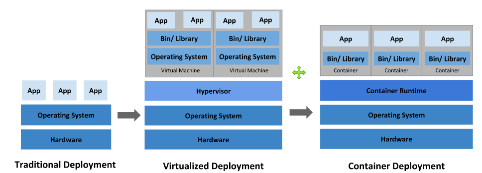

# 해당 코너에서 알 수 있는 것

- 가상머신과 컨테이너의 차이
- 컨테이너의 장점


# 가상머신은 너무 무거워!

- 전통적인 배포 방식과 가상화된 배포 방식의 이슈와 맞물림
- 두 가지 상황을 어떻게 해결해야할까?

시나리오1) 서로 다른 배포 환경에서 발생하는 문제 해결

시나리오2) 스케일 아웃 - 도커 호스트가 같은 경우도 있지만, 다른 경우가 더 많다.

이를 해결하기 위해 가상화된 배포 방식을 사용할 수 있지만 너무 무겁다! 이미지에 항상 guest OS가 붙어있기 때문에!


컨테이너의 이식성 특징은 `코드로 관리하는 인프라` 와 `불변 인프라` 로 실현 가능


# 핵심) 컨테이너가 왜 중요하냐?

- devops 실현 기술
- docker와 kubernetes의 기반 기술


# 컨테이너 개발 시대까지의 과정



## 전통적인 배포

배포방식:애플리케이션을 **물리 서버**에서 실행

장점: 단순

문제점

- **한 물리 서버에서 여러 애플리케이션의 리소스 범위를 정의할 방법이 없다.**
  - 예를 들어 물리 서버 하나에서 여러 애플리케이션을 실행하는 것.
  - 리소스 전부를 차지하는 애플리케이션 인스턴스가 있을 수 있고, 결과적으로는 다른 애플리케이션의 성능이 저하될 수 있다.
  - = 리소스 할당문제 = 리소스 비효율적인 활용 => 애플리케이션의 증가는 바로 비용 증가

대안: 애플리케이션별 서버 운영

=리소스 충분한 활용X, 많은 물리 서버 유지 비용

## 가상화된 배포 시대(전통적인 배포의 대안)

- **= 가상화 = 가상머신 = 하이퍼바이저를 통해 하드웨어를 에뮬레이션 = 하이퍼바이저형 가상화**
- 가상화는 호스트OS 위에 게스트OS를 가져오는 기술이다.  **= 하드웨어 수준 가상화**
- 가상화는 **단일 물리 서버**의 CPU에서 **여러 가상 시스템(VM)을 실행**할 수 있게 한다.
- 각 VM은 가상화된 하드웨어 상에서 자체 운영체제를 포함한 모든 구성 요소를 실행하는 하나의 완전한 머신이다.
- 이 기술은 개발자가 모두 동일한 호스트에서 실행되는 서로 다른 가상 머신에서 여러 OS를 실행할 수 있도록 했기 때문에 처음에는 획기적이었다. 따라서 추가 하드웨어 리소스가 필요하지 않았다. 

```
장점
- VM 간에 애플리케이션을 격리 -> 서로 자유로운 접근 불가 -> 보완성 제공!
- 효율적인 리소스 활용
- 쉽게 애플리케이션 추가 및 업데이트-> 비용 절감! -> 확장성 제공!
- 가상화를 통해 물리 리소스를 폐기가능한 가상머신으로 구성된 클러스터로 만들 수 있다.
```


## 가상머신의 문제점


- 가상 머신은 Guest OS 에 BIOS, 가상 CPU, 가상 메모리, 가상 디스크, 가상 NIC 등을 제공하여 마치 물리서버에서 실행되는 것처럼 보입니다.
- 이 때문에 게스트 OS 입장에서는 OS 시작과 정지 등의 운영에 있어서 물리서버와 아무런 차이점 없이 운용이 가능합니다.
- 가상화 기술은 가상머신 이미지마다 OS (게스트 OS)가 필요합니다. 이로인하여 **OS 에 대한 라이선스**가 필요합니다.
- 또한 운영하면서 **가상머신의 OS 별로 차이점이 발생**하게 되고 이로 인하여 운영관리의 어려움이 증가하게 됩니다.
- 시간에 따라 **이미지 사이즈가 증가**하면서 **마이그레이션에 대한 부담**도 커지게 됩니다.


## 컨테이너 개발 시대(가상머신의 문제점 해결)

- 컨테이너화는 가상화를 운영체제 수준으로 가져오는 기술이다. = 운영체제 수준 가상화
- VM과 유사! **격리성**을 완화한 것! 즉, 애플리케이션 간에 운영체제(커널)를 공유한다. 호스트OS 하나에서 여러 OS를 가상화
- 가상화는 하드웨어에 추상화를 가져오는 반면 컨테이너화는 운영 체제에 추상화를 가져온다. =운영체제 수준 가상화
- 컨테이너화는 가상화의 한 유형이기도 하다. 그러나 여기에는 게스트 OS가 없고 호스트 OS를 활용하고 가상 머신과 달리 필요할 때 관련 라이브러리 및 리소스를 공유하므로 컨테이너화가 더 효율적이다.
- 애플리케이션별 바이너리 및 컨테이너 라이브러리는 호스트 커널에서 실행되므로 처리 및 실행이 매우 빠르다. 컨테이너를 부팅하는데도 1초밖에 걸리지 않는다. 모든 컨테이너는 호스트OS를 공유하기 때문에 애플리케이션 관련 바이너리 및 라이브러리만 보유한다. 가상머신보다 가볍고 빠르다.

## 컨테이너를 통한 가상화 기술의 문제점 해결


- 컨테이너는 이와 달리 OS를 가상화하여 여러 개의 컨테이너를 OS 커널에서 직접 실행합니다.
- 컨테이너는 기존의 가상화 기술보다 훨씬 가볍게 동작하며, OS 커널을 공유하고, 시작 시간이나 종료 시간이 빠르고 , 메모리를 훨씬 적게 차지합니다.
- 컨테이너는 가상 머신과 마찬가지로 애플리케이션을 관련 라이브러리 및 종속 항목과 함께 패키지로 묶어 소프트웨어 서비스를 위한 환경을 분리할 수 있도록 해줍니다.
- 가상화 기술과 컨테이너 기술이 유사점은 여기까지입니다. 컨테이너를 사용하면 개발자와 IT 운영팀이 훨씬 작은 단위로 업무를 수행할 수 있어이점이 훨씬 많습니다.

## (정리 표)

|                    | **하이퍼 바이저 형 가상화**                                  | **컨테이너 형 가상화**                                       |
| :----------------- | :----------------------------------------------------------- | :----------------------------------------------------------- |
| 시작 시간          | 몇 분                                                        | 몇 초                                                        |
| 이미지 크기        | 수 GB ~ 수백 GBOS를 포함하여 애플리케이션과 필요한 런타임 소프트웨어 | ~ 수백 MB애플리케이션과 런타임 소프트웨어만                  |
| Guest OS           | Windows/Linux 등 다양한 선택 가능                            | 호스트 OS 와 동일한 OS                                       |
| 이식성             | 대부분 가상 이미지에 대한 변환이 필요함                      | 컨테이너 이미지 그대로 사용 가능                             |
| 데이터 관리        | VM 내부또는 연결된 스토리지에 저장                           | 컨테이너 내부에 있는 데이터는 종료시 소멸되며, 필요에 따라 스토리지를 이용하여 저장 |
| Guest OS 와의 관계 | Guest OS는 하드웨어(가상)로 인식                             | Host OS를 커널 수준으로 분리하여 OS를 가상화 형태로 사용하여 필요에 따라 호스트와 리소스 공유 가능 |


하이퍼 바이저 형 가상화와 컨테이너 기술를 비교하면 컨테이너는 OS가 포함되지 않아 크기가 작고, 고속으로 시작과 정지 합니다.


# Docker 컨테이너 단점

### HOST OS 에 종속적

리눅스 컨테이너는 OS에서 Linux Kernel이 관리하는 것이므로, 당연히 Linux 이외의 다른 OS 에서는 동작하지 않으며, 컨테이너 환경에서도 다른 OS를 설치할 수 없습니다.

컨테이너에 Linux의 모든 배포판은 설치할 수 있지만, 실행중인 커널은 하나이기 때문에 엄밀하게는 컨테이너는 Host OS 의 커널을 사용하게 됩니다.

예를 들어 Ubuntu Host OS에서 컨테이너에 CentOS를 설치한다고 해도 실행중인 커널은 Ubuntu 커널입니다.

### 컨테이너별 커널구성이 불가능

정확하게는 커널에 관련된 작업은 가능합니다. 그러나 컨테이너마다 다른 커널 작업을 수행 할 수는 없습니다. 커널의 기능으로 구성되는 환경이기 때문에 당연히 전체 컨테이너에서 보이는 커널은 동일합니다.

따라서 컨테이너에서 보이는 장치나 로드되는 커널 모듈은   모두 동일합니다.

 

이상과 같이 LXC의 장점과 단점을 살펴보았습니다. 무엇보다도 컨테이너형 가상화가 유리한 유즈케이스에 잘 활용하는 것이 중요하겠습니다.


# *다 이해했어? 다음에 답해보자*

- *컨테이너는 멀티 OS환경을 어떻게 실현할까?*


# *이제 이 컨테이너를 잘 다루기 위한 도구가 도커와 쿠버네티스!*


# (참고)

- [쿠버네티스란 무엇인가? \| Kubernetes](https://kubernetes.io/ko/docs/concepts/overview/what-is-kubernetes/)
- [msaschool - msaschool](http://msaschool.io/operation/architecture/architecture-three/)
- [컨테이너 기술과 가상화 기술 비교 - Opennaru, Inc.](http://www.opennaru.com/cloud/virtualization-vs-container/)
- [Immutable infrastructure (변경 불가능한 인프라) with Container( 컨테이너 ) (opennaru.com)](http://www.opennaru.com/openshift/immutable-infrastructure-with-docker-and-containers/)