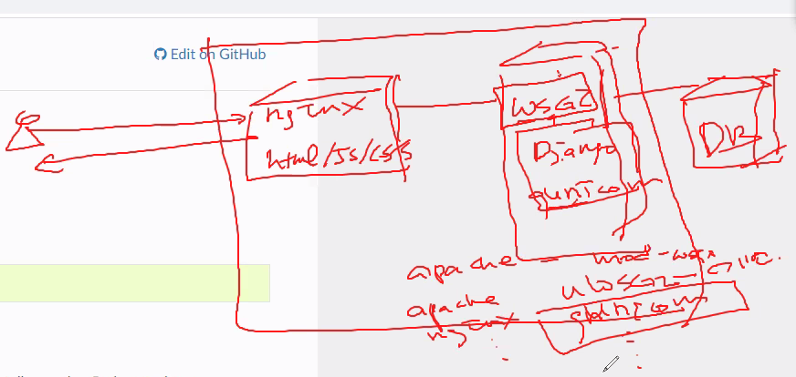

오늘은 장고 빌드(오후)

10시 20분까지 이번주 일정 및 해야할 것 논의, 10시 30분 부터 수업 ㅈ


비즈니스 프로세스 그려보기 -> 산출물 도출

이번주 요구사항 도출 및 유저스토리(제공된 템플릿) 작성 마쳐야 함.

프론트단은 목업툴부터 시작

백단은 

모델 디자인은 목업과 같이 시작하기에 어렵고, 이번주 이벤트 스토밍을 통해서 서비스에 어떠한 데이터들이 필요한지 파악하고, aggregate 단위로 서비스가 쪼개지는게 보통이라 이것에 대해 감을 잡는다.

UML툴을 사용해서 클래스 다이어그램| er 다이어그램|시퀀스 다이어그램을 그린다.


장고에서는 JPA기능이 있기 때문에 쿼리를 직접 작성할 필요가 없다.(makemigrations, migrate 통해서 가능)

다음주 부터 구현 시작


이번주 하이브리드(수요일) 평가있음. 수행평가는 별도할 것 없고  CloudGuru ppt 하나로 취합.

---

# 1:00~2:00

오후 장고 레스트 프레임워크 도커에 올리고, 클라우드 구루에 배포하기


장고에서 내장된 서버가 실제 운영 환경에는 적합하지 않음(가능은 하지만 가용성이 보장되지 않음)

아파치, nginx 에 배포해주어야 함

웹 서버에서는 django의 lifecyle 등을 해석 못함 -> `deployment checklist` django document 참고

---

## 운영환경을 위한 배포를 할 때, django 실행환경을 구축해야 한다.

>그림있음

HTTP/HTTPS 요청

FIREWALL

web server -http 요청 해석

app

application server(middleware) ->JAVA에선 JVM

WAS - tomcat

DB

**WSGI**


CGI, 확장 CGI(PHP, ASP(>c#, .net), JSP(>servlet>java ee))<->FLASK, DJANGO

기존에는 임베디드 manage.py 로 runserver로 실행

운영환경에서는 이럴 경우 응답속도가 느려지고 필요없는 리소스가 발생한다.

운영환경에서는 gunicorn start를 통해 실행한다.

django python 실행환경을 제공하는 컨테이너이다.

그래서 apache, nginx에서 제공하는 uwsgi, gunicorn 구현물을 사용한다.

## gunicorn을 통한 배포




참고사이트) [Django 자습 - WikiDocs](https://wikidocs.net/book/837)


## 임베디드 runserver (도커를 통한 로컬 테스트)

깃에서 배포할 것이기 때문에 push 해놔야 함


### nginx, container - docker image로 생성 | EC2 인스턴스

nginx 컨테이너 접속

### python, git 설치

apt-get update

python 설치

git 설치 (원래는 리눅스 설치하면 포함되어 있음, 그런데 우린 nginx 이미지를 이용했으므로 확인 필요) - 왜? 개발 서버에서 git으로 관리하고 있기 때문에 git에서 가져오는 식으로 개발이 진행된다.

레포지토리 pull, tutorial로 디렉터리 변경 [강사님코드](https://gitlab.com/cloud_msa/web/django_workspace/-/tree/master/djangorest/tutorial)

이제 가상화환경 만들어서 gunicorn 으로 배포

nginx 포팅해서 nginx를 통해서 통신


### 가상환경 생성 

pip3 install virtualenv

virtualenv venv

source venv/bin/activate

c

### STATIC_ROOT 디렉토리 지정

static 폴더 위치 지정

vi 버전 확인, 설치

settings.py 확인 (강사코드일 경우, esc dd로 swagger 삭제)

STATIC_ROOT = os.path.join(BASE_DIR, 'static/')

BASE_DIR : settings.py ../../

os.path import 확인


### 마이그레이션


### django, djangorestframework, gunicorn 설치(마이그레이션이 안 될 경우)


### 유저 생성

python3 manage.py createsuperuser

admin


### static 파일 모으기

python3 manage.py collectstatic

*우리는 rest로 하기 때문에 의미가 없긴 함*

### runserver

외부에서 접근 불가능 확인. 이유 알기


#### 내부 요청하기(로컬테스트 완료)

docker exec -it nginx bin/bash

curl localhost:8000


*이제 gunicorn에 배포하면 됨*


## runserver가 아닌 Gunicorn에 배포

gunicorn --bind 0.0.0.0:8000 tutorial.wsgi

curl localhost:8000/api/members


### 리눅스 운영체제에 서비스 등록. (systemd 서비스 등록)

*gunicorn --bind 0.0.0.0:8000 tutorial.wsgi* 매번 이렇게 명령어 치는 것 불편

웹서버가 켜지면서 gunicorn도 실행되도록 gunicorn을 daemon으로 생성

 systemd로 gunicorn을 데몬으로 등록

/etc/systemd/system/gunicorn.service 생성(path는 내 프로젝트에 따라 수정)


#### 서비스 등록 상태확인 종료

```
systemctl start gunicorn
systemctl enable gunicorn
systemctl status gunicorn
```


# 4:00

## 서비스 설정 추가


ls -al /etc/nginx

cat /etc/nginx/nginx.conf

cp /etc/nginx/conf.d/default.conf /etc/nginx/conf.d/default.origin

vi default.conf

esc dd 로 root 날리고 다음을 추가

```
location /{
	include proxy_params;
	proxy_pass http://127.0.0.1:8000
		or
	proxy_pass tutorial/run/
}
```

settings.py - ALLOWED_HOST 등록

service nginx restart -> failed

docker nginx, nginx, gunicorn 실행 상태 확인

http://localhost/api/members

settings.py - ALLOWED_HOST 설정


## question

1. rest에서 뿐만 아니라  이전 django framework에서도 했어야 하는 과정이지?
2. 