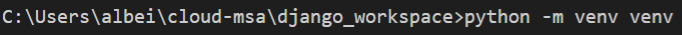

# VSCODE 가상환경 설정

1. 프로젝트 폴더 아래에서 터미널에 `python -m venv <가상환경 이름>` 을 입력한다.

   

2. `./venv/Scripts/activate.bat` 실행

3. 

4. python interpreter 에서 해당 python 버전과 일치하는 가상환경 인터프리터이 생성되었는지 확인

5. 

virtualenv venv 로 가상환경 디렉터리 생성

## 가상환경을 사용하는 이유

해당 프로젝트의 환경 설정으로 인해 시스템 전체에 악영향을 주는 불상사를 막는다.

또한 반대로 호스트 시스템의 환경 문제로 인해 해당 프로젝트에 영향 주는 것을 방지하기 위한 목적이다.