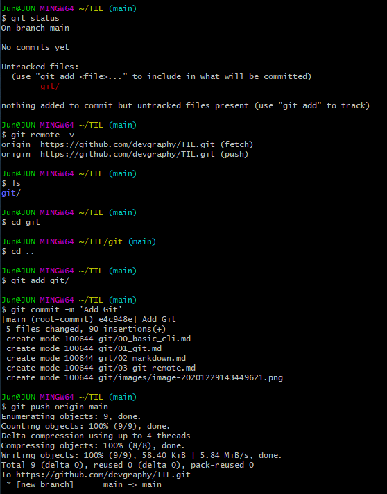

# 03. Git Remote

* `git remote` : remote repository 주소 등록(여기서는 github repo)

  * `git remote add origin 주소` : 주소를 origin 이라는 별칭으로 등록

  * git remote -v:  등록된 remote 주소 확인

    ``` origin  https://github.com/devgraphy/TIL.git (fetch)
    origin  https://github.com/devgraphy/TIL.git (fetch)
    origin  https://github.com/devgraphy/TIL.git (push)
    ```

* `git push [별칭] [브랜치이름]` : `별칭`으로 `브랜치`를 push(전송)

  * git push origin main: origin 으로 main 브랜치를 전송

* `git clone [주소]` : 주소로부터 repo 가져오기

* `git pull [별칭] [브랜치이름]` : `별칭` 으로부터 `브랜치`를 pull(내려받기)  <- 내일(12/30) 사용해볼 예정


