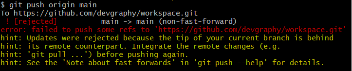

## pull을 빠뜨린 경우

* (원격에서 d를 추가 하여, 현재 내 로컬에선 d가 없는 경우) e를 `commit` 합니다.
* 그리고 `push`

```bash
Jun@JUN MINGW64 ~/remoteplace/TIL-test (main)
$ git push origin main
To https://github.com/devgraphy/TIL-test.git
 ! [rejected]        main -> main (fetch first)
error: failed to push some refs to 'https://github.com/devgraphy/TIL-test.git'
# push 실패
hint: Updates were rejected because the remote contains work that you do
# 업데이트가 실패했는데, remote에는 니가 local에 가지고 있지 않은 작업을 들고 있다.
hint: not have locally. This is usually caused by another repository pushing
# 지금 같은 경우는 다른 repo로 push하려고 시도한 것이거나
hint: to the same ref. You may want to first integrate the remote changes
# push를 다시 하기 전에 remote에서 발생한 변경 사항을 먼저 통합(반영)을 해야 할 수 있다.
hint: (e.g., 'git pull ...') before pushing again.
hint: See the 'Note about fast-forwards' in 'git push --help' for details.
```


* `git pull origin main` 수행

```bash
Merge branch 'main' of https://github.com/devgraphy/TIL-test #이미 작성된 메시지
# Please enter a commit message to explain why this merge is necessary,
# especially if it merges an updated upstream into a topic branch.
#
# Lines starting with '#' will be ignored, and an empty message aborts
# the commit.
```

​	

* **vim** : 에디터
  * esc
  * :
  * w(write, 저장)q(quit, 종료)
  * enter


```bash
Jun@JUN MINGW64 ~/remoteplace/TIL-test (main)
$ git pull origin main
remote: Enumerating objects: 3, done.
remote: Counting objects: 100% (3/3), done.
remote: Compressing objects: 100% (1/1), done.
remote: Total 2 (delta 1), reused 2 (delta 1), pack-reused 0
Unpacking objects: 100% (2/2), 237 bytes | 13.00 KiB/s, done.
From https://github.com/devgraphy/TIL-test
 * branch            main       -> FETCH_HEAD
   dbfafec..e43dbe8  main       -> origin/main
Merge made by the 'recursive' strategy.
 d.txt | 0
 1 file changed, 0 insertions(+), 0 deletions(-)
 create mode 100644 d.txt

```


```
$ git push origin main
fatal: 'origin' does not appear to be a git repository
fatal: Could not read from remote repository.

Please make sure you have the correct access rights
and the repository exists.

```

## non-fast-forward



발생 배경: push -> error: failed to push some refs to ''

원인:

해결책: `git push origin +main` 처럼 브랜치 앞에 `+` 명시