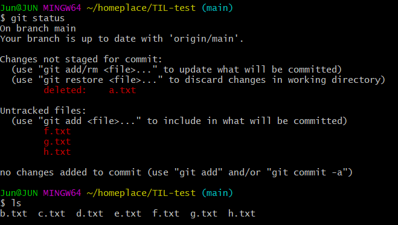

# 05. 취소하기

1. git add 취소하기

   * git add가 된 상황

     ```bash
     Jun@JUN MINGW64 ~/remoteplace/TIL-test (main)
     $ git status
     On branch main
     Changes to be committed:
       (use "git restore --staged <file>..." to unstage)
             new file:   f.txt
     ```

     ```bash
     git restore --staged f.txt
     ```

   * 구버전

     ``` bash
     git reset HEAD f.txt
     ```

     

     ```bash
     Jun@JUN MINGW64 ~/remoteplace/TIL-test (main)
     $ git restore --staged f.txt
     
     Jun@JUN MINGW64 ~/remoteplace/TIL-test (main)
     $ git status
     On branch main
     Untracked files:
       (use "git add <file>..." to include in what will be committed)
             f.txt
     
     nothing added to commit but untracked files present (use "git add" to track)
     ```

   * 

2. git commit 취소(되돌아가기)

   ```
   $ git reset [돌아갈 commit의 hash]
   ```

   ```
   $ git reset 9b558bf
   ```

   * 옵션

     ```
     $ git reset --mixed [hash]
     ```

     * staging 없앰 + 작업한 것은 남아있음 (default)

     ```
     $ git reset --soft [hash]
     ```

     * staging 그대로 유지 + 작업한 것 남아있음.

     ```
     $ git reset --hard [hash]
     ```

     * **[주의]** 작업한 것까지 날려버림

       ```bash
       Jun@JUN MINGW64 ~/remoteplace/TIL-test (main)
       $ git reset --hard 9b558bf
       HEAD is now at 9b558bf Merge branch 'main' of https://github.com/devgraphy/TIL-test
       
       Jun@JUN MINGW64 ~/remoteplace/TIL-test (main)
       $ git status
       On branch main
       nothing to commit, working tree clean
       
       ```

   * hash
   
     * ???
   
   *  HEAD의 상대적 위치(몇 번 전으로 이동할 건지)
   
     * HEAD~{숫자}
   
       * `HEAD~1`(`HEAD~`)
       * HEAD~2
   
     * ```bash
       $ git reset HEAD~
       ```
   
     * commit 되돌리기
   
       * HEAD~1(1단계 전으로 되돌리고)
       * --mixed: staging X, 작업 유지 
       * --soft: staging O, 작업 유지
       * --hard: 작업 통채로 X
   
     * git log 시 내용이 너무 많이 잘리는 겨우
   
     * q로 종료
   
     * 방향키로 위아래 왔다갔다 할 수 있음

3. WD(Working Directory) 변경 내용 취소(삭제) 하기, 원상 복구

   * WD
   * 지금 우리가 작업 중인 공간
   * == git이 관리하고 있는 공간
   * == 기록이 한번이라도 기록된 파일들이 있는 공간
   * 
   * f, g, h는 WD에 있는 파일 X
   * b, c, d, e만 WD에 있는 파일

   ```bash
   $ git restore [파일명]
   $ git restore a.txt
   ```

   * 구버전

     ```bash
     $ git checkout -- [파일명]
     ```

     

   