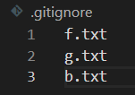
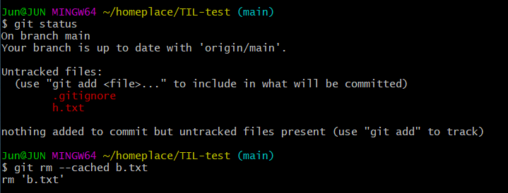
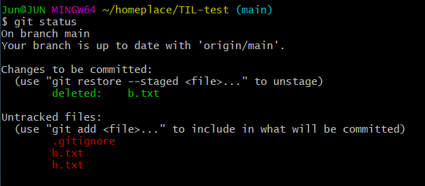
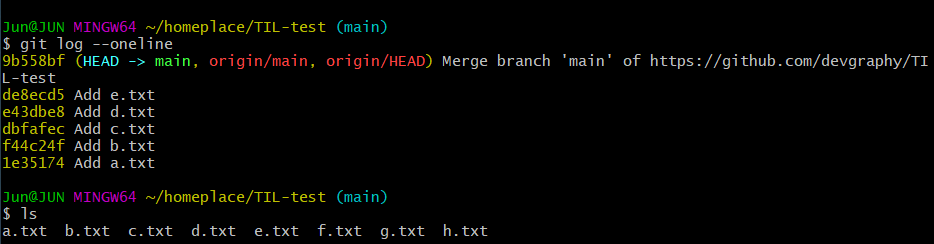

# 06. gitignore

* 우리가 git으로 관리하고 싶지 않은 파일들을 제외시키는 방법

  * 우리가 원하지 않는 파일을 제외
  * 외부에 공개되면 안되는 것들(key, secret)

* untracked files에 아예 표시가 되지 않는다!

* `.gitignore`

  * `.gitignore`에 작성된 파일들은 git으로 관리하지 않겠다! 무시해라!

  ```
  .DS_Store # Mac OS에서만 사용하는 파일
  ```

# 작성법

```
f.txt # 특정 파일
secret/ # 특정 폴더, 그 안에 있는 것들도 다 제외
*.png # 특정 확장자 (.png로 끝나는 파일명을 모두 제외)
!profile.png # 모든 png는 빼고, profile.png는 넣고!
```

* 처음부터, git으로 관리한 적이 없을 때부터 관리를 해줘야 함!
* 그렇다면 이미 commit을 한 파일들은 어떻게 제외할 수 있을까?
  1. `.gitignore` 에다가 파일 명시
  2. `git rm --cached [파일명]`
     * git에서 더 이상 관리하지 않겠다.
     * 
     * 
     * 
     * 
     * 

* `.DS_Store` : Mac OS
* `Thumbs.db` : Windows
* VSCode 상 파일명 옆 문자
  * U(Untracted files)
  * M(Modified)


# gitignore 가 반영되지 않는 경우

기재한 폴더나 파일의 이름이 한글이어서 깨진 경우

- 여러가지 방법으로 한글 깨짐 현상을 극복하려 했지만 실패했다.
- 특정 폴더를 ignore하고 싶다면 폴더만 영어 이름으로 하고 .gitignore 에 `폴더명/`으로 기재해서 해결한다.
  - 이때 내부 파일들의 이름은 한글이어도 상관이 없다.
  - 


