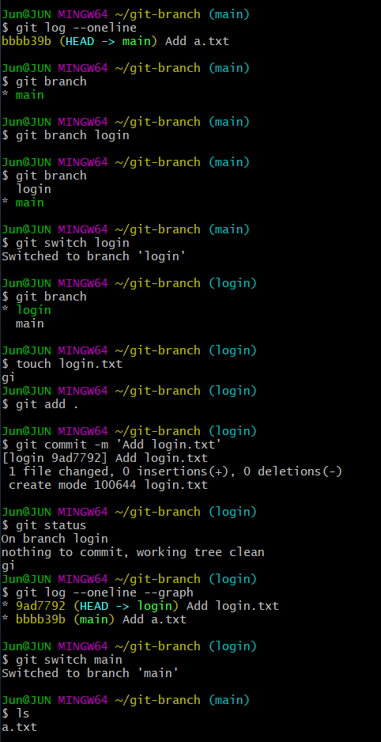

# 07. Branch

* branch: 가지->가지치기
* `git branch` : 브랜치 목록 확인
* `git branch login`: `login` 브랜치 생성
* `git switch login` : login 브랜치로 이동
* 가지치기 시작점부터 보여줌
  * 
  * `git log --oneline --graph --all` :  한줄로, 그래프 포함, 모든 브랜치를 보여줌
  * `git switch -c login` : 브랜치 만들면서 바로 이동(c: create)
    * `git branch login` + `git switch login` 
    *  구버전
      * 이동
        * `git checkout login` : 이동 
        * `git checkout -b login` : 생성하면서 바로 이동


##### 기본 branch master -> main으로 변경(+get 버전 업그레이드)

git 2.28.0 버전부터 직접 설정으로 통해 git의 기본 branch를 변경할 수 있다.

먼저 git 버전을 최신 버전으로 업그레이드하는 방법을 소개한다.

```bash
sudo add-apt-repository ppa:git-core/ppa -y
sudo apt-get update
sudo apt-get install git -y
```


그 다음, `git config --global` 명령어를 통해 `init.defaultBranch`를 main으로 설정한다.

```bash
git config --global init.defaultBranch main
```

직접 ~/.gitconfig에 다음을 추가해도 된다.

`````bash
[init]
  defaultBranch = main
`````


##### Ubuntu Shell prompt에 branch name 표시하기

.bashrc에 다음의 내용을 추가 

```
git_branch() {
  git branch 2> /dev/null | sed -e '/^[^*]/d' -e 's/* \(.*\)/(\1)/'
}

export PS1="\[\e]0;\u@\h: \w\a\]${debian_chroot:+($debian_chroot)}\[\033[01;32m\]\u@\h\[\033[00m\]:\[\033[01;34m\]\w\[\033[00m\] \$(git_branch)\$ "
```

