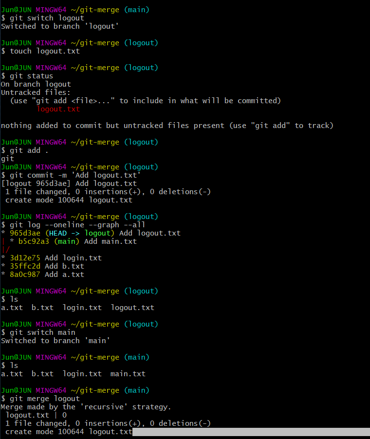

# 08. Merge Branch

* 병합
  * git merge [브랜치 이름]

1. Fast-Forward

   * 가장 잘 일어나지 않음. 가장 단순한 방식

   * ```
     (main) $ git switch -c login
     (login) $ touch login.txt
     (login) $ git add, git commit
     (login) $ git switch main
     (main) $ git merge login
     ```

   * 

   * 

   * 병합하고 보통 서브 브랜치는 삭제함

     * 

2. 3-way Merge (변경사항이 있는 경우)

   * 

   * 

3. Merge Conflict

   * 

   * 

     ```
     <<<<<<< HEAD
     # Merge Branch
     
     - main에서 작성한 코드!
     =======
     # MErge Branch
     
     - signup에서 작성한 코드!
     >>>>>>> signup
     
     ```

     * 직접 수정하거나, 명시된 거 선택하거나
     * `main과 signup에서 합의한 내용!` 으로 직접 수정
     * 


