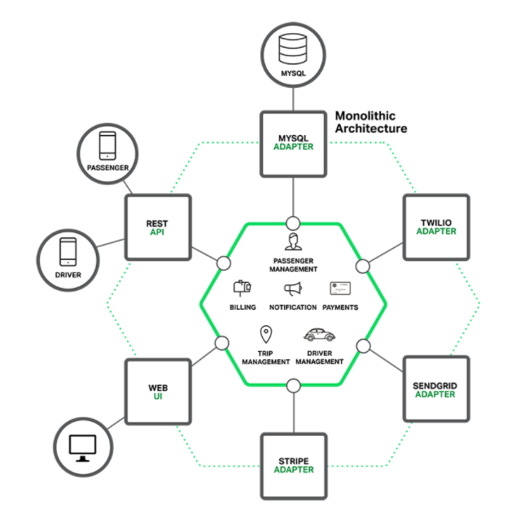

도메인과 서비스만 정의가 되면 fe와 be단에 무엇이 오든 

mvc패턴과 layer 패턴 컨셉으로 역할 별로 정리되어있다고 생각을 가지고 아키텍처를 바라보는 것이 중요.

단순히 함수가 나타났을 때 따라 들어가는게 아니라

이런형태의 구현에 익숙해져야 함

MVC패턴에서 Controller에서

모놀리식에서는 view select하게 했지만

MSA에서는 JSON형태의 데이터로 응답한다.

객체지향은 재사용 가능한 형태로 만들어야 함

안 보고도 만들수 있을정도로 해야 함!

내일은 웹의 동작원리 설명

다음주는 TODO로 웹 완성 (자기 주제X)

 우리과정은 AWS로 되어있음. 클라우드 사용방법이 의존적일 수밖에 없음

공통적으로 DOCKER는 알아야 하기 때문에 DOCKER를 먼저 설명하고, 충분히 다룰 수 있는 상황되면

