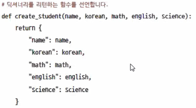
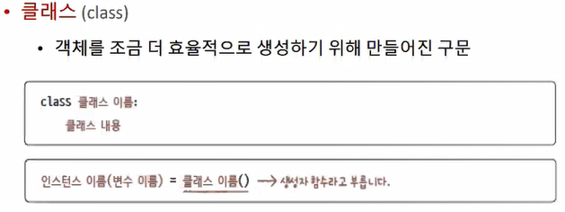
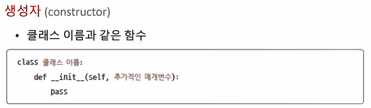
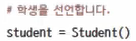
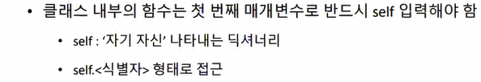

# 1. 클래스 기본

## 객체

* 클래스 타입에 의해서 인스턴스화하여 실제 데이터가 담겨지는 것

* 객체를 만드는 함수를 만들 수 있다.

  


## 클래스 선언



* 인스턴스: 생성자를 사용하여 클래스 기반으로 만들어진 객체


## 생성자 (entity.py 참고)



 

* `__init__`은 생성자 호출 시에 반응할 코드를 작성해준다.



* 사용하는 변수를 명시적으로 선언하지 않는다. 생성자를 통해 클래스의 데이터를 알 수 있다.


 


## 메서드

* 클래스가 가지고 있는 함수
* 함수를 사용하는 이유: 반복해서 사용하는 기능을 만들어서 단순히 호출하여 사용하기 위해
* 멤버 메서드와 멤버 변수는 반드시 첫 번째 파라마터로 `self` 를 써줘야 한다.
* `self`에는 생성될 때 객체를 의미한다.

```java
// python의 self 의미는 java의 this 의미와 같다.
class Person(){
	String id;
	String name;
    
    // 디폴트 생성자
	Person(){
	}

	// 생성자
	Person(String id, String name){	
		// 가독성을 위해서 변수이름을 같게 하였는데,
        // 이때 단순히 id = id라 하면 가장 가까운 로컬변수를 가리키게 돼서 해당 객체의 데이터를 가리키야 하는
        // 원래 의도와 달라진다. 그래서 this 키워드를 사용하기 시작했다. python에서 this 역할을 하는 것이 self이다.
        this.id = id;	
		this.name = name;
	}
}
```


## Object Class & 매직 메서드

* 클래스 이름의 생성자를 호출하면 내부적으로 불려지기를 약속된 콜백 메소드*

* '__ <메소드명> __'  처럼 표현 됨

* 직접 호출할 일 없음. 생성자를 호출하면 파이썬 컨테이너에서 필요한 시점에 호출함

* 특수한 상황에 자동으로 호출되도록 만들어짐

* 언제 호출되는지를 알고 오버라이딩해서 원하는 대로 사용할 수 있음

  
  
* `__init__`

* `__str__`


## 상속 (python_workspace\school\entity.py)

```python
# 수퍼 클래스
class Person:
    def __init__(self, id, name):
        self.id = id
        self.name = name
        
    def info(self):
        print("id:{}, name:{}".format(self.id, self.name))
        

# 서브 클래스1
class Student(Person):
    def __init__(self, id, name, major):
        super().id = id
        super().name = name
        self.major = major
        
    def student_info(self):	# 다형성 적용하여 수정 필요
        super().info()
        print(" major:{}".format(self.major))
        
# 서브 클래스2
class Teacher(Person):
    def __init__(self, id, name, subject):
        super().id = id
        super().name = name
        self.subject = subject
        
    def teacher_info(self):	# 다형성 적용하여 수정 필요
        super().info()
        print(" subject:{}".format(self.subject))
        
# 서브 클래스3        
class Employee(Person):
    def __init__(self, id, name, department):
        super().id = id
        super().name = name
        self.department = department
        
    def employee_info(self):# 다형성 적용하여 수정 필요
        super().info()
        print("department:{}".format(self.department))
```


```java
class Student extends Person{
	String major;
	Student(){}
	Student(String id, String name, String major){
		super(id, name);
		this.major = major;
	}
	
	public String student_info(){
		return super.info()+"\t major: this.major";
	}
}

```


* 부모 클래스로부터 자식클래스에 멤버 변수, 멤버 메서드를 상속받아 자식클래스의 것처럼 사용
* `generalization` : 추상화된 기존 클래스에서 부모 클래스를 새로 생성
* `Specialization` : 기존 클래스를 상속받는 자식 클래스를 추상화(employee)
* `다중상속` : 다른 누군가가 만든 형태들을 조립하여 내가 원하는 것을 만드는 것
* super(): 부모클래스의 생성자, 메서드 호출
* 상속을 inheritance 보다 generalization으로 부르는 경우도 많다.

* 언어에 따라 다중 상속 지원 여부 다름


* 상속 정보:  부모클래스의 데이터와 오퍼레이션이 상속됨

* 부모 클래스의 클래스명을 파라미터로 써주면 상속이 된다.


보통 학생정보를 등록한다면

`super()` 메서드 이용해서 부모의 메서드(생성자도 포함) 호출할 수 있다.

`super`.  키워드하고 헷갈리지 말기


<사진1>

## `MVC패턴`과 `MVT패턴`

<사진2>

MVC패턴

장고에서는 화면에 나타나는 VIEW는 Template이라 씀

Controller를 view라고 씀

데이터를 담아 로직 처리하는 것을 Model 이라 하여

장고에서는 MVT 패턴이라 불린다.


`MVC모델`

view(화면) - control(제어역할: valid 체크, 비즈니스 로직 체크) - model

모델에서 비즈니스로직, persistant 한 로직을 작성


# 2. 클래스의 추가적인 구문

## 어떤 클래스의 인스턴스인지 확인하기

`isinstance(인스턴스, 클래스)` : 객체가 어떤 클래스로부터 만들어졌는지 확인

```python
print("isinstance student Student: ", isinstance(student,Student))	# True
print("isinstance student Student: ", isinstance(student,Teacher))	# False
print("isinstance student Student: ", isinstance(student,Person))	# True
```


## 클래스 변수와 메서드

## 가비지 컬렉터

## 프라이빗 변수와 GETTER/ SETTER


## 다형성

* 객체지향을 사용하는 이유가 되는 특성

* 객체지향을 사용하는 이유 = 재사용성(사용자 코드가 재사용될 수 있도록 만드는 것)

* 재사용성에 대한 오해 말라!

  * 클래스를 정의하거나 코드를 제공해주는 것의 재사용이 아님
  * 코드의 길이가 더 길어질 수도 있음
  * 클래스나 표준을 만들었더라도 사용할 때 가져다 쓰는 쪽에서 인터페이스가 변하면 재사용성이 떨어진다.
  * 이것에 객체지향 컨셉이 맞아 떨어짐
  * 안타깝게도 파이썬의 경우에는 문법이 유연하다보니 객체지향을 표현하는데 어려움이 존재하기는 한다.(장단점이 존재한다.)

  

* 매직 매서드가 오버라이딩이 가능한 이유
  * 부모의 메서드를 재정의해서 사용할 수 있음
  * already defined로 오류가 생기지 않음.
  * 부모의 매직 메서드를 자식에서 재정의한 경우, 자식의 메서드를 호출했을 때 재정의한 메서드가 호출된다.
  * 반면 자식 메서드를 재정의하지 않았을 경우, 부모의 메서드를 호출한다.
  * 부모와 자식 모두에서 정의하지 않은 매직메서드를 호출한 경우, 내부적으로 호출되기로 약속된 object  클래스의 메서드를 호출한다. object는 공통적인 클래스에 대한 내용이 명시되어 있다.

* 수퍼 클래스는 사용법의 표준을 제공한다.

  * 그래서 사용자는 표준을 보고 일관된 형태로 호출을 하더라도 실제 응답은 상속받은 객체에 맞게 반응한다.

  ```python
  student.info()  # student.student_info 형태에 다형성 적용
  teacher.info()
  employee.info()
  
  # __str__
  # 객체 출력 - 최상위 object class의 __str__ 호출
  print(student) 	# __main__: 엔트리 포인트
  print(teacher) 	# object at : 객체 위치
  print(employee) # 데이터 출력하려면 재정의 필요
  ```

  

***

(1.13 수)


*Person, Student 객체를 생성하지 못하도록 추상화할 수 있다!* <-????


***

isinstance() 함수: 객체가 어떤 클래스로부터 만들어졌는지 확인


`__ str __`


***

클래스 변수

객체를 선언하더라도 

가비지 컬렉터

heap: 레퍼런스가 끊긴 데이터가 공간을 차지하고 있으면 이럴 공간 해제하는 역할을 수행한다.(idle 타임에 파이썬 컨테이너가 수행)

stack영역: 값을 덮고 씌우고 하기 대문에 가비지 컬렉터와 상관이 없다.

그때 호출하는 메서드가 `__del__`임

정확한 시점을 알고 제거하는 경우에 `__del__`을 재정의하지만. 알기 쉽지 않아 재정의하지 않음

***

캡슐화(은닉화)

* 구현을 모르더라도 사용법을 알면 사용할 수 있다.

* 사용자 코드의 세부 구현을 모르고 사용할 수 있도록 제공

* ex) 차의 내부 원리를 모르더라도 사용법을 알면 운전하는 건 문제가 없다. 

  

  프라이빗 변수(외부에 접근 못하도록 막도록 설정)

* `private` variable로 선언

* getter/setter 메서드를 통해 구현상관없이 변수 접근(필터링 역할)

* 생성자를 통해서만 변수에 접근가능

* getter/setter 로 접근

* 


`static`


***

### 사용자 정의 예외

* exception 상속받는 ExceptionClass 정의
* 나누기 0, int값 변환하는데 문자열 입력 -> 파이썬 컨테이너에서 예외 호출
* 예외상황 발생 시 (원하는 시점에 조건을 만족할 때). 강제로 ExceptionClass 발생
* ExceptionClass 발생가능한 실행문 사용시 try ~ except ~ finally 문으로 처리
* exception.py


***

### 모듈화(파이썬 함수 파일 참고-'모듈 만들기'부터)

* 그동안 하나의 디렉토리 안에 다 때려넣음 -> students 파일 변경
* 객체 핸들링하는 목적
* 규모가 커지면  하나의 파일로 관리하는게 말이 안됨.
* <과제>이것을 todo로 다시 한번 연습하기!
* student 폴더 안에 studnetMagrSystem 폴더 생성
  * entity
  * controller_view:
  * dao
  * service
  * view_template
  * exception
* 규모가 작기 때문에 controller_view와 service가 모호해질 수 있긴 함
* 엔트리 포인트로 `__main__` -> 시작점을 알려줌(파일명 출력과 구분)
* 엔트리 포인트의 모듈 외에는 파일명으로 출력된다.
* <NO이해> module_basic에서 test_module.py의 `__name__` 과 start.py에서의 `__name__` 의 차이
  * import 받은건지 엔트리 포인트인지 구분할 수 있다??? 이정도???


***

3:10~

* module_basic과 student 디렉토리 차이점은??
  * `__pycache__` -> import 로 호출되는 모듈들을 관리하기 위한 파이썬 컨테이너가 생성하고 실행하는 폴더
  * import 하게  되면 이 패키지를 관리하기 위한 파일 ->  모듈화가 되어있다는 의미


### `__init__.py` 13:00

* <NO이해>
* 


>개발자에게 비즈니스 마인드도 필요하다.
>
>> 실무에서 영업과 친해지면 좋음. 영업이 정보가 많다.
>>
>> 
>>
>> 기술 트렌드 쫓아가기 위해서는 전자신문 읽기
>>
>> 쉽게 접할 수 있는 신문, 사람, 경영관리 책(관련 분야)들이 도움이 많이 된다.
>>
>> 일단 관심을 갖는게 중요하다. 하루아침에 안되는데, 노력하면 된다.
>>
>> 
>>
>> 블로그, 깃허브 나만의 정보를 그때그때 내가 원하는 정보를 빠르게 찾을 수 있도록 잘 정리해두는 게 중요하다.
>>
>> 깃에다가 수업 내용을 관리하듯이, md 파일로 블로그 기능이 있으니까
>>
>> 접하는 기술셋, 비지니스를 잘 정리해두는 것만으로도 도움이 될 수 있다.
>>
>> 
>>
>> 여기에 집중하다보면 메인을 놓칠수가 있으니 밸런스 중요.
>>
>> 
>>
>> 다양한 사람들을 만나는게 정말정말정말 중요!!!!!
>>
>> 알게 되는 사람들의 연락처를 잘 관리하는 게 중요!


컴파일 타임의 에러는 PROBLEMS에 나옴

런타임 에러는 TERMINAL에 나옴


