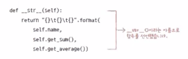
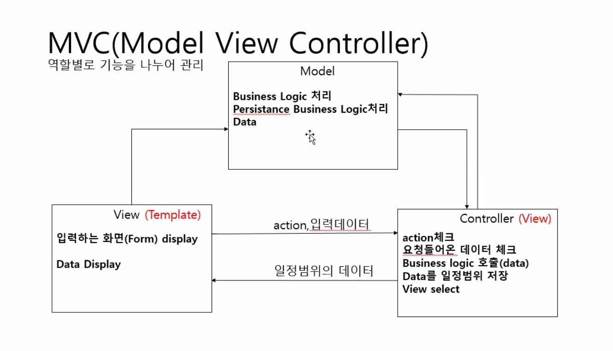
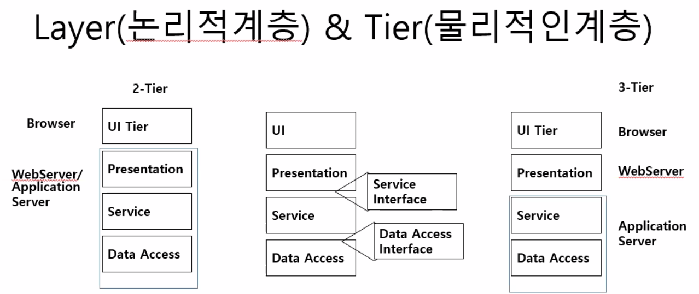

# 파이썬 클래스

장고에서 객체 핸들링할 필요가 있기 때문에 잘 익혀둬야 하는 부분

다른 객체지향 언어를 사용해본 사람은 문법에 익숙해질 필요가 

클래스 타입에 의해서 인스턴스화 하면 데이터를 담을 수 있는 객체가 되는 것

클래스의 장점은 상속, 캡슐화, 다형성에 의해서 재사용성을 극대화할 수 있는 장점이 있는 것이다.

클래스 키워드 이용해서 클래스를 만들어서 클래스를 핸들링할 수 있다.

__클래스 문법__

`class` 클래스명:

​	클래스 내용

인스턴스_이름

__매직 메서드__

 `__init__`

객체 초기화하면 자동적으로 `__init__` 자동으로 호출

언제 호출되는지 이해

파이썬 내부 컨테이너에 의해 실행되는 함수

오버라이딩해서 재수정해서 사용

직접 명시해서 사용할 일 별로 없음

class 클래스 이름:

`인스턴스`란?

`__init__` 메서드 작성법

`학생 관리 시스템 개발` 시스템 개발 수주

<요구사항>

함수를 사용하는 이유

반복해서 사용하는 기능을 만들어넣고 호출해서 사용하려고

>엔지니어 기본이 충족된 후에 비즈니스가 입혀져야 한다.
>
>실무에서 영업과 친해지면 좋음. 영업이 정보가 많음
>
>기술 트렌드 쫓아가기 위해서는 전자신문
>
>여기에 집중하다보면 메인을 놓칠수가 있음
>
>쉽게 접할 수 있는 신문, 사람, 경영관리 책(관련 분야)들이 도움이 많이 됨
>
>일단 관심을 갖는게 중요.
>
>하루아침에 안되는데, 노력하면 됨
>
>블로그, 깃허브 나만의 정보를 그때그때 내가 원하는 정보를 빠르게 찾을 수 있도록 잘 정리해두는 게 중요
>
>깃에다가 수업 내용을 관리하듯이, md 파일로 블로그 기능이 있으니까
>
>접하는 기술셋, 비지니스를 잘 정리해두는 것만으로도 도움이 될 수 있다.
>
>다양한 사람들을 만나는게 정말정말정말 중요!!!!!
>
>알게 되는 사람들의 연락처를 잘 관리하는 게 중요!

`generalization`

`specialitation`

`__MVC모델__`

view(화면) - control(제어역할: valid 체크, 비즈니스 로직 체크) - model

모델에서 비즈니스로직, persistant 한 로직을 작성

`레지스트리`

파일 잘 안썼음

persistent 데이터를 저장하기 위한 것이 db: rdbms, nosql(document형태의 키-값  저장)

`MVT모델`

장고 들어가기 전에 HTTP 프로토콜 기반으로한 웹의 동작 원리를 이해해야 함

***

(1.13 수)

객체 기본 컨셉(entity.py)

상속:부모클래스의 데이터와 오퍼레이션이 상속됨

???일반적으로 생성자는 상속되지 않음

보통 학생정보를 등록한다면

`super()` 메서드 이용해서 부모의 메서드(생성자도 포함) 호출할 수 있다.

`super`.  키워드하고 헷갈리지 말기

객체 사용하는 이유: reuse = 재사용할 수 있게 가능하면 사용자 코드를 만들어라

reuse는 사용자 코드가 reuse될 수 있게 만드는 것이 목적

코딩 라인 수가 더 길어질 수 있음. class, 표준을 추가하여 만들었을 지라도 

가져다 쓰는 쪽에서 인터페이스가 자꾸 변하면 안됨

그래서 만드는 쪽은 가능하면  class, 표준을 만들어야 하는데 이게 객체지향이 가장 맞아 떨어짐.

그러나 장단점 존재한다.

>self.name = name 이부분에서 self.name과 name의 각각의 의미를 이해를 잘 못했습니다. 설명 부탁드립니다.
>
>인자를 멤버 변수에 넣기위해 self를 사용한다.
>
>> 다른 (타입이 존재하는)객체지향 언어와 비교
>>
>> class Person(){
>>
>> ​	String id;
>>
>> ​	String name;
>>
>> ​	Person(){
>>
>> ​	}
>>
>> ​	Person(String id, String name){
>>
>> ​		this.id = id;	//가독성을 위해서 변수이름을 같게 하였는데, 이때 단순히 id = id라 하면 가장 가까운 로컬변수를 가리키게 돼서 의도와 달라진다.
>>
>> ​		this.name = name;
>>
>> ​	}
>>
>> }

*Person, Student 객체를 생성하지 못하도록 추상화할 수 있다!*

공공쪽은 전자정부프레임워크를 사용하게 됨 (egovframe.go.kr)

은행쪽에서 사용하는 경우도 있음

쉘스크립트를 작성하는 것은 대부분 파이썬이 내장되어 있음

보안, 데이터 분석, AI 는 파이썬을 많이 활용

현대오토에버는 GO 언어도 활용하고 있음

> 그많은 언어 다해야 하냐?
>
> syntax가 다를 뿐이지, 대부분 객체지향 컨셉이기 때문에
>
> 이 컨셉이 언어마다 다르지 않음
>
> 그래서 문제를 발생할 때, 클래스를 설계하는 노하우를 정교화한게 디자인패턴임 (1:00:00)
>
> 언어 하나를 고수할 필요는 없음
>
> 표현법, API가 다를 뿐.
>
> 

***

isinstance() 함수: 객체가 어떤 클래스로부터 만들어졌는지 확인

`__ str __`

재정의 = 오버라이딩

다형성

클래스는 최상위 object class를 상속받음

***

클래스 변수

객체를 선언하더라도 

가비지 컬렉터

heap: 레퍼런스가 끊긴 데이터가 공간을 차지하고 있으면 이럴 공간 해제하는 역할을 수행한다.(idle 타임에 파이썬 컨테이너가 수행)

stack영역: 값을 덮고 씌우고 하기 대문에 가비지 컬렉터와 상관이 없다.

그때 호출하는 메서드가 `__del__`임

정확한 시점을 알고 제거하는 경우에 `__del__`을 재정의하지만. 알기 쉽지 않아 재정의하지 않음

***

캡슐화(은닉화)

* 구현을 모르더라도 사용법을 알면 사용할 수 있다.

* 사용자 코드의 세부 구현을 모르고 사용할 수 있도록 제공

* ex) 차의 내부 원리를 모르더라도 사용법을 알면 운전하는 건 문제가 없다. 

  

  프라이빗 변수(외부에 접근 못하도록 막도록 설정)

* `private` variable로 선언

* getter/setter 메서드를 통해 구현상관없이 변수 접근(필터링 역할)

* 생성자를 통해서만 변수에 접근가능

* getter/setter 로 접근

* 

`static`

***

### 상속

* 부모 클래스로부터 자식클래스에 멤버 변수, 멤버 메서드를 상속받아 자식클래스의 것처럼 사용
* `generalization` : 추상화된 기존 클래스에서 부모 클래스를 새로 생성
* `Specialization` : 기존 클래스를 상속받는 자식 클래스를 추상화(employee)
* `다중상속` : 다른 누군가가 만든 형태들을 조립하여 내가 원하는 것을 만드는 것
* super(): 부모클래스의 생성자, 메서드 호출

언어에 따라 다중 상속 지원 여부 다름

***

### 사용자 정의 예외

* exception 상속받는 ExceptionClass 정의
* 나누기 0, int값 변환하는데 문자열 입력 -> 파이썬 컨테이너에서 예외 호출
* 예외상황 발생 시 (원하는 시점에 조건을 만족할 때). 강제로 ExceptionClass 발생
* ExceptionClass 발생가능한 실행문 사용시 try ~ except ~ finally 문으로 처리
* exception.py

***

### 모듈화(파이썬 함수 파일 참고-'모듈 만들기'부터)

* 그동안 하나의 디렉토리 안에 다 때려넣음 -> students 파일 변경
* 객체 핸들링하는 목적
* 규모가 커지면  하나의 파일로 관리하는게 말이 안됨.
* <과제>이것을 todo로 다시 한번 연습하기!
* student 폴더 안에 studnetMagrSystem 폴더 생성
  * entity
  * controller_view:
  * dao
  * service
  * view_template
  * exception
* 규모가 작기 때문에 controller_view와 service가 모호해질 수 있긴 함
* 엔트리 포인트로 `__main__` -> 시작점을 알려줌(파일명 출력과 구분)
* 엔트리 포인트의 모듈 외에는 파일명으로 출력된다.
* <NO이해> module_basic에서 test_module.py의 `__name__` 과 start.py에서의 `__name__` 의 차이
  * import 받은건지 엔트리 포인트인지 구분할 수 있다??? 이정도???

***

3:10~

* module_basic과 student 디렉토리 차이점은??
  * `__pycache__` -> import 로 호출되는 모듈들을 관리하기 위한 파이썬 컨테이너가 생성하고 실행하는 폴더
  * import 하게  되면 이 패키지를 관리하기 위한 파일 ->  모듈화가 되어있다는 의미

### `__init__.py` 13:00

* <NO이해>
* 

### MVC 패턴

기능별 모듈화 + 클래스별 모듈화 조합해야 재사용성을 높일 수 있음

<NO이해 41:00>studentMagrSystem 폴더 예시-> 

entity 대신 dtd라고 사용하기도 함

(소프트웨어 아키텍과 관련된 실무)

***

### Layer

* 인터넷에서 사용하는 프로토콜이 TCP/IP 프로토콜
* stream 으로 io할 때도, 서로 이해할 수 있는 약속이 필요해
* 분산환경에서는 요청,제공하는 쪽에서 약속된 규약이 필요함 -> 프로토콜이라 함
* 인터넷에서 필요할 때마다 프로토콜을 만들어 냈음.->인터넷에서 TCP/IP 프로토콜로 표준화
* 인터넷의 분산환경에서 통신하려면 응용계층에서 우리가 아는 형태의 데이터를 전달하면
* TCP/IP는 4개 or 5개 계층으로 나눔
* 응용계층의 HTTP/HTTPS 프로토콜을 사용함
* 서로 인접한 계층에만 영향을 받음
* Layer 패턴은 아래 계층에만 영향을 받음 ->아직 독립성 안갖춰짐 -> 표준(인터페이스)를 제공하여 독립성을 보장할 수 있음
* 

* 배포할 때 관련
* `티어` 
* MVC 패턴과 관련 (계속 반복될 내용임)
* 아키텍처 패턴에 준해서 프레임워크를 사용하기도 하고..
* 클래스 디렉토리를 나눈 기준에 대해 알기 위한 내용
* AWS 환경 구축할 때와 관련되어 있음
* 

***원리가 항상 중요하다. 그것은 블로그가 아닌 스펙문서에 나와 있다!***

***

### StudentMagrSystem 을 클래스로 구분하기

***

1/14

<각각의 패키지 밑에 `__init__` 파일 추가. 그 안에 아무런 내용이 없어도 됨. 패키지 인식하는 용도로

<NO이해>모듈화 어떻게 할건지???

데이터와 기능이 있는것들은 클래스로 모듈화하고

기능만 있는 것들은 기능별로 나눌 것임

모든 클래스는 명시하지 않더라도 object class를  상속받는다.

부모거를 그대로 재정의해서 사용가능하다 -> 다형성

재정의된 메서드가 버츄얼 인보케이션 됨

같은 이름인데 충돌 나는거아니냐 ?

18:00분까지 다시 정리

***

영상2

8:50 모듈 흐름

22:00 역할별로 모듈화하는 것의 장점(굉장히 중요)

students 변수를 클래스 변수를 선언한 이유(파일 입출력과 관련) (굉장히 중요)

웹으로 바꿨을 때 바뀌는 부분

todo로 바꿔보기

리팩토링 -유지보수하기 편하도록 패턴 적용, 성능 향상시키도록 수정하는 것

[[JavaScript\] 리팩토링은 어떻게 해야 할까? ① : 네이버 블로그 (naver.com)](https://m.blog.naver.com/PostView.nhn?blogId=magnking&logNo=220973190294&proxyReferer=https:%2F%2Fwww.google.com%2F)

어제 오늘 리팩토링 한 것. mvc 패턴 적용해서

***

14:00

<NO이해>작성 순서(매우 중요)

제 질문: 구현하는 순서가 궁금합니다. 수업시간에entity -> view -> service -> exception -> dao -> controller 이렇게 했던거 같은데 항상 이런 순서로 구현하는 것인가요???

entity -> dao(단위테스트) ->service->controller->view template 확인

view template쪽은 프론트 개발자

백앤드 - entity~~~
프론트앤드 API설계 참조해서 백앤드 호출
프론트 : API호출 -> Model->Controller ->View

spring framework에서 스프링부트에서 JPA 프레임워크 사용해서 DAO 

view 템플릿 쪽은 

프론트단도 mvc 패턴이 적용될 수 있음

***

1/14

<각각의 패키지 밑에 `__init__` 파일 추가. 그 안에 아무런 내용이 없어도 됨. 패키지 인식하는 용도로

<NO이해>모듈화 어떻게 할건지???

데이터와 기능이 있는것들은 클래스로 모듈화하고

기능만 있는 것들은 기능별로 나눌 것임

모든 클래스는 명시하지 않더라도 object class를  상속받는다.

부모거를 그대로 재정의해서 사용가능하다 -> 다형성

재정의된 메서드가 버츄얼 인보케이션 됨

같은 이름인데 충돌 나는거아니냐 ?

18:00분까지 다시 정리

***

영상2

8:50 모듈 흐름

22:00 역할별로 모듈화하는 것의 장점(굉장히 중요)

students 변수를 클래스 변수를 선언한 이유(파일 입출력과 관련) (굉장히 중요)

웹으로 바꿨을 때 바뀌는 부분

todo로 바꿔보기

리팩토링 -유지보수하기 편하도록 패턴 적용, 성능 향상시키도록 수정하는 것

[[JavaScript\] 리팩토링은 어떻게 해야 할까? ① : 네이버 블로그 (naver.com)](https://m.blog.naver.com/PostView.nhn?blogId=magnking&logNo=220973190294&proxyReferer=https:%2F%2Fwww.google.com%2F)

어제 오늘 리팩토링 한 것. mvc 패턴 적용해서

***

14:00

<NO이해>작성 순서(매우 중요)

제 질문: 구현하는 순서가 궁금합니다. 수업시간에entity -> view -> service -> exception -> dao -> controller 이렇게 했던거 같은데 항상 이런 순서로 구현하는 것인가요???

entity -> dao(단위테스트) ->service->controller->view template 확인

view template쪽은 프론트 개발자

백앤드 - entity~~~
프론트앤드 API설계 참조해서 백앤드 호출
프론트 : API호출 -> Model->Controller ->View

spring framework에서 스프링부트에서 JPA 프레임워크 사용해서 DAO 

view 템플릿 쪽은 

프론트단도 mvc 패턴이 적용될 수 있음

