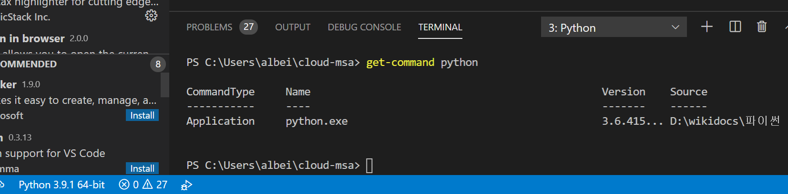
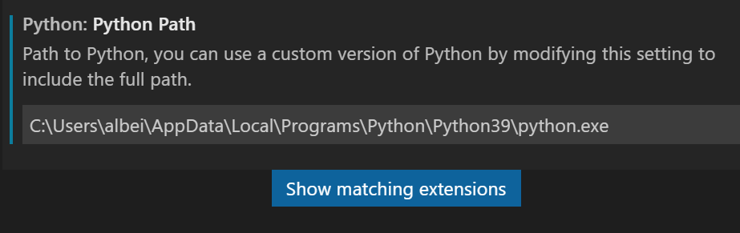

# 1. terminal 상에 python 명령어 실행 안 될 때



```bash
PS C:\Users\albei\cloud-msa> python
Fatal Python error: Py_Initialize: unable to load the file system codec
ModuleNotFoundError: No module named 'encodings'

Current thread 0x00004a4c (most recent call first):
```


`#` 문제 정의: terminal 상에 python 실행 안 되는 문제

`#` 문제 확인: 

`get-command` 또는 `which` 명령어로 python.exe의 위치 확인

시스템 환경 변수의 path에 파이썬과 관련된 주소 확인

환경 변수에서 지정한 파이썬 버전과 실행하려는 파이썬 버전이 일치하지 않아  VSCode 상의 오른쪽 상단 실행버튼으로는 실행이 잘 될 수 있다.


`#` 해결책: 

1. File - Preferences - Settings

2. python.pythonpath 검색

3. `python` -> <변경할 파이썬 위치>

   

4. VSCode 재실행
5. `python`명령어로 실행하는 것과 VSCode 상에서 오른쪽 상단의  실행 버튼의 결과가 다르다면,
   * 시스템 환경 변수 - path 에서 python 과 관련된 변수를 삭제한다. (이 경우, 자동적으로 python.exe의 위치를 변경한다. 여러 버전이 있을 경우 문제가 될 수 있다.)
   * VSCode 상에 python interpreter path로 설정한 주소를 시스템 환경 변수의 path에 똑같이 등록시켜준다. (권장)


