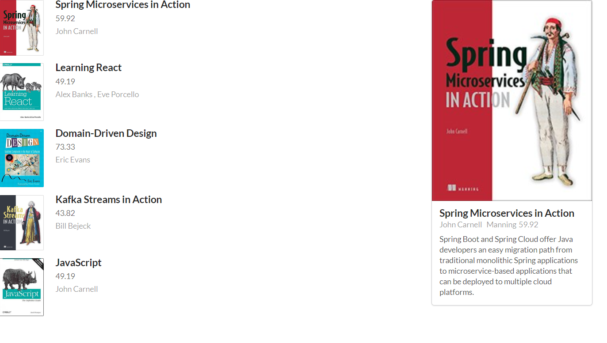
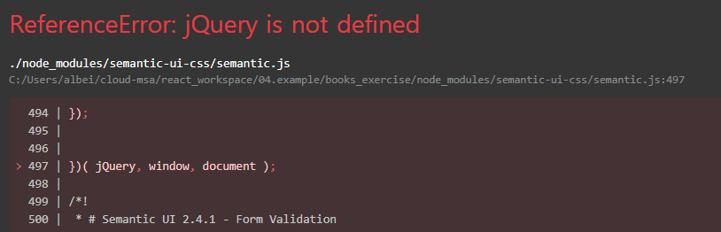

최종 UI

# Error

## ReferenceError: jQuery is not defined

시도1(X). node_modules 지우고 yarn install 

시도2(X). semantic-ui-css, semantic-ui-react 패키지 삭제 후 재설치

시도3. 의심가는 부분 주석하면서 단위 테스트 html 태그 부분, import 부분

index.js -> app.js -> ...

`import {Item, Image} from 'semantic-ui-css'` => `import {Item, Image} from 'semantic-ui-react'`

## TypeError: Cannot read property 'imgUrl' of undefined

시도1(O). props로 넘기는 컴포넌트에서의 변수명과 받는 쪽 컴포너트의 변수명이 정확히 일치하는지 확인한다.