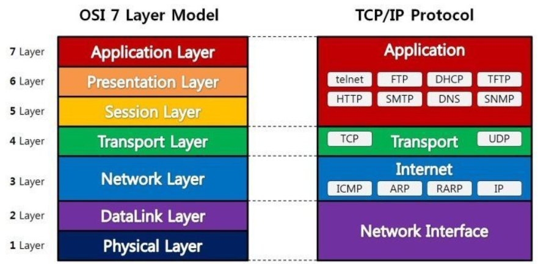

# LAN, WAN, 인터넷

LAN: 사용자가 직접 구축, 운용, 관리하는 네트워크

WAN: 기업의 거점(LAN)들을 연결하는 네트워크

인터넷: 전세계의 ISP가 상호 연결된 네트워크


# LAN 과 WAN 차이

어느 정도 규모가 큰 기업은 여러 곳의 거점을 가지고 있다. 이때, 각 거점의 네트워크는 'LAN'에 해당한다.

이러한 거점을 연결해서 하나의 사내 네트워크를 구축해야 하는데 물리적인 케이블로 연결하여 관리하는 것은 무리이지 않은가? 그래서 등장한 것이 바로 'WAN'이다. 기업의 거점 사이를 연결하기 위해 SKT 등의 전기통신사업자가 만든 네트워크를 가리킨다.

|                     | LAN                                      | WAN                                  |
| ------------------- | ---------------------------------------- | ------------------------------------ |
| 네트워크            | 사내 네트워크 여러 거점 네트워크 중 하나 | 기업의 거점 사이를 연결하는 네트워크 |
| 구축,운용,관리 주체 | 사용자가 직접                            | 전기통신사업자                       |
| 통신요금            | 내부 통신엔 요금 부과X                   | 월정액 통신료 부과                   |

* LAN의 규격으로 가장 많이 보급된 것은 '이더넷'이다.
* 


# WAN과 인터넷 차이

두 가지 측면에서 큰 차이가 있다.

|                 | WAN                              | 인터넷              |
| --------------- | -------------------------------- | ------------------- |
| 네트워크 관리자 | 전기통신사업자 e.g. SKT, KT, LGU | 접속사업자 e.g. ISP |
| 통신상대        | 사내 컴퓨터                      | 누구나              |

```
요즘에는 WAN 대신 인터넷을 이용하는 경우도 늘어나고 있따.
전기통신사업자에게 구축과 관리를 맡기는 WAN보다 인터넷을 이용하는 쪽이 더 적은 비용으로 거점 간 통신을 구현할 수 있기 때문이다.
하지만 보안리스크가 존재한다. 그래서 이용되는 것이 인터넷 VPN이다.
인터넷 VPN은 'IPsec', 'SSL', 'PPTP/L2TP' 등의 암호화 기술을 이용해 데이터를 암호화함으로써 인터넷을 경유하는 거점 간 통신을 보다 안전하게 만들어준다. 
```


네트워크를 통해서 데이터를 주고받는 주체는 '애플리케이션'이다. 컴퓨터가 서로 데이터를 송수신하는 설명이 많은데, 실제로는 컴퓨터에서 동작하는 애플리케이션이 데이터를 송수신하고 있다.


# 프로토콜

데이터를 주고 받기 위해서는 아래와 같이 다양한 규약이 필요하다.

- 데이터의 포맷
- 데이터를 송수신하는 순서
- 데이터의 송신처
- 에러 처리

이러한 통신 규약을 '프로토콜'이라고 부른다.

통신을 수행하는 기기들은 서로 같은 통신 프로토콜(규약)에 기초하여 네트워크 통신을 수행한다.


# 네트워크 아키텍처

*단, 통신 프로토콜 하나에 네트워크 통신이 필요로 하는 기능 모두를 쑤셔 넣지는 않는다. 그랬다가는 통신 프로토콜이 복잡해지고 기능 추가 등의 확장성도 부족해진다. 그래서 넽으ㅝ크 통신에 필요한 기능마다 복수의 통신 프로토콜이 정의되어 있는 것이다. 네트워크 통신은 이와 같이 복수의 프로토콜 조합으로 구현되어 있다.*


네트워크 아키텍처에서는 통신에 필요한 기능들을 모듈화해 계층 구조로 만든 뒤, 각 계층(모듈)의 기능을 구현하기 위한 통신 프로토콜을 조합한다. 대표적인 네트워크 아키텍처는 'OSI 참조 모델'이다.


# OSI 참조 모델의 용도



물리 계층으로부터 순서대로 레이어1(L1), 레이어2(L2)와 같이 표현하기도 한다.

OSI 7 계층의 사고방식이 약간 복잡하기 때문에 그다지 이용되고 있지 않다. OSI 참조 모델은 네트워크 아키텍처의 모델로서가 아니라, 네트워크의 기능이나 장비의 특징을 가리키거나 네트워크의 상태에 대해 언급할 때의 잣대로써 사용되고 있다. 예를 들어 'L3 스위치'나 'L4-7 스위치'와 같은 네트워크 장비 명칭은 OSI 참조 모델의 계층에 기초한 것이다. 그리고 장애 발생 시에 '이건 물리 계층의 문제다'와 같은 말을 하는 경우가 있는데, 이러한 표현도 OSI 참조 모델에 기초한 것이다.


# TCP/IP

OSI를 대신해 가장 폭넓게 이용되고 있는 네트워크 아키텍처가 바로 TCP/IP이다. 그리고 LAN이나 인터넷에서도 이 TCP/IP에 기초하여 통신이 이루어지고 있다.

인터넷 게층보다 위에 있는 것은 모두


## TCP/IP의 4개 계층의 역할


## 계층별 통신 경로


## 하위 계층의 통신 경로가 기반이 된다

