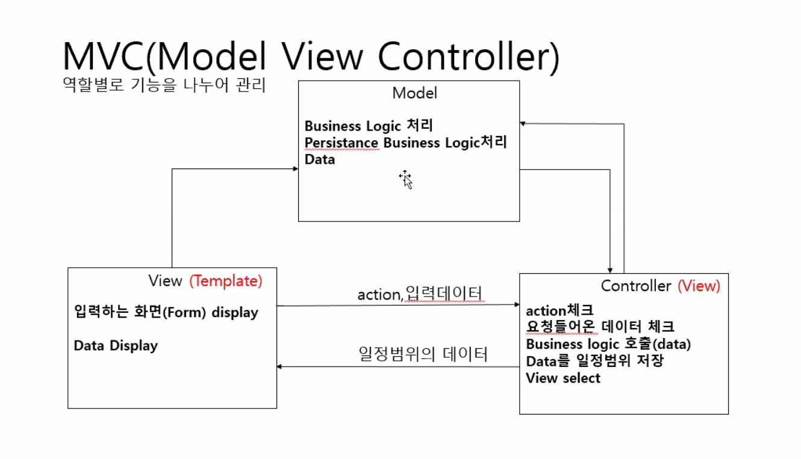
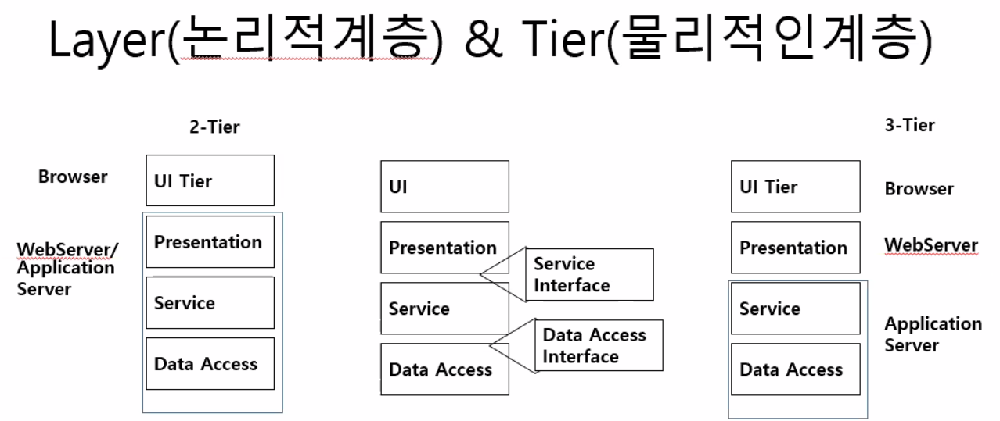
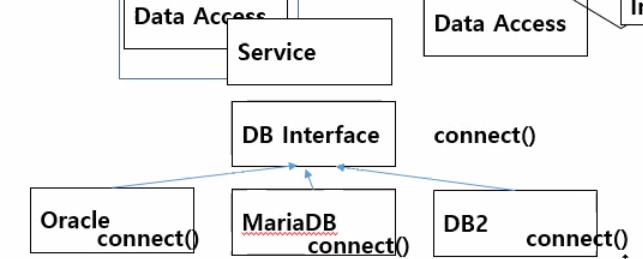

# MVC 패턴

기능별 모듈화 + 클래스별 모듈화 조합해야 재사용성을 높일 수 있음

<NO이해 41:00>studentMagrSystem 폴더 예시-> 

entity 대신 dtd라고 사용하기도 함

(소프트웨어 아키텍과 관련된 실무)

***

# LAYER

* 인터넷에서 사용하는 프로토콜이 TCP/IP 프로토콜
* stream 으로 io할 때도, 서로 이해할 수 있는 약속이 필요해
* 분산환경에서는 요청,제공하는 쪽에서 약속된 규약이 필요함 -> 프로토콜이라 함
* 인터넷에서 필요할 때마다 프로토콜을 만들어 냈음.->인터넷에서 TCP/IP 프로토콜로 표준화
* 인터넷의 분산환경에서 통신하려면 응용계층에서 우리가 아는 형태의 데이터를 전달하면
* TCP/IP는 4개 or 5개 계층으로 나눔
* 응용계층의 HTTP/HTTPS 프로토콜을 사용함
* 서로 인접한 계층에만 영향을 받음
* Layer 패턴은 아래 계층에만 영향을 받음 ->아직 독립성 안갖춰짐 -> 표준(인터페이스)를 제공하여 독립성을 보장할 수 있음
* 

* 배포할 때 관련
* `티어` 
* MVC 패턴과 관련 (계속 반복될 내용임)
* 아키텍처 패턴에 준해서 프레임워크를 사용하기도 하고..
* 클래스 디렉토리를 나눈 기준에 대해 알기 위한 내용
* AWS 환경 구축할 때와 관련되어 있음
* 

***원리가 항상 중요하다. 그것은 블로그가 아닌 스펙문서에 나와 있다!***

***

### StudentMagrSystem 을 클래스로 구분하기

***

1/14

<각각의 패키지 밑에 `__init__` 파일 추가. 그 안에 아무런 내용이 없어도 됨. 패키지 인식하는 용도로

<NO이해>모듈화 어떻게 할건지???

데이터와 기능이 있는것들은 클래스로 모듈화하고

기능만 있는 것들은 기능별로 나눌 것임

모든 클래스는 명시하지 않더라도 object class를  상속받는다.

부모거를 그대로 재정의해서 사용가능하다 -> 다형성

재정의된 메서드가 버츄얼 인보케이션 됨

같은 이름인데 충돌 나는거아니냐 ?

18:00분까지 다시 정리

***

영상2

8:50 모듈 흐름

22:00 역할별로 모듈화하는 것의 장점(굉장히 중요)

students 변수를 클래스 변수를 선언한 이유(파일 입출력과 관련) (굉장히 중요)

웹으로 바꿨을 때 바뀌는 부분

todo로 바꿔보기

리팩토링 -유지보수하기 편하도록 패턴 적용, 성능 향상시키도록 수정하는 것

[[JavaScript\] 리팩토링은 어떻게 해야 할까? ① : 네이버 블로그 (naver.com)](https://m.blog.naver.com/PostView.nhn?blogId=magnking&logNo=220973190294&proxyReferer=https:%2F%2Fwww.google.com%2F)

어제 오늘 리팩토링 한 것. mvc 패턴 적용해서

***

14:00

<NO이해>작성 순서(매우 중요)

제 질문: 구현하는 순서가 궁금합니다. 수업시간에entity -> view -> service -> exception -> dao -> controller 이렇게 했던거 같은데 항상 이런 순서로 구현하는 것인가요???

entity -> dao(단위테스트) ->service->controller->view template 확인

view template쪽은 프론트 개발자

백앤드 - entity~~~
프론트앤드 API설계 참조해서 백앤드 호출
프론트 : API호출 -> Model->Controller ->View

spring framework에서 스프링부트에서 JPA 프레임워크 사용해서 DAO 

view 템플릿 쪽은 

프론트단도 mvc 패턴이 적용될 수 있음

***

1/14

<각각의 패키지 밑에 `__init__` 파일 추가. 그 안에 아무런 내용이 없어도 됨. 패키지 인식하는 용도로

<NO이해>모듈화 어떻게 할건지???

데이터와 기능이 있는것들은 클래스로 모듈화하고

기능만 있는 것들은 기능별로 나눌 것임

모든 클래스는 명시하지 않더라도 object class를  상속받는다.

부모거를 그대로 재정의해서 사용가능하다 -> 다형성

재정의된 메서드가 버츄얼 인보케이션 됨

같은 이름인데 충돌 나는거아니냐 ?

18:00분까지 다시 정리

***

영상2

8:50 모듈 흐름

22:00 역할별로 모듈화하는 것의 장점(굉장히 중요)

students 변수를 클래스 변수를 선언한 이유(파일 입출력과 관련) (굉장히 중요)

웹으로 바꿨을 때 바뀌는 부분

todo로 바꿔보기

리팩토링 -유지보수하기 편하도록 패턴 적용, 성능 향상시키도록 수정하는 것

[[JavaScript\] 리팩토링은 어떻게 해야 할까? ① : 네이버 블로그 (naver.com)](https://m.blog.naver.com/PostView.nhn?blogId=magnking&logNo=220973190294&proxyReferer=https:%2F%2Fwww.google.com%2F)

어제 오늘 리팩토링 한 것. mvc 패턴 적용해서

***

14:00

<NO이해>작성 순서(매우 중요)

제 질문: 구현하는 순서가 궁금합니다. 수업시간에entity -> view -> service -> exception -> dao -> controller 이렇게 했던거 같은데 항상 이런 순서로 구현하는 것인가요???

entity -> dao(단위테스트) ->service->controller->view template 확인

view template쪽은 프론트 개발자

백앤드 - entity~~~
프론트앤드 API설계 참조해서 백앤드 호출
프론트 : API호출 -> Model->Controller ->View

spring framework에서 스프링부트에서 JPA 프레임워크 사용해서 DAO 

view 템플릿 쪽은 

프론트단도 mvc 패턴이 적용될 수 있음

