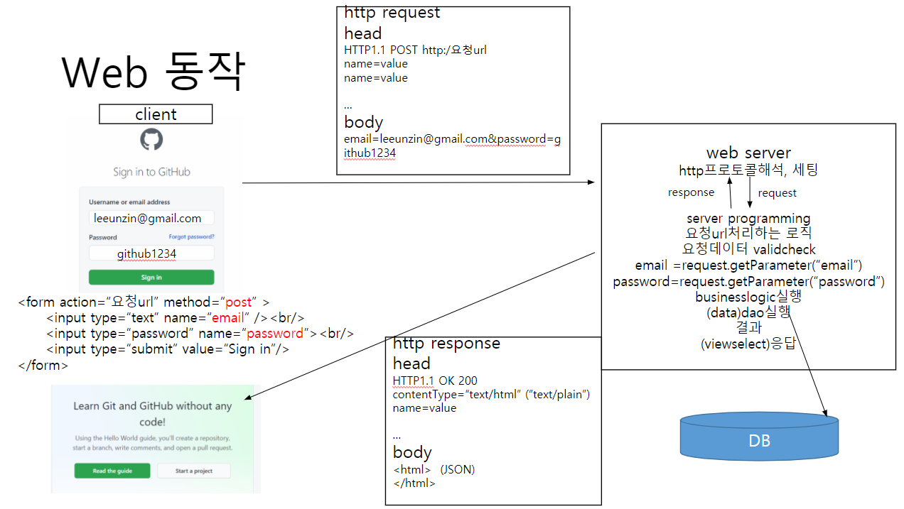
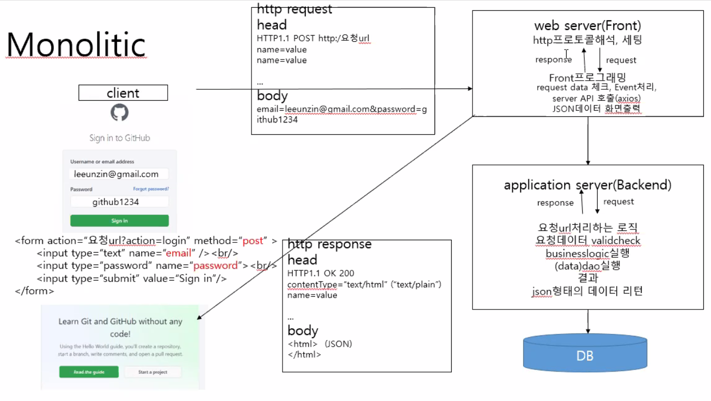
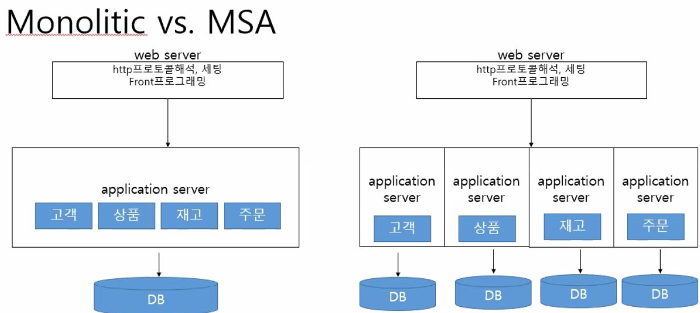
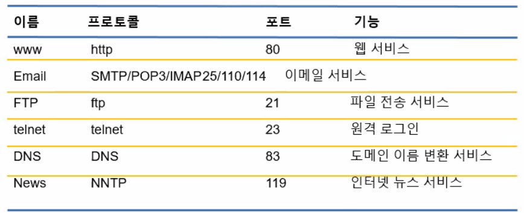
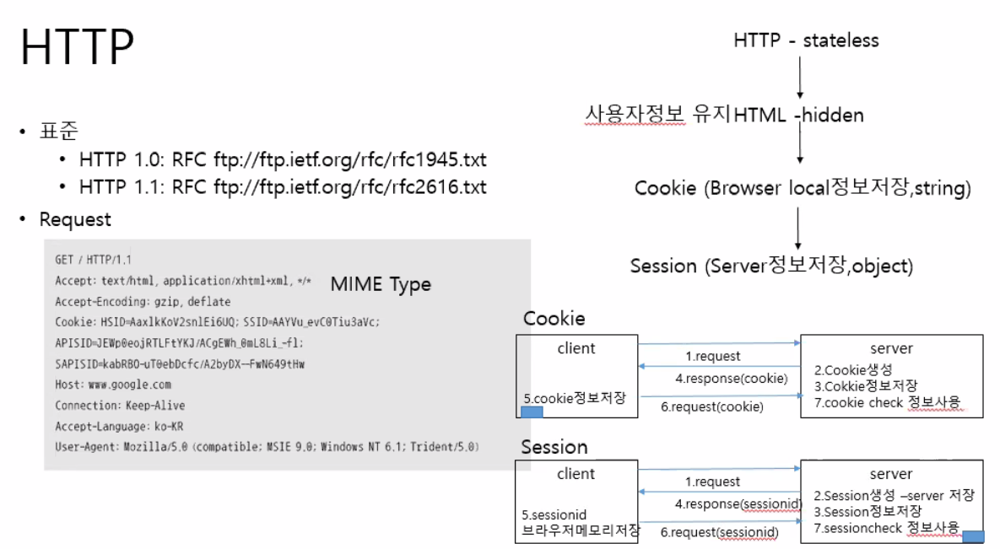
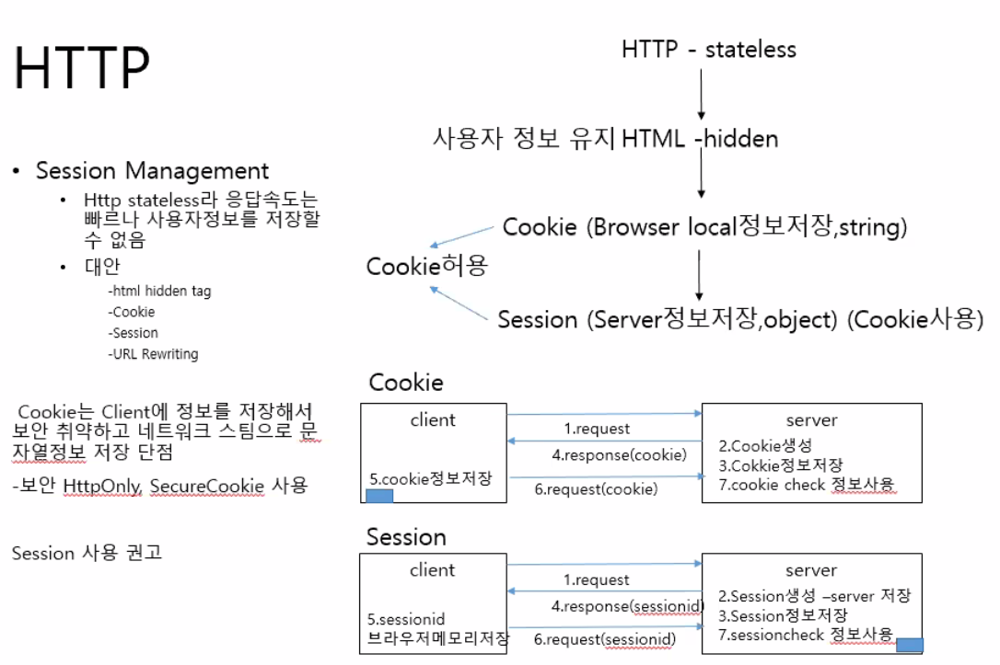
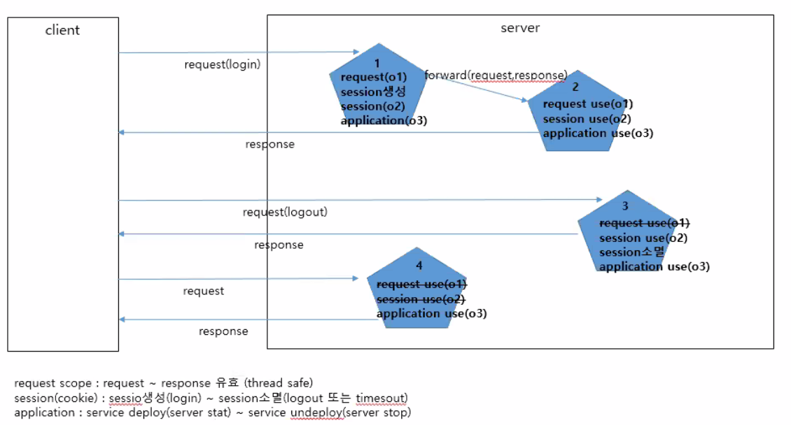
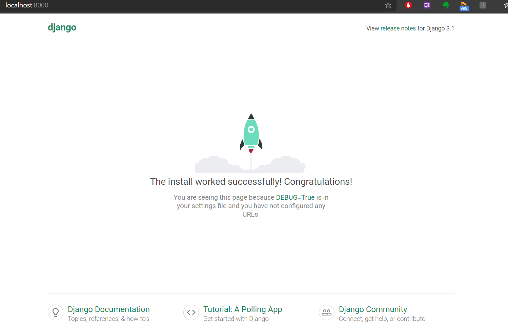

# 웹의 동작원리(2. 00:00~)

# 이걸 왜 알아야 하지?

​																																																																													**button과 submit 차이**

button : 이벤트를 줘야하고

submit : 자체 이벤트를 포함하고 있음

`http request`

* head에는 key-value 쌍으로 정보가 저장
* body에는 전달하고자하는 클라이언트의 정보가 담김
* b

`method = "post"`

### web server

* http 프로토콜 해석
* 

`java script` 문법 익힌 이유

### server programming

* MVC 패턴 적용되는 부분
* DJANGO로 작성하는 부분
  * controlloer 를 view라는 이름으로 작성
  * 따로 DB 설치하지 않더라도 DB 모델이 있음

## 모놀리식

* server API 적용하여 server의 역할을 줄인 모델
* 여기서 MVC 패턴은 Front단과 back 단이 적용됨
* 

### web server

* 

### application server

* json 형태의 데이터 리턴이 달라지는 부분

## 모놀리식 VS MSA

모놀리식

* 하나의 DB에 모든 모듈을 넣음

MSA

* 기본 컨셉은 쪼개자
* 뷰는 상관없이 모듈을 쪼개고 다른 곳에서 배포를 해도 상관 없도록 한다.
* 물리적으로 나뉘어도 상관없음
* DB가 여러개 쓰일 수 있고, 심지어 DB가 달라도 상관이 없다.
* 만약 문제가 발생이 됐다하면, 전체 인프라에 영향을 주는게 아니라, 전체를 백업하지 않고 부분만 백업
* scale out 되기 때문에 로드 밸런싱에 용이해짐
* 

밥먹고와서는 HTTP 프로토콜 설명 (먼저 MDN 사이트 먼저 참고)

DJANGO 설치

HTTP 프로토콜

* 헤더에 대한 이해하면 웹 프로그래밍 하는 데 도움됨
* 객체들은 사용하는 언어에서 다 제공되지만
* 알고 사용하는 것과 모르는 것은 차이가 있음

# HTTP(2:00~)

* 인터넷은 TCP/IP 기반의 네트워크가 전세계적으로 확대되어 하나로 연결된 'network of network'
* 인터넷 = www 가 아님
* www는 인터넷 기반의 서비스 중 하나
* 
* 응용계층의 프로토콜 - 웹에서 사용하기 위한 프로토콜
* 표준
  * http 1.0
  * http 1.1
* BODY 부분은 HTML 또는 JSON 형식으로 들어올 수 있다.
* `XHR`: XML HTTP REQUEST. 요청한 데이터가 어떠한 형식으로 들어왔는 지 볼 수 있다.
* 헤더에 설정을 해놓더라도 표준대로 설정하더라도 브라우저에 따라 다르게 반응할 수 있다.
  * 이를 위해 JQUERY는 크로스 브라우징해서 API제공해줘서 한 때 많이 사용함
  * 복잡한 로직의 프론트단을 작성하는데 한계가 있었음
  * 
* request
* stateless - 사용자의 상태정보를 가지고 있지 않음
  * 사용자를 구분하지 않음
  * 응답속도가 빠르다.
  * 이로 인해 사용자가 많아짐.
  * 사람이 많아짐에 따라 요구사항이 늘어남. 동적 반응하기를 원함
  * 프로토콜 자체로는 할 수 가 없었음
  * html의 hidden 타입으로 인해 (<input hidden ="hiddendata" name="hidden"/>)
    * url에  이 속성이 나타남
  * 쿠키로 stateless한 http를 보완하게 됨

* 쿠키 단점
  * 문자열밖에 저장 못함
  * 보안 문제
    * 복잡한 문자로 되어있어보이지만 64base 인코딩된것일 뿐 디코딩으로 얼마든지 해석 가능
    * 쿠키에 담긴 pw를 디코딩 가능
    * 옥션 소송 사건 패소

* 

# HTTP Request (3:00)

# Django 설치

# django 프로젝트 생성

# 앱 생성(5:00)

