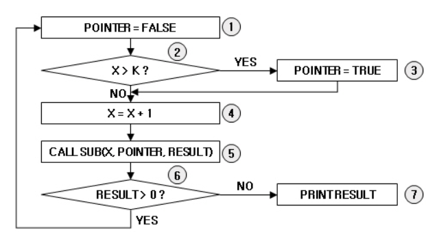

**[20년3회] 정보처리기사 실기 가답안 (합격률 18%, 합격자 수 2,573명)**


1. EAI 구축유형 중 Message Bus와 Hybrid를 제외한 나머지 두 가지 유형은?

\- 답안: **PPP, Hub & Spoke**

\- **출제: 통합 구현 3강**

\- 참고: PPP = Point to Point

---

2. 대표적인 내부 라우팅 프로토콜, 대규모 네트워크에 적합, 링크 상태 라우팅 프로토콜로도 불리는 라우팅 프로토콜은?

\- 답안: **OSPF(최단 경로 우선 프로토콜)**

\- **출제: 응용 SW 기초 기술 활용 2강**

---

3. 심리학자 톰 마릴은 컴퓨터가 메시지를 전달하고, 메시지가 제대로 도착했는지 확인하며, 도착하지 않았을 경우 메시지가 재전송하는 일련의 방법을 가리켜 '기술적 은어'라는 뜻으로 (  )이라 불렀다.

\- 답안: **프로토콜**

\- 출제:

---

4. **헝가리안 표기법**에 대해 서술

\- 답안: 컴퓨터 프로그래밍에서 변수 및 함수의 이름 인자 앞에 데이터 타입을 명시하는 코딩 규칙

마이크로소프트(Microsoft)의 찰스 시모니(Charles Simonyi)가 개발 책임자로 있을 때 제안 

\- 출제:

---

5. 데이터베이스에서 **스키마**에 대해 서술

\- 답안: 데이터베이스의 구조와 제약조건에 대한 명세를 기술한 것

\- **출제: SQL 응용 1강**

---

6. C언어-출력 결과를 쓰시오.

```c
int main(){
  int i, c=0;
  while(i<10){

​     i++;
​     c *= i;

  }
  printf("%d", c);
}
```


\- 답안: **0**

\- **출제: C언어 1강**

---

7. UI 설계 원칙 중 **직관성**에 대해 서술

\- 답안: 누구나 쉽게 이해하고 사용할 수 있어야 한다.

\- **출제: 화면 설계 1강**

---

8. C++ 에서 **생성자**의 의미 서술

\- 답안: 객체 생성 시 초기화 작업을 위한 함수로써, 객체를 생성할 때 반드시 호출되고, 제일 먼저 실행된다.

또는

new 연산자를 통해서 객체를 생성할 때 반드시 호출이 되고 제일 먼저 실행되는 일종의 메소드

\- **출제: 프로그래밍 언어 활용 4강, 20년 2회 기출풀이 강의**

---

9. **형상 통제**에 대해 서술

\- 답안: 산출물의 변경 사항을 버전별로 관리하여 목표 시스템의 품질 향상을 지원하는 활동

\- **출제: 서버 프로그램 구현 1강**

---

10. TCP/IP에서 신뢰성 없는 IP를 대신하여 송신측으로 네트워크의 IP 상태 및 에러 메시지를 전달해주는 프로토콜

\- 답안: **ICMP**

\- **출제: 소프트웨어 개발 보안 구축 1강**

---

11. SQL-테이블에 속성 추가

( ① ) TABLE 학생 ( ② ) 주소 VARCHAR(20);

\- 답안: **① ALTER ② ADD**

\- **출제: SQL 응용 1강**

---

12. **리팩토링**의 목적 서술

\- 답안: 코드의 외부 행위는 바꾸지 않고 내부 구조를 개선시켜 소프트웨어를 보다 이해하기 쉽고, 수정하기 쉽도록 만드는 것

\- **출제: 필기 요약-애플리케이션 테스트 관리 1강**

---

13. 분기 커버리지 과정 순서 배열



\- 답안: **1234567, 124561** 또는 **1234561, 124567**

\- **출제: 애플리케이션 테스트 관리 1강**

\- 참고: 7칸, 6칸 비워져 있었음 (**문제는 파일 첨부합니다.**)

---

14. 관계대수-두 개의 릴레이션 A 와 B가 있을 때 B의 릴레이션의 모든 조건을 만족하는 경우의 튜플들을 릴레이션 A에서 분리해 내어 프로젝션 하는 연산자 기호

\- 답안: **÷**

\- **출제: 응용 SW 기초 기술 활용 5강**

---

15. SQL-과목별 점수의 평균이 90이상인 과목이름 최소점수 최대점수 적는 문제(WHERE 구문 사용 X, GROUP BY, HAVING, AS 사용)

\- 답안: **select 과목이름, min(점수) as 최소점수, max(점수) as 최대점수 from 성적 group by 과목이름 having avg(점수) >= 90;**

\- **출제: SQL 응용 2강**

\- 참고: 대/소문자 구분하지 않습니다. ; 생략 가능하다고 지문 있었음.

---

16. 동치 분할 테스트, 경계값 분석 테스트 등 내부 구조를 보지 않고 하는 테스트

\- 답안: **블랙박스 테스트**

\- **출제: 애플리케이션 테스트 관리 1강**

---

17. C언어-출력 결과를 쓰시오.

```c
int r1( ){
  return 4;
}

int r10( ){
  return (30+r1( ));
}

int r100( ){
  return (200+r10( ));
}

int main( ){
  printf("%d ", r100( ));
  return 0;
}
```


\- 답안: **234**

\- **출제: C언어 3강**

---

18. 자바-출력 결과를 쓰시오. (짝수 합계 구하는 문제)

```java
public class Gisafirst{

  public static void main(String []args){
    int i=0;
    int sum=0;
    while (i<10){
      i++;
      if(i%2==1)
       continue;
    sum += i;
    }
  System.out.print(sum);
  }
}
```


\- 답안: **30**

\- **출제: C언어 1강**

---

19. 자바-상속

```java
abstract class Vehicle{
 String name;
 abstract public String getName(String val); 

 public String getName(){
 return "Vehicle name :" + name;
 }
} 

 

class Car extends Vehicle{
 public Car(String val){
 name = super.name = val;
 }
 public String getName(String val){
 return "Car name :" + val;
 }
 public String getName(byte val[]){
 return "Car name :" + val;
 }
}

public class Test{
 public static void main(String[] args){
 Vehicle obj = new Car("Spark");
 System.out.printf(obj.getName());
 }
}
```


\- 답안: **Vehicle name :Spark**

\- **출제: 자바 2강**

\- 참고: 띄어쓰기는 채점과 무관합니다.

---

20. SQL-학생 테이블에서 이름이 민수인 튜플 삭제

\- 답안: **DELETE FROM 학생 WHERE 이름 = '민수' ;**

\- **출제: SQL 응용 2강**

\- 참고: 대/소문자 구분하지 않습니다. ; 생략 가능하다고 지문 있었음.