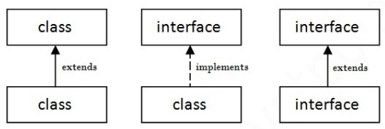

### 추상클래스

- 동일한 부모를 가지는 클래스를 묶는 개념
- 상속을 받아서 기능을 확장시키는 것이 목적
- 미완성 설계도라고도 표현
- 상속을 위한 클래스이기 때문에 따로 객체를 생성할 수 없다.
- 추상 클래스를 설명하기 위해 Animal 추상 클래스를 선언해보자
  - 어떤 A라는 클래스가 추상 클래스를 상속받는다면 A클래스는 추상 클래스에 선언했던 추상 메서드를 무조건 구현해야하는 룰이 있다.
  - 이 룰을 어기면 에러가 발생한다.
  - 자식 클래스로 Dog, Cat을 선언해줄 수 있다.
- 추상 클래스에는 일반 메서드도 구현할 수 있다. 

### 인터페이스

- 모든 메서드가 추상 메서드인 경우를 말한다.
- 인터페이스는 구현 객체가 같은 동작을 한다는 것을 보장하는 것이 목적이다.
- 추상클래스가 미완성 설계도라면 인터페이스는 기본 설계도라고 할 수 있따.
- 인터페이스도 추상클래스처럼 다른 클래스를 작성하는데 도움을 주는 목적으로 작성하고
- 인터페이스는 추상 클래스와 반대로 다중 상속이 가능하다.
- 클래스끼리, 인터페이스끼리 상속할 때는 extends
- 클래스가 인터페이스를 상속받을 때는 implements 키워드를 사용한다.
- 

### 추상클래스와 인터페이스 차이

- 추상클래스와 인터페이스의 공통점은 추상 메서드를 사용할 수 있다는 것
- *추상클래스가 인터페이스 역할을 다 할 수 있는데 왜 굳이 2가지로 나눠서 사용할까? '사용의도' 때문*
- 추상 클래스는 IS -A "~이다" 
- 인터페이스는 HAS -A "~을 할 수 있는"
- 다중상속의 가능 여부에 따라 용도를 정한 것 같다
- 자바의 특성상 한개의 클래스만 상속이 가능하여 해당 클래스의 구분을 추상클래스 상속을 통해 해결하고, 할 수 있는 기능들을 인터페이스로 구현

참고사이트)

[[JAVA\] 추상클래스 VS 인터페이스 왜 사용할까? 차이점, 예제로 확인 :: 마이자몽 (tistory.com)](https://myjamong.tistory.com/150)

[[01\] 추상클래스와 인터페이스의 차이가 뭐죠? :: J 기술 블로그 (tistory.com)](https://cbw1030.tistory.com/47)

[자바의 추상 클래스와 인터페이스 (brunch.co.kr)](https://brunch.co.kr/@kd4/6)