# 네트워크 개요

- 네트워크 구성요소
- 토폴로지
- 규모에 따른 네트워크 분류
- 계층 구조 이해해서 계층별 기능과 프로토콜 필요성 이해

## 네트워크 구성요소

- 노드(장치) + 링크
- 장치: PC, 서버, 라우터, 스위치
- 링크: 유선, 무선

## 좋은 네트워크 조건

1. 성능
   - 처리량, 처리시간으로 측정 가능
   - 처리량(throughput): 링크를 통해 전달되는 단위시간당의 데이터의 양
   - 지연시간(delay): 경유시간, 응답시간, 왕복시간
     - 경유시간: 한 장치에서 다른 장치로 데이터가 전달 되는데 걸리는 시간
     - 응답시간: 요청과 응답에 소요되는 시간
     - 왕복시간(RTT; Round Trip Time): 출발지에서 목적지까지 왕복하는데 걸리는 시간
2. 신뢰성
   - 장애빈도, 장애 발생 후 회복시간, 재난에 대한 견고성 등으로 측정 가능
3. 보안성
   - 불법적인 침입이나 정보유출에 대한 보안 확보

## 링크 연결 형태

*링크의 연결 형태를 유/무선으로 분류하기도 한다*

- 링크는 데이터를 한 장치에서 다른 장치로 전달하는 통신 경로
- 일대일 연결, 멀티포인트 연결로 나뉜다.
- 멀티포인트: 여러 노드가 하나의 링크를 공유한 형태
- 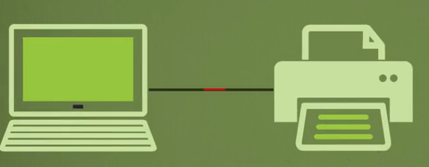
- 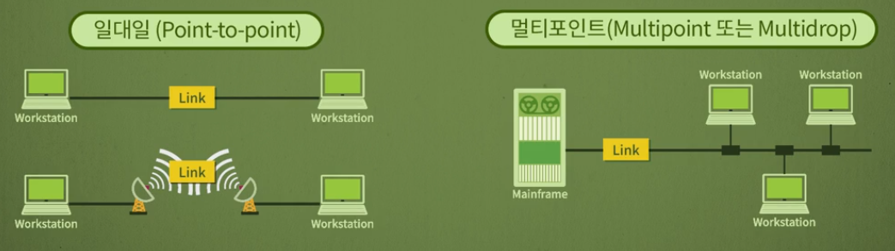

## 네트워크 토폴로지

- 네트워크의 구성요소인 장치와 링크가 어떻게 배치되어 있는가를 의미 = 장치와 링크의 연결 형태
- 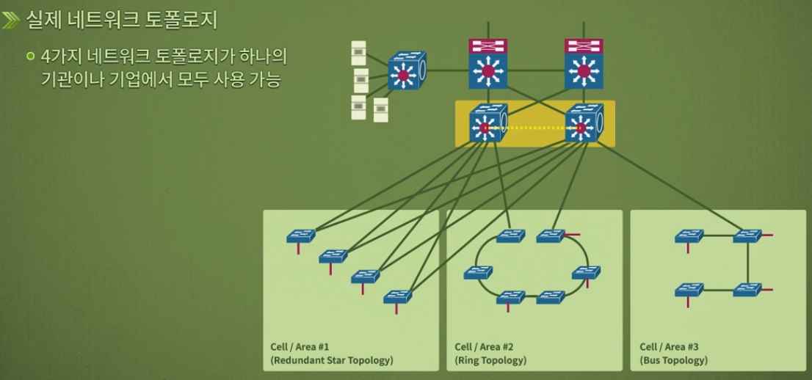

1. 성형
   - 각 장치가 중앙의 장치에 일대일 연결되어 통신하는 형태
   - 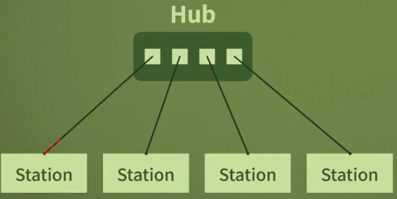
2. 버스형
   - 하나의 케이블에 여러 장치들이 연결되어 각 신호가 전체에 전달되는 형태
   - 타고다니는 버스와 상관 없음. 컴퓨터 구조의 버스와 연관
   - 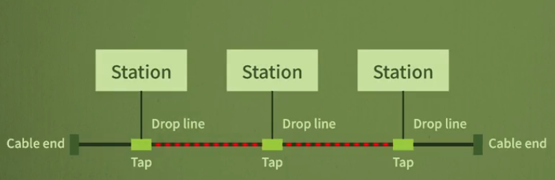
3. 링형
   - 장치들이 링 형태로 서로 연결되어 데이터가 링을 따라 한쪽 방향으로 전달
   - 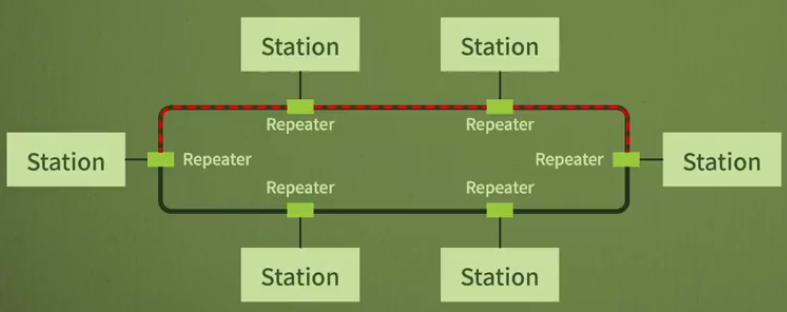
4. 그물형
   - 세 가지 형태가 아니면 그물형으로 분류
   - 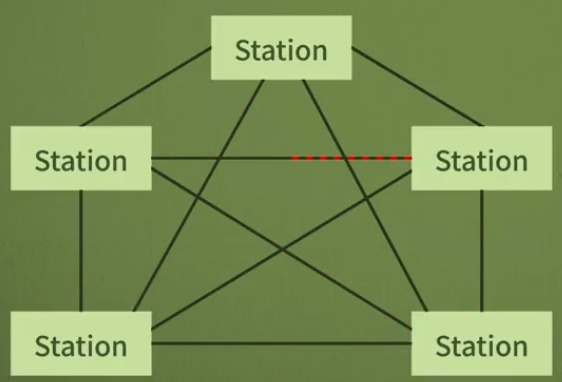

## 네트워크 분류

- *네트워크 분류 방법은 여러가지가 있을 수 있다. 유무선으로도 가능하다. 통상적으로 크기, 소유권, 구조 등에 의해서 분류*
- 일반적으로 LAN, MAN, WAN으로 분류
- 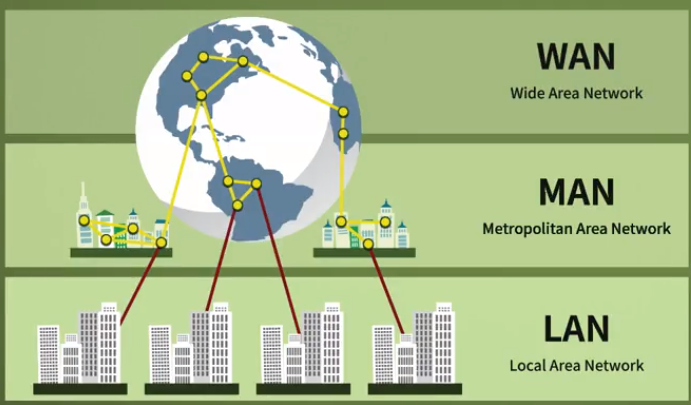

1. LAN
   - 보통 한 사무실, 건물, 캠퍼스, 회사 등에서 장치들이 서로 연결되며,
   - 개인적으로 소유 가능
   - 범주를 특정할 순 없지만 가까운 거리에 옹기종기 모여있는 노드와 링크들
2. MAN
   - 도시 정도의 크기를 포함하는 규모
3. WAN
   - 지역적으로 넓은 범위에서 데이터를 전송하기 위해 구성
   - 여러 네트워크가 연결되는 경우를 인터넷

# 네트워크 모델과 표준 프로토콜

- 계층화
- 모델
- 프로토콜

## 계층화

- **독립적으로 관리**가 가능하다.
- 특정 계층에 문제가 생겼을 때, 특정 계층만 바꾸면 된다. 다른 계층에 영향을 주지 않는다.
- 사람간의 대화에도 계층이 존재한다.
- 만약 언어가 부족하면 언어 공부를, 귀가 좋지 않으면 보청기를 끼우는 식으로 대처가 가능하다.
- 
- 인터넷의 속도가 빨라진다하면 속도와 관련된 장치만 교체하면 되지, 컴퓨터의 다른 내용을 바꾸지 않는다.

## 모델

- 사람의 대화는 3개 계층으로 나누는 것처럼, 몇 개의 계층으로 나누는지에 대한 모형을 의미한다.

### OSI 7계층

- OSI 7계층. 인터넷이 나오면서 거의 사용 안 함

### TCP/IP

- 인터넷에서는 프로토콜. **인터넷 모델**이라고도 함
- 5개의 계층으로 나눈다.
- 기계와 기계가 정보를 주고 받을 때
- 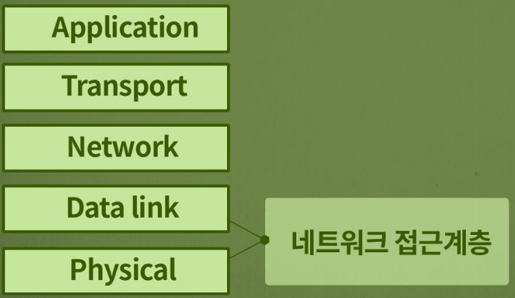

#### 1. 물리 계층

- 장치 연결 부분의 ⭐**물리적인 특성**을 명시
- 비트의 전기적 혹은 광학적 표현
- 데이터 속도, 비트의 동기화, 토폴로지, 전송 모드, 선로 구성 등에 관한 사항
- **메시지 포맷 존재X**. 비트의 나열로 보고 쏜다.
- 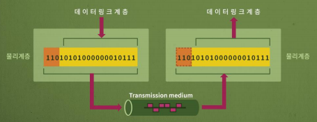

#### 2. 데이터링크 계층

- 이 계층부터 메시지 포맷이 나타남. 헤더가 존재
- 프레임화, 송수신 주소 명시, 흐름제어, 에러제어, 접근 제어 등
- 가장 중요한 기능은 에러 제어
- ⭐**에러제어**: 비트에 대한 에러 검출과 복구
  - 0을 보냈는데 1을 받는 경우 처럼. 여러가지 잡음 때문에 데이터 손상으로 인한 에러를 검출하고 복구
- **흐름제어**: 수신 측과 송신 측의 데이터 처리 속도 차이를 해결
  - 호름 조절. 데이터를 빠를 경우 데이터가 넘치는 경우가 발생하기 때문에 이를 조절
- **접근제어**: 여러 장치들이 동일한 링크를 공유할 때 충돌이 발생하지 않도록 조정
- 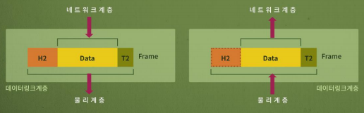

#### 3. 네트워크 계층

- 가장 중요한 기능은 ⭐**라우팅**
- 초기 송신지에서 최종 수신지로 데이터를 전달하는 계층으로 송수신 주소를 명시하고 라우팅을 수행
- 라우팅: 패킷을 최종 목적지로 보내는 여러 경로가 있는데, 그 경로를 선택하는 기능(경로 설정)
- 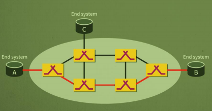

#### 4. 전송계층

- 프로세스에서 프로세스로 데이터를 전달(⭐**end to end**)
- 내 컴퓨터 안에 여러 프로그램이 존재하는데, 이 중에서 누구한테 보내는가를 결정하는 것
- 특정 프로세스에 대한 주소지정
- 메시지를 세그먼트단위로 분할 및 조립
  - 큰 용량의 데이터를 한 번에 보내기에 부담스러우므로 분할해서 보내는데 이를 다시 조립하는 역할을 수행
- 연결제어
  - **연결형**과 **비연결형**으로 선택해서 보낼 수 있다.
- 종단간 흐름제어
- 종단간 에러제어를 수행
  - 분할된 데이터가 깨지는 문제를 다룸
- 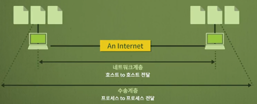

#### 5. 응용 계층

- 사용자가 직접 사용하는 계층
- 파일을 송수신하는 FTP
- 원격지 접속 하는 Telnet
- 전자우편을 주고받는 SMTP
- 하이퍼텍스트를 지원하는 HTTP
- 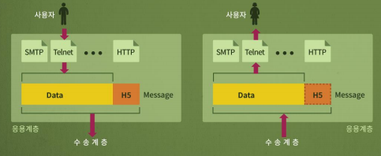

## 프로토콜

- 프로토콜 = 규칙
  - **프로토콜**이란 데이터를 주고 받는데 이용되는 **규칙의 집합**
- 표준 프로토콜
  - 하나로 정해놓고 쓰자해서 합의된 규칙을 의미
  - 표준화 기구
    - 표준 프로토콜로 정의하는 곳. ISO, ITU-T, ANSI, IEEE, EIA 등이 존재
  - **De jure 표준**과 **De facto 표준**으로 구분
    - De jure: 표준화 기구가 공식적으로 표준으로 규정한 것
    - De facto: 사실상 표준으로서 이미 많이 사용하고 있어서 표준으로 채택된 것