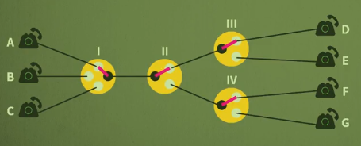
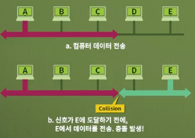

스위칭의 필요성과 종류에 대해서 살펴보고, 공유 매체 환경에서 가능한 프로토콜에 대해 살펴본다.

# 스위칭 방법과 종류

스위칭이 필요성과 스위칭 방식인 회선교환, 메시지교환, 패킷교환 등 3가지에 대해 알아보며, 또한 패킷 교환 방식에서 데이터그램방식과 가상회선 방식에 대해서 알아보고 마지막으로 MPLS에 대해 학습한다.

- 스위칭의 필요성과 종류
- 공유 매체 환경에서 가능한 프로토콜

## 스위치의 필요성

- 모든 장치간에 링크로 연결시키면 비용이 커진다.(링크도 돈이다)
- 링크의 대다수는 유휴시간이 많아 효율이 저하
- 
- 문제점을 해결하기 위해 **여러 장치들을 스위치에 연결되도록 구성**
- 스위치는 ⭐**필요할 때마다 두 개의 장치를 연결-효율적으로 데이터 전송하기 위함**
- 스위치들이 연결되어 큰 규모의 네트워크를 만들 수 있음
- 

## 스위칭 방식

1. 회선교환

   - 회선 = 어렵게 생각말고 선이라고 생각
   - 두 장치 사이에 **물리적인(논리적인) 선을 연결하는 방식**
   - 송신자와 수신자간에 여러 장치를 거쳐가는 선이 있는데, 두 사람에게 ⭐**전용 선을 할당**하는 것
   - 다른 사람은 이 선을 사용 못 한다.
   - 전화망(**PSTN**; Public Switched Telephone Network)이 이 방식을 사용
   - 회선 연결 시 , 데이터를 주고 받는 동안 계속 유지 즉, 자원이 연결되어 있는 동안 계속 점유
   - 두 장치 사이에 고정된 속도를 가짐
   - 연결을 설정하는데 시간이 소요되며, 이후에는 지연시간이 없음
   - 데이터 전송이 많은 경우 유용
   - 

2. 메시지교환

   - 회선교환은 데이터 보내지도 않는 동안에 대해서도 비용이 발생하는 문제가 발생
   - 다른 사람에게 그 선을 공유하기 위해서 나온 것
   - 물론 보내는 동안에는 다른 사람이 사용하지 못 함. 돌려가면서 쓸 수 있다.
   - ⭐**Store and forward**
     - 전달할 메시지 전체를 한번에 인접 노드로 모두 전달
     - 메시지를 수신하면 다음 노드로 메시지를  전달
     - 
     - 중간 노드들이 모두 이 데이터를 저장해야해서 메모리 비용이 매우 큰 문제 발생

3. 패킷교환

   - ⭐통신 장치가 저장할 수 있는 크기로 잘라서 보내자
   - 자른 단위를 **패킷**이라 한다.
   - 패킷의 순서를 담은 정보를 **헤더**라 한다.
   - 패킷을 보내는 동안에 점유된 선에서는 다른 패킷은 보내지 못한다.
   - 다른 컴퓨터가 보내는 패킷이 점유할 수 있다.
   - 
   - 군집성 있는(bursty) 트래픽 전송에 적합
   - 두 장치가 하나의 전송속도를 갖지 않음 즉, 우선순위가 적용됨
   - 회선교환방식은 링크에 문제가 발생하면 중간에 다른 링크를 선택할 수 없음

   

   1. 데이터그램
      - 사용자 메시지를 잘라서 목적지만 정해놓고 보내는 것
      - 네트워크 비연결형(데이터그램) 패킷 스위치
      - 연결설정과정이 없음
      - 각 패킷이 서로 독립적으로 처리되며, 목적지에 순서와 상관없이 도착
      - 통상적으로 양단간에 요청-응답의 형태를 가짐
      - 항상 같은 경로로 전송하지 않음
      - 네트워크 전체를 항상 효율적으로 사용할 수 있다.
      - 어딘가에서는 순서제어 기능을 해줘야 함
   2. 가상회선
      - 개념적으로 회선교환과 비슷
      - 연결을 설정해서 두 사람만 쓰는 것
      - 가상으로 전용 회선을 설정해서 패킷을 전송한다.
      - 경로가 정해져있기 때문에, 스위칭 속도가 빠르다.
      - 순서대로 패킷이 들어온다.
      - 
      - 레이블로 회선을 설정한다. 레이블이 붙은 순서들의 나열로 메시지를 보낸다.
      - 

   **MPLS**

   - Multi-Protocol Label Switching의 약자
   - **데이터그램을 가상회선 방식으로 바꿔 사용하는 것**
   - 데이터그램에서 라우팅하는데 매번 시간이 소요되기 때문에 즉, 속도문제!
   - **라우터 및 스위치처럼 작동이 가능함**
   - 라우터처럼 동작할 경우, MPLS는 대상 주소를 기반으로 패킷을 전달
   - 스위치처럼 동작할 경우, Lable을 기반으로 패킷을 전달
   - 속도를 개선하기 위해서 MPLS를 많이 사용하고 있다.
   - 

# 다중접속 프로토콜

다중접속 프로토콜이 무엇인지 알아보며, 다중접속의 3가지 기법인 무작위 접근, 통제된 접근, 채널화에 대해서 학습한다.

## 다중접속

**링크(매체)를 여러 장치들이 공유(접근)하는 환경에서 전송을 시도하는 경우**를 의미

여러 개의 컴퓨터들이 매체에 접근하는데 관련된 문제

- 일반적으로 데이터링크 계층에서 수행
- 데이터링크 계층에서 접근제어 기능을 가짐
- 두 개의 부계층이 존재
  - 상위 부계층은 데이터 링크를 제어 (LLC 계층)
  - 하위 부계층은 공유 매체의 접근 문제를 해결(MAC 계층)
  - 

## 다중접속 프로토콜

다중접속에 관련한 문제를 해결하는 규칙

### 1. 무작위 접근(Random access) protocols

- 서로 대등한 관계의 통신
- 한 시스템이 다른 시스템을 통제하지 않음
- 임의의 시스템이 전송을 위해 시간을 정하지 않음 -> 무작위 접근
- 어떤 시스템이 전송할 차례인지 정하는 규칙이 없음 -> 경쟁
- 여러 시스템이 전송하면 **충돌**이 가능하며, 해당 프레임은 손상되어 재사용 불가능
- 

1. ALOHA
   - 하와이 대학교에서 개발
   - 무선 LAN으로서 9600bps 속도로 동작
   - 각 시스템은 기지국으로 데이터 전송
   - MA에 해당
   - 기지국은 수신된 프레임을 목적지로 전달
   - 송신 시스템은 ACK를 기다림
   - 수많은 충돌 발생. ACK기다리다 허송세월
   - 
2. CSMA(Carrier Sense Multiple Access)
   - 각 시스템은 데이터를 전송하기 전에 매체를 우선적으로 검사
   - "sense before transmit", "listen before talk"
   - 
   - 전파지연시간으로 인해 여전히 충돌 가능성이 존재
   - 데이터를 전송한 짧은 순간에 상대방이 캐리어 센스를 했는데 아무도 안 보냈을 수도 있고
   - 동시에 보내는 상황이 발생할 수 있다.
3. CSMA/CD
   - CSMA에 Collision Detection 기능을 수행하는 것
   - 데이터를 전송한 시스템은 전송의 성공여부를 계속 감시
   - 충돌이 감지(collision detection)되면 즉시 전송 중지
   - 충돌이 발생하면 지금 보내봤자 이후 데이터는 모두 깨진다고 판단
   - 
4. CSMA/CA
   - 무선 네트워크에선 CD방식을 사용하기 어려움
   - 선이 없다보니까 충돌난 신호가 감쇠가 심하게 발생하면 감지하기 어려워짐
   - 아예 충돌을 회피해보자라는 철학이 CA
   - 충돌을 피하기 위해 CSMA/CA 에서는 3가지 기법 사용
     1. IFS(InterFrame Space)
        - 채널이 빈 경우라도 **바로 보내지 않고 잠시 기다려 충돌을 회피**
     2. 충돌 윈도우(Contention window)
        - 전송 준비 완료 시 임의의 수를 선택하여 시간만큼 기다림
        - A random number of slots
     3. ACK(Acknowledgments)
        - ACK는 데이터를 수신한 시스템이 보내는 응답을 의미
        - ACK가 없는 경우 송신 시스템은 데이터가 유실되었다고 판단
   - 

### 2. Controlled-access protocols

- 누군가 제어한다.
- 하나의 시스템이 제어국이 되어 다른 시스템들의 전송권한을 제어
- 동시에 둘 이상의 시스템이 전송을 못하게 함으로써 충돌제어
- 시스템들은 자신의 순서가 돌아오기 전까지는 전송 불가능

1. 예약(Reservation)
   - 시스템은 데이터를 송신하기 전에 예약 필요
   - N개의 시스템은 N개으 예약된 mini slot이 예약 프레임 내부에 존재
   - 예약된 시스템은 데이터프레임을 예약 프레임 뒤에 전송
2. 폴링(Polling)
   - "너 데이터 보낼거 있냐" 라고 중앙에서 통제해서 물어보는 것
   - 제어 시스템과 송수신 시스템으로 구성
   - 송신 시 제어 시스템에게 알림, 수신 시 제어시스템에게 문의
3. Token passing
   - 토큰을 가진 시스템이 데이터를 송신할 권한을 가짐

### 3. Channelization protocols

- 선을 논리적인 길로 나눠 사용하는 것
- 링크를 시간, 주파수, 코드로 나누어서 여러 개의 채널을 만들고 이들을 서로 다른 시스템들이 이용하는 방법

1. FDMA
   - 주파수 분할 다중접속
   - 사용 가능한 대역폭은 모든 시스템이 공유
   - 각 시스템은 할당된 대역을 이용하여 데이터 전송
   - 각 대역은 특정 시스템을 위해 예약 됨
2. TDMA
   - 시간 분할 다중접속
   - 단일 주파수 대역을 사용
   - 주파수를 시간 간격으로 분할하여 모든 시스템이 동시에 데이터 전송
3. CDMA
   - 코드 분할 다중접속
   - 링크가 전체 대역폭을 하나의 채널에서 공유
   - 모든 시스템은 시분할 없이 동시에 데이터 송신 가능

