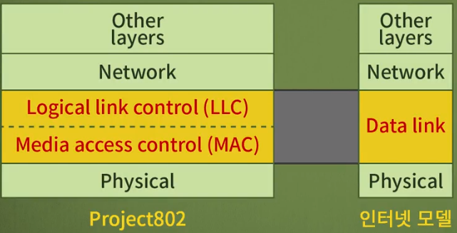
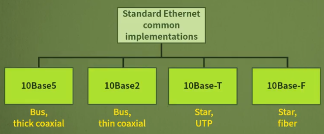

LAN에서 사용하는 매체의 종류와 특성에 대해서 알아보고, 유선 LAN의 구조와 Ethernet에서의 변화와 고속 및 Gigabit Ethernet에 대해서 알아본다.

# 1. LAN에서 사용하는 매체

신호를 전달하는 물질을 **매체**라고 하는데, LAN에서 사용하는 매체가 무엇이 있는지 알아본다. 그리고 매체의 종류로 선으로 연결되는 유도매체와 선 없이 연결되는 비유도 매체로 나누어서 학습한다.

- LAN에서 사용하는 매체의 종류와 특성

## 전송 매체의 종류

- 전송 매체는 **에너지를 전달하는 물질**을 의미
- 

### 유도 매체 = 유도체 = 유선 = guided

#### 꼬임선(TP; Twisted-pair cable)

- 쉴드(차폐) 유무에 따라 UTP, STP로 나뉜다.
- 쉴드는 외부로부터 잡을 막아주는 보호막
- 

1. UTP(Unshield)
   - 쉴드(차폐)X
   - 대부분의 TP케이블이 UTP에 해당
   - UTP의 성능이 많이 향상되었다.
   - 
   - UTP 카테고리: UTP 품질 기준으로 분류해놓은 것
     - CAT5 가 가장 많이 쓰임
     - 
   - TP 커넥터: 어댑터
     - RJ-45를 가장 많이 사용
     - 
2. STP(Shield)
   - 비싸다
   - 

#### 동축 케이블(Coaxial cable)

- TP 케이블보다 높은 주파수의 신호를 전달
- 중심축에 내부 도체가 있고 이를 절연체로 둘러 싼 뒤, 여기에 외부 도체를 원통의 그물 형태로 씌우고[[1\]](https://namu.wiki/w/동축 케이블#fn-1), 최종적으로 피복으로 감싼 형태의 케이블이다.
- 케이블의 굵기, 도체의 굵기, 쉴드의 특성, 전기적 특성 등등에 따라서 수도 없이 많은 종류가 있는데, 그냥 이런 구조를 가지기만 하면 모두 동축케이블이라고 부른다.
- 구리선을 쓴다고 동축이 아니다.
- 그러나 감쇄가 심해 최근 사용이 줄어드는 추세. 광케이블로 넘어가는 추세
- 안에 굵은 구리선에 하나, 밖을 감싸고 있는 구리선, 겉에 피복으로 구성됨
- e.g. VTR-비디오와 TV를 연결하는 선
- 
- 동축 케이블 커넥터
  - 동축 케이블 LAN은 거의 사용하지 않음
  - 케이블 TV에서 보통 사용.
  - 

#### 광케이블(Fiber-optic cable)

- 위 케이블들과 다르게 전기 신호 대신 빛 신호를 전달

- 유리나 플라스틱으로 만들어짐

- 현존하는 매체 중에서 가장 고속의 광대역 전송이 가능한 매체

- 해저 케이블, 유선 통신 등 많은 영역에서 다양하게 사용

- 고속, 외부 잡음이 적음

- 

- 광케이블 커넥터

  - 3종류의 커넥터가 존재

  - SC 커넥터, ST 커넥터, MT-RJ 커넥터

  - 

    

### 비유도 매체 = 비유도체 = 무선 = unguided

- 매체: 공기

- 물리적인 도체 없이 신호를 전달하는 매체

- 공기에 주파수를 쏜다.

- 파가 존재함

- 주파수가 높을 수록 직진성이 강해진다.

- 보통 1G를 기준으로 1G보다 낮으면 라디오 웨이브, 1G보다 높으면 마이크로 웨이브

- 라디오 웨이브; 라디오파 - 다방향성이 강함

- 마이크로 웨이브;마이크로파 - 단방향성이 강함

- 

  

## 네트워크 전체에서의 LAN의 위치

- 라우터를 기점으로 외부는 WAN, 내부는 LAN이다.

## LAN 프로토콜 규격

LAN은 OSI 7계층의 1,2계층에 대한 규격이다.

# 2. 유선 LAN: Ethernet

유선 LAN 표준에 대해 알아보며, 대표적으로 이더넷의 프레임 형태, 주소 등에 대해 살펴보고 이더넷의 발전 과정에 대해 학습한다.

## Ethernet 표준 채택 역사

- Xerox사에서 1976년에 이더넷 발명
- 초기에 Digital Equipment, Intel, Xerox 3사에서 이더넷을 표준으로 제안
- 미국 표준기구인 IEEE에서 이더넷을 표준으로 지정
- 국제표준화기구인 ISO에서 이더넷을 국제표준으로 채택

## LAN 프로토콜의 계층

- 공유된 매체에서 어떻게 데이터를 전송할까라는 고민에서 시작된다.
- MA - CSMA - CSMA/CD, CSMA/CA
- 매체를 여러 개의 장치가 접속하는 사용하는 프로토콜
- 이더넷은 OSI 7계층의 1,2 계층에 대한 규격이다.
- 이더넷은 LLC와 MAC으로 구성된 2개의 부계층이 존재
  - 매체가 다양한데, 다양한 매체들을 수용하도록 돕는 계층인 MAC
  - 이외에 매체에 관계없이 공통적으로 필요한 기능을 수행하는 LLC
- 

### MAC 계층

- MAC  계층은 매체의 특성과 운용방식에 따라 여러 개의 프로토콜이 존재

### LLC 계층

- **흐름제어, 에러제어 등 각종 제어에 대한 행위를 수행**
- LLC는 **모든 LAN에서 공통**의 계층

## IEEE 802 Working Groups

- 속도와 토폴로지에 따라서 표준을 정하는 위원회를 설립
- 위원회 이름이 프로토콜 이름으로 사용되기도 함
- 처음엔 LAN 프로토콜인 이더넷으로 시작하면서 발전을 거듭하면서 다양한 표준을 지정
- 무선랜은 802.11
- 근거리 통신 PAN(LAN아님)은 802.15 - e.g. 블루투스, ZigBee
- 이동통신 802.16, 802.20
- 이더넷을 초석으로 발전한 형태
- 

## 이더넷 속도 발전 과정

*10배씩 빨라짐!*

1. 이더넷 - 10Mbps
2. 패스트 이더넷 - 100Mbps
3. 기가비트 이더넷 - 1Gbps
4. 텐-기가비트 이더넷 - 10Gbps

## 이더넷 프레임(MAC 프레임)

- 이더넷 프레임은 7개의 필드로 구성
- Physical layer header = (Preamble + SFD) 를 포함시키기도 하고 안 포함하기도 함
- 왜냐하면 하드웨어가 비트 손실이 발생할까봐 임의로 끼워놓기 때문에 관점에 따라서 달라진다고 해석
- Preamble: 프레임이 곧 도착하니 준비하라는 의미
- SFD(Start frame delimiter): 프레임의 시작을 알림
- 목적지 주소
- 송신지 주소
- 길이/ 타입: 네트워크 계층의 프로토콜을 길이 또는 타입으로 명시 
- 데이터: 최소 46바이트에서 최대 1500바이트에서 가능
- CRC: Cyclic Redundancy Check: 사용자가 보내는 메시지에 에러 검출 목적
- 프레임 전체 길이는 최대 1518, 최소 64바이트 (데이터 길이 + 나머지 18바이트)
- 

### 주소 지정

- 각 시스템은 NIC(Network Interface Card)를 갖고 있는데, LAN 카드라고도 불림
- LAN카드에는 고유주소가 설정되어 있음
- MAC 주소, Ethernet 주소, 하드웨어 주소라고 함
- IP주소와 다르게 사용자가 설정할 수 없음
- 공장에서 출하될 때 정하는 주소
- 6바이트로 이루어져 있으며 보통 16진수로 표기
- 브로드캐스트 주소는 모든 비트가 '1'인 FF-FF-FF-FF-FF-FF 로 구성
- 그 외에는 보내고자하는 주소와 받는 사람의 주소를 정확히 명시하는 유니캐스트가 있다
- 

## MAC 프로토콜

- 이더넷은 1-persistent **CSMA/CD** 를 사용
- 데이터를 보내기 전에 Carier sense하여 충돌 감지
- 유휴라고 판단이 되면 바로 치고들어가서 쏜다.
- 여러 매체가 동시에 이렇게 결정이 될때 충돌이 발생
- 

## 이더넷의 형태

### 이더넷(10Mbps)

- 숫자 10은 속도를 의미
-  base: base band 신호 방식 - 디지털 신호를 그대로 보내는 방식
  - LAN 케이블 자르면 깍두기 모양의 디지털 신호가 나온다
- 뒤에 숫자는 케이블 종류를 의미
- 

#### 10Base-5

- 500m의 버스형 두꺼운 동축케이블
- 처음에 만들어진 이더넷
- think ethernet 또는 thinknet으로 불림
- 동축케이블을 여러 장치들이 공유매체로 사용하는 LAN
- 10Mbps의 속도, 베이스밴드 신호방식, 한 세그먼트가 500m에 달함(한 케이블의 최대길이)
- 리피터를 달면 최장 2500m까지 가능
- 거의 사용X
- 

#### 10Base-2

- 200m의 버스형 얇은 동축 케이블
- 두 번재 개발된 이더넷
- thin ethernet/ cheapernet 이라고 불림
- 동축 케이블을 여러 장치들이 공유매체로 사용하는 LAN
- 두께가 10BASE5보다 얇음
- 10Mbps 속도, 베이스밴드 신호방식, 한 세그먼트가 185m에 달함
- 거의 사용x. 동축케이블의 문제점 때문
- 

#### 10Base-T

- 스타형 UTP
- Twisted Pair Ethernet
- CSMA/CD 방식을 10Mpbs, Baseband, Twisted pair 방식으로 구현
- 대부분 UTP 케이블로 사용
- 허브: LAN에서 많이 사용되는 네트워크 장치
- IP 공유기가 허브에 해당. 뒷면에 RJ-45커넥터를 연결할 수 있는 구멍이 존재
- 

#### 10Base-F

- 스타형 광케이블
- 시스템과 허브를 연결하는 케이블로서 광케이블을 이용
- 

### Fast Ethernet

- 기존의 이더넷보다 10배 빠름, 100Mbps
- 기존 이더넷과 호환 가능
- 자동협상(Autonegotiation)기능으로 속도 등을 조정
- 개발된 형태는 3종류
- 

#### 100BASE-TX

- Two-wires category 5 UTP
- TX: Two-wires 송수신이 동시에 되는 기능
- 성능이 더 좋다.

#### 100BASE-CX

- Two-wire fiber

#### 100BASE-T4

- Four-wires category 3UTP
- T4: 동시에 송수신을 허용하지 않음

### Gigabit Ethernet

- 또 10배 빨라짐
- 1기가부터는 광케이블을 훨씬 많이 사용함
- 속도가 1Gbps로 상향되었으나 기존 이더넷이나 고속 이더넷과 서로 호환 가능
  - 48비트 주소, 프레임 형태, 최소/최대 프레임 크기, 자동협상 기능 등을 지원
- 광섬유나 TP를 이용한 개발된 형태를 갖고 있음
  - SX, LX, CX 모두 광케이블
  - Twisted wire를 사용할 수는 있음. 동시에 주고 받을 순 없다.
- 속도만 계속 빨라지고 CSMA/CD프로토콜은 전혀 바뀌지 않음
- 

### Ten-Gigabit Ethernet

- 프로토콜 그대로 사용하고 10배 빨라짐
- 기존 이더넷, 고속 이더넷, 기가비트 이더넷과 서로 호환되도록 설계
  - 48비트 주소, 프레임 형태, 최소/최대 프레임 크기, 자동협상 기능 등을 지원