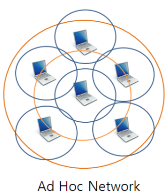
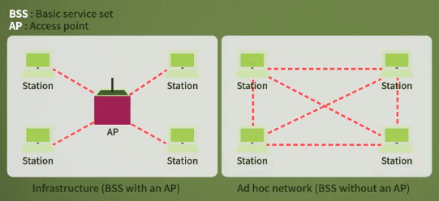
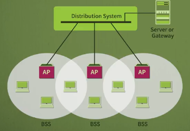
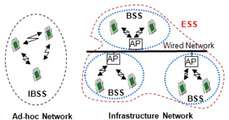

선이 없이 네트워크가 연결되는 무선 LAN에 대해 살펴보며, 무선 LAN에 구조에 대해 살펴보고 네트워크와 네트워크를 연결해주는 장치에 대해 알아본다.

# 1. 무선 LAN

- 무선 LAN은 BSS와 ESS 두 종류의 서비스를 지원
- 하나의 AP를 지원하냐, 둘 이상의 AP 그룹을 지원하냐의 차이
- ESS를 사용하면 여러 AP들이 커버하고 있는 어떤 지역에서도 로밍할 수 있다.
- AP(Access Point) 를 유무선 공유기라고도 함
- 흔히 IP 공유기라고 부름
- 무선 LAN과 직접적으로 연관된 무선 LAN 장비를 AP라고 부른다.
- 카페, 집에서 어떤 WIFI 리스트를 보고 선택을 하게 되는데, 그게 바로 무선 장치 즉, AP를 선택하는 행위

## Basic Service Set(BSS)

- Infrastructure 모드/ Ad hoc 모드

- WI-FI에도 두 모드를 지원

- WIFI는 대부분 인프라 모드를 사용하여 작동

### Infra 모드: AP라는 중앙의 기지국을 이용하는 모드

- Wi-Fi 액세스 포인트를 기지국이라고 한다.
- wifi wlan 허브를 구입한 후, KT, LGU+, SK브로드밴드와 같은 인터넷 서비스 제공업체(ISP)가 제공하는 가정용 라우터의 통신 포트에 연결하여 기지국을 인터넷에 연결한다.
- 기지국 아래에 수백 개의 단말기가 존재해도, 서로 직접 통신할 수는 없고 기지국(허브)을 통해서만 통신할 수 있다.
- 

### Ad hoc 모드: AP가 없는 모드

- 중간에 AP 장치를 경유하지 않고 직접 통신하는 모드
- 다른 통신 기반 시설없이 무선 어댑터가 설치된 단말만으로 네트워크의 구성이 가능
- 기지국이 없음이 무선 단말기들이 서로 직접 통신. 곧 단말이 라우터, L3의 역할을 하는 것
- 예를 들어, 북한에 간다면 사용할 수 있는 인프라 네트워크가 존재하지 않는다. 이 경우, 군인들이 사용하는 무선기기들과 통신하기 위해서는 Ad-hoc 네트워크를 사용해야 한다.
- 단말이 많아질 수록 네트워크의 범위도 그만큼 넓어지고 통신 범위도 넓어진다. 단, 통신 범위 거리 안에 있어야 한다.
- 하나의 독립적인 IBSS는 다른 IBSS에 연결할 수 없다. IBSS끼리 서로 통신할 수 없다.
- 
- 

- 

- 

## Extended Service Set(ESS)

- 여러 BSS로 구성된 서비스를 의미
- BSS는 분산 시스템이라고 불리는 유선 네트워크에 연결된다.
- 
- 
- 

## 기본적인 Wi-Fi 동작

Wi-Fi 인터페이스를 켜면 기지국(AP)가 검색된다.

각각은 BSS ID라고 불리는 기지국의 고유 이름이다.

이 기지국들이 동일한 무선 주파수를 사용하면 서로 간섭이 발생한다. 예를 들어, 동시에 여러 개의 라디오를 켜면 제대로 소리를 들을 수 없다. TV 채널이 서로 다른 것처럼 Wi-Fi는 약간 다른 주파수를 설정하여 채널로 나뉜다. 채널 스캐닝을 통해 어떤 기지국이 어떤 채널을 사용하고 있는지 파악하고, 최대한 간섭을 줄이는 채널을 선택합니다. 채널 스캐닝 결과, 어떤 기지국이 있고 어떤 세기의 신호가 있는지 등등의 정보를 얻게 된다.

이러한 신호 정보를 '비콘'이라고 한다. 비콘 프레임은 IEEE 802.11 기반 WLAN의 매니지먼트 프레임 중 하나이다. 비콘 프레임은 주기적으로 전송되어 무선 LAN의 존재를 알린다. 비콘 프레임은 BSS에서 AP에 의해 전송이 된다. Wi-Fi를 사용하는 디바이스는 사용 가능한 채널들을 검색하는 두 가지 방법(능동/수동) 중 하나를 사용할 수 있다. 능동 스캔 중에는 클라이언트 라디오가 직접 probe 요청을 전송하고, AP로부터 probe 응답을 수신한다. 수동 스캔에서 클라이언트 라디오는 각 채널에서 AP가 주기적으로 보내는 비콘을 수신 받기 위해 대기한다.

기지국은 일정 시간 간격으로 '비콘'이라는 신호를 보낸다. 이 비콘에는 타임스탬프, 시간 간격, SSID, 사용된 채널 번호, 기능 정보와 같은 기지국에 대한 유용한 정보를 포함하고 있다.

통신하고자 하는 AP를 찾아 선택한 후에는, 'Authentication'과 'Association'이 필요하다. Authentication은 단말이 기지국을 이용할 권한을 가지고 있는지 여부를 확인하는 작업이다. 암호확인은 가장 많이 사용되는 인증방법이다.

이 절차가 성공적으로 수행되면 Association을 한다. 단말은 AP 또는 라우터와 연결(등록)하여 네트워크에 완전히 접근할 수 있다. Association은 AP가 각 단말을 기록하여 프레임이 제대로 전달되도록 한다. Association은 Ad-hoc 모드가 아닌 무선 인프라네트워크에서만 발생한다. 이 2가지 절차가 끝나게 되면, 데이터가 전송될 수 있다.

[우리집 최적의 와이파이(WIFI) 채널(Channel) 찾기 외장 뇌장소 (tistory.com)](https://tysct.tistory.com/200)